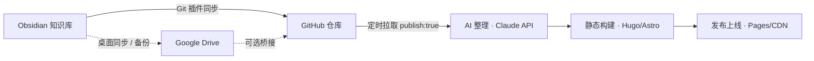

# TechnicalBlog

把 GitHub 仓库和 Google Drive 中同步的 Obsidian 笔记，由 AI 整理成单篇技术文章，定时发布到博客。测试通过后会用 `git subtree split` 拆分成独立仓库（见根目录 `docs/claude-code-cloud-notes.md`）。

本文档的可视化版本见 [`obsidian-publish-pipeline.html`](./obsidian-publish-pipeline.html)（浏览器直接打开）。

## 整体思路

拆成四个可以独立选型、独立替换的环节，而不是设计成一整个大系统：**数据源接入 → AI 整理生成 → 调度触发 → 发布上线**。下图实线是推荐路线，虚线是可选分支。

## 数据源接入

让流水线能读到 Obsidian 笔记，并且分辨出"什么变了"。

| 方案 | 技术栈 | 取舍 | 结论 |
|---|---|---|---|
| GitHub 仓库单一来源 | Obsidian Git 插件 + git | 有 diff、有提交历史，原生适配 CI；前提是笔记先经过 git 同步 | **推荐** |
| Google Drive → GitHub 桥接 | Drive API + 定时脚本写回 git | 能接住只在 Drive 编辑、没走 git 的笔记；多一套 OAuth/服务账号和轮询逻辑 | 可选 |
| 双源各自轮询 | 两条独立监听/轮询逻辑 | 两套状态、两套失败模式，笔记内容其实是同一份 | 不建议 |

Git 天然带 diff、提交历史和触发钩子；Google Drive 的同步大多只是文件级镜像，拿不到这些。默认只让 GitHub 仓库进流水线，Google Drive 继续做它最擅长的事——多设备间的个人备份。

## AI 整理生成

把选中的笔记（可能零散、带双链和 frontmatter）整理成一篇结构完整的技术文章。

| 方案 | 技术栈 | 取舍 | 结论 |
|---|---|---|---|
| LLM 出 Markdown，渲染器出 HTML | Claude API + 现成 SSG 渲染管线 | 多一次转换；HTML 结构稳定、主题统一，不怕模型吐出破损标签 | **推荐** |
| LLM 直接出 HTML | Claude API + HTML 格式 prompt | 少一步转换；标签结构、转义、样式钩子全靠模型自觉，主题难统一维护 | 不建议 |
| RAG 式跨笔记整理 | embeddings + 向量检索 + LLM | 能自动关联相关笔记一起整理；多养一套索引和更新逻辑 | 可选 |

模型档位上，整理类任务 `claude-sonnet-5` 通常够用，量大且要求不高的摘要可以再降到 Haiku 档。一次定时任务要处理多篇笔记时，把不变的风格指南/输出格式放进系统提示最前面并加 prompt caching，能省下不少重复计费的 token。

## 调度触发

决定"整理 + 发布"这条链什么时候跑一次。

| 方案 | 技术栈 | 取舍 | 结论 |
|---|---|---|---|
| GitHub Actions 定时任务 | `schedule` cron，跑在 blog 仓库 | 零额外基础设施，和代码同仓库，个人博客量级免费额度够用 | **推荐** |
| 外部调度器 | Cloud Scheduler / Vercel Cron 等 | 不受单次运行时长限制；多一个要维护的账号和部署目标 | 可选 |
| 自建常驻服务 | 自己维护的常驻进程/服务器 | 为一个每天跑一次的任务，养一台要保活、打补丁的机器 | 不建议 |

调度只是"什么时候跑一次"，不需要长期占资源的常驻服务，也不用再额外管一台机器的存活。

## 发布上线

把生成的文章变成访问者能看到的网页。

| 方案 | 技术栈 | 取舍 | 结论 |
|---|---|---|---|
| 静态站点生成器 + Git 托管自动部署 | Hugo / Astro / Eleventy + GitHub Pages 或 Cloudflare Pages 等 | push 即构建部署，没有服务器和数据库，文章历史天然在 git 里 | **推荐** |
| Headless CMS + 独立前端 | CMS API + Next.js 等前端 | 换来协作编辑、评论等能力；多一套 CMS 托管、鉴权、前后端双部署 | 可选 |
| 自建后端直接渲染 | 自写服务端 + 自建数据库 | 把 SSG 已经做好的事重新做一遍 | 不建议 |

## 推荐的最简整体方案

全部用已经存在的东西拼起来，不新增服务器、数据库、CMS 或向量库：

1. Obsidian Git 插件把 vault 同步到 GitHub 仓库（只读输入，Google Drive 不接入自动化）
2. blog 仓库里的 GitHub Actions `schedule` 定时任务（例如每天一次）
3. 拉取 vault 仓库，筛选 frontmatter 标了 `publish: true` 且未处理过的笔记（用一个 `published.json` 记录已处理项）
4. 调用 Claude API（Sonnet 档位打底，简单摘要可降到 Haiku 档）把笔记整理成 Markdown
5. 写入 blog 仓库的内容目录、更新 `published.json`，commit + push
6. Hugo 或 Astro（任选其一，看熟悉度）构建站点
7. push 触发 GitHub Pages / Cloudflare Pages 自动部署

## 还需要决定

- **内容颗粒度**：一篇笔记对一篇博客，还是把几篇相关笔记合并整理成一篇？决定了怎么选笔记、怎么写 prompt。
- **Google Drive 要不要接入自动化**：如果所有笔记最终都会经过 Obsidian Git 插件同步，Drive 可以完全留在流水线之外。
- **发布节奏**：定时轮询（简单）够用，还是需要 push 即触发（要多一层跨仓库的 webhook/`repository_dispatch`）？
- **SSG 和主题**：Hugo、Astro、Eleventy 差异主要在生态和熟悉度，不影响上面的架构。

## 实施时留意的坑

- **两个仓库分开**：流水线只读 vault 仓库、只写 blog 仓库。让自动化和 Obsidian Git 插件的自动提交共用同一个仓库，迟早会撞上冲突。
- **去重和幂等**：cron 每次都会重新扫描，没有状态记录就会重复整理、重复发布同一篇笔记。
- **密钥只放 Actions Secrets**，不要出现在仓库或生成的文章里。
- **真要接 Google Drive 的话**：Drive API 只能告诉你"文件改了"，给不了"改了什么"，桥接脚本要自己算 diff，比读 git log 麻烦不少。

<!-- ponytail: 以上是架构方向和技术选型记录，还没有实现代码；具体的 prompt、frontmatter 字段名、SSG 项目脚手架留到真正开始写代码时再定，避免现在假设错了返工。 -->
