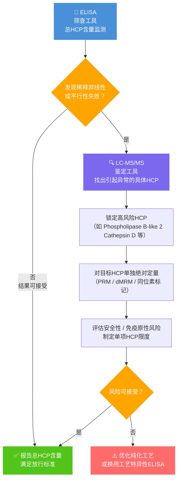

<!-- 引子通道产出。校验全过，人工确认后移入 src/content/posts/ 即可发布。
来源：Quality_and_Regulation/验证相关/ELISA方法开发-稀释线性和平行性.md
模式：加法　7,686 字符 → 10,469 字符
-->
---
title: "ELISA 方法开发中的稀释线性与平行性：MRD 建立、HCP 专属考量与非线性排查"
date: 2026-08-26
category: "03质量控制"
primaryTag: "03质量控制/残留/HCP"
description: "ELISA 定量的可靠性取决于一个常被低估的前提：样品经系列稀释后，基质不再干扰抗体-抗原结合，且内源性分析物被抗体识别的方式与标准品（calibrator）一致。本文围绕这一前提展开，先介绍最小所需稀释度（MRD）的建立流程与接受标准，再对比 HCP ELISA 与 Prote"
tags:
  - "03质量控制/残留/HCP"
sourceNotes:
  - "Quality_and_Regulation/验证相关/ELISA方法开发-稀释线性和平行性.md"
---

ELISA 定量的可靠性取决于一个常被低估的前提：样品经系列稀释后，基质不再干扰抗体-抗原结合，且内源性分析物被抗体识别的方式与标准品（calibrator）一致。本文围绕这一前提展开，先介绍最小所需稀释度（MRD）的建立流程与接受标准，再对比 HCP ELISA 与 Protein A ELISA 在稀释线性评估上的本质差异，随后展开平行性测试的目的、样品选择及其与抗体覆盖率测试的关系，最后结合 USP〈1132〉的框架梳理稀释非线性的成因排查与报告规则。

## 稀释线性与 MRD：要解决什么问题

ELISA 定量依赖标准曲线，但真实样品基质（高浓度 mAb、盐、脂质、表面活性剂等）可能干扰抗体-抗原结合，使测量值偏离真值。稀释线性实验的目的是找到一个最佳的样品稀释倍数——最小所需稀释度（Minimum Required Dilution, MRD），使得在该稀释倍数及更高倍数下，样品基质不再干扰分析物的准确定量。这一工作通常在线方法开发（非正式验证）阶段完成。

稀释线性与平行性是两个相互补充但目的不同的参数：

- **稀释线性**：用加标样品（加入 calibrator 材料）评估基质效应，确定 MRD；
- **平行性**：用含高浓度内源性分析物的真实样品评估抗体识别的等价性，检验方法对实际工艺样品的适用性。

两者缺一不可：MRD 解决"基质干扰"问题，平行性解决"样品中的分析物是否被正确识别"问题。日常检测中遇到的每一类样品，都需要单独进行 MRD 评估，并将结果写入 SOP。

## MRD 建立的实验流程与数据判定

以下流程引自 Cygnus Technologies 关于 ELISA 稀释线性建立的指南：[Establishing Dilution Linearity for Your Samples in an ELISA](https://www.cygnustechnologies.com/establishing-dilution-linearity-for-your-samples-in-an-elisa?srsltid=AfmBOop14dBWLOxen7IMcO6vWlVj4Z7Vr8F-H7TUIE_0GgChLRDWzRGD)，适用于一般 ELISA 方法开发。

**样品制备**——采用"加标回收（Spike and Recovery）"方式制备线性稀释样品：

- **加标样品（Spiked Sample）**：取低/无含量的真实样品基质，加入已知高浓度的 Protein A 标准品。加标浓度应使该样品的**首次稀释**（例如 1:2 或 1:4 稀释）后，读数落在标准曲线的中高浓度范围（例如靠近 ULL，即定量上限）。
- **基质样品（Unspiked Sample）**：保留一份未加标的原始样品基质，用于后续计算或作为对照。

**系列稀释**：使用分析缓冲液（Assay Diluent Buffer）对加标样品进行系列稀释，一直稀释至两倍LOQ以上；同时对基质样品（未加标的）进行相同的系列稀释，以评估样品中可能存在的内源性 Protein A 含量，并检查 Hook 效应。

**检测**：将所有稀释的样品（加标系列和未加标系列）以及标准曲线带入 ELISA 板进行检测。

**数据计算**：

1. **内源性浓度**：计算基质样品系列稀释的浓度；
2. **加标浓度**：计算加标样品系列稀释的浓度；
3. **回收计算**：从加标样品的测量浓度中减去相应稀释度的内源性浓度，得到净加标浓度；
4. **稀释校正**：将净加标浓度乘以其对应稀释倍数，计算相邻两个稀释度之间的浓度差异，应不高于 ±20%。


上图示例中 MRD 为 1:4。需要针对日常检测遇到的每一类样品进行上述 MRD 评估，为每类样品建立 MRD，写入 SOP 中。

## HCP ELISA 与 Protein A ELISA 的稀释线性差异

> [!info] 与 Protein A ELISA 的核心差异
> HCP（宿主细胞蛋白）是**数百至数千种蛋白的复杂混合物**，ELISA 试剂盒使用多克隆抗体检测，因此稀释线性的操作与评估逻辑与 Protein A（单一蛋白）存在本质差别。

### 样品前处理差异

Protein A ELISA 有一个 HCP ELISA 没有的特有步骤——酸性解离（Acid Dissociation）。mAb 的 Fc 区域会结合残留的 Protein A，使其以结合态存在于样品中，直接检测会严重低估含量。因此 Protein A ELISA 在稀释前须进行：

1. 加入酸性缓冲液（如甘氨酸-HCl，pH 3.0），室温处理 30～60 min；
2. 中和至检测所需 pH 后再进行系列稀释。

HCP ELISA 无需上述前处理，直接用分析稀释液（Assay Diluent）稀释即可。

> [!warning] 注意
> 少数与 mAb 共洗脱的"co-purified HCP"（如能结合 Fc 结构域的 HCP）在理论上也存在被屏蔽的风险，但通常不做酸解离处理，而是通过<mark style="background:#fff88f">平行性测试</mark>来判断方法是否适用。

### 加标物选择

| | Protein A ELISA | HCP ELISA |
|---|---|---|
| 分析物性质 | 单一蛋白 | 复杂蛋白混合物 |
| 加标物 | 纯化 Protein A 标准品（简单） | 商品化 HCP 标准品（如 Cygnus F550）**或**工艺特异性 null cell 制备的 HCP 抗原 |
| 代表性风险 | 低 | ⚠️ 高：商品化标准品组成可能与实际工艺 HCP 不完全一致，存在系统性低估风险 |

商品化标准品的代表性风险在实际项目中很难提前排除：即便使用相同 CHO 细胞系、相同平台纯化工艺，不同抗体分子残留的 HCP 种类与含量也可能不同[依据 3]。

### 内源性分析物与 MRD 建立策略

HCP 在不同纯化阶段浓度跨度极大，必须对每类样品分别建立 MRD：

**上游/早期纯化步骤（收获液、澄清液、Protein A 洗脱液）**
- 内源性 HCP 浓度高（ng/mL ～ μg/mL 量级），**无需加标**；
- 直接对内源性样品做系列稀释（如 1:10 → 1:100 → 1:1000 → 1:10000）；
- 各稀释点回算浓度一致性即为线性评估。

**晚期纯化步骤/药物原液（DS）**
- 内源性 HCP 接近 LOQ，**需要加标**，操作方式与 Protein A 相同，加入 HCP 标准品；
- 加标浓度设定：首次稀释后读数落在标准曲线中高浓度区（靠近 ULOQ）；
- 向下稀释至 2×LOQ 以上，扣除内源性后计算净回收率。

> [!question] DS 阶段加标物是否应选用工艺过程样品（上游高 HCP 样品）？
> **不推荐**。DS 阶段稀释线性的目的是检验**DS 基质（高浓度 mAb）是否干扰定量**，而非验证抗体覆盖率，因此加标物应与标准曲线 calibrator 保持一致（商品化 HCP 标准品），原因如下：
>
> 1. **循环误差**：上游样品的 HCP 浓度本身由该 ELISA 测定，以此作为加标的"标称值"存在循环引用，标称浓度不可靠；
> 2. **基质混叠**：将上游复杂基质引入 DS，无法区分"DS 基质干扰"与"上游样品带入的干扰"；
> 3. **组成不匹配**：能通过多步纯化残留至 DS 的 HCP 是高度富集的特定亚群，与上游 HCP 组成差异显著，加入上游样品并不能模拟 DS 中的真实情况。
>
> **工艺特异性 HCP（上游样品）适用于平行性测试**，而非 DS 阶段 MRD 测定——两者目的不同，需分开评估：
>
> | 评估目的 | 推荐加标/样品来源 |
> |---------|----------------|
> | DS 阶段稀释线性（MRD） | 商品化 HCP 标准品（同 calibrator） |
> | 平行性（抗体覆盖率） | 含高内源性 HCP 的早期工艺样品（无需加标，用内源物） |

**接受标准（两类样品相同）**：各稀释点回收率 80～120%。

### 综合对比

| 评估维度 | Protein A ELISA | HCP ELISA |
|---------|----------------|-----------|
| 样品前处理 | ⚠️ 需酸性解离步骤 | 直接稀释，无特殊前处理 |
| 加标物 | 单一 Protein A 标准品 | HCP 标准品（有代表性风险） |
| 内源性可直接用于线性 | 否（DS 中 Protein A 通常接近零） | 是（上游样品内源浓度高） |
| 需建立 MRD 的样品类型 | 主要是纯化后样品 | 每个纯化步骤均需单独建立 |
| 平行性的重要性 | 中等（主要检验基质效应） | ⚠️ 极高（同时检验抗体覆盖率） |
| 平行性失败的含义 | 提示提高 MRD | 可能需换用工艺特异性试剂盒 |
| 法规参考 | FDA guideline, PDA TR-66 | USP 〈1132〉, ICH Q6B |

## 平行性：目的、方法与样品选择

平行性（Parallelism）指样品系列稀释后，各稀释点反算回原液的浓度应当一致——即样品的剂量-响应曲线与标准曲线形状相同（平行），仅在横轴上发生位移。

```
信号
│        标准曲线
│      ╱
│    ╱       ← 样品曲线（平行）
│  ╱       ╱
│╱       ╱
└──────────────── 浓度（log）
    ↑平行 = 两条曲线斜率相同，仅左右位移
```

**核心判断标准**：各稀释点反算浓度的一致性（CV ≤ 20% 或各点偏差 ≤ ±20%）。

平行性测试只使用含高浓度内源性分析物（浓度低于 ULOQ）的真实样品。其目标在于确认内源性分析物与抗体结合的特性与 calibrator 一致。

### 平行性 ≠ 抗体覆盖率测试

平行性的真正目的是验证方法适用性（Assay Suitability）——确认样品中内源性分析物被抗体识别的方式与 calibrator 相同。平行性测试本身并不等同于抗体覆盖率测试：

| | 平行性测试 | 抗体覆盖率测试 |
|---|---|---|
| **方法** | ELISA 系列稀释 | 2D-DIGE（双向差异凝胶电泳） |
| **测什么** | 内源性分析物与 calibrator 的识别行为是否一致 | 多克隆抗体能识别多少种 HCP |
| **结果形式** | 各稀释点回收率一致性（定量） | 覆盖率百分比（接受标准 ≥ 70%） |
| **关系** | 平行性失败可**提示**覆盖率不足 | 覆盖率不足会导致平行性失败 |

平行性是覆盖率不足的功能性间接指标，而非直接测量手段。行业接受标准：2D-DIGE 法验证抗体覆盖率 ≥ 70%。

不平行的两种根本原因：

| 原因 | 表现 | 解决方案 |
|------|------|----------|
| 基质效应 | 低稀释倍数偏离，高稀释倍数趋于一致 | 提高 MRD |
| 样品 HCP 组成与 calibrator 差异大 | 各稀释倍数均不平行，无法通过稀释改善 | 换用工艺特异性试剂盒 |

### 样品选择

> [!warning] 为何不能用加标样品做平行性？
> 加标样品加入的是 calibrator 材料（商品化 HCP 标准品），其响应必然与标准曲线平行，无法检验任何问题。平行性测试的核心是检验**内源性的、工艺真实产生的 HCP** 能否被抗体以与 calibrator 一致的方式识别。

推荐样品类型（按优先级）：

| 样品 | 内源 HCP 浓度 | 适用性 |
|------|-----------|--------|
| 细胞培养收获液（HCCF） | 极高（μg/mL） | ✅ 最佳，HCP 组成最多样 |
| 澄清液 | 高 | ✅ 良好 |
| Protein A 洗脱液 | 中等 | ✅ 可用，代表工艺相关 HCP |
| 中间纯化池 | 低～中 | ⚠️ 视浓度而定 |
| DS（药物原液） | 极低（近 LOQ） | ❌ 不适用，内源 HCP 不足以评估 |

> [!info] DS 不做平行性的原因
> 内源 HCP 过低，系列稀释后很快低于 LOQ，无法获得足够数据点判断曲线形状。DS 阶段只做稀释线性（加标 calibrator，检验基质效应），两者目的与操作完全不同。

## 稀释非线性：机制、排查与处置

稀释线性失败（回收率持续偏高 >120% 或偏低 <80%）是样品基质或分析物本身特性干扰检测的外在表现。不同方向的偏差背后机制不同，需要针对性排查。

### 回收率 > 120%（过高回收）

过高回收通常在低稀释倍数（高基质浓度）时出现，随稀释倍数增大逐渐向 100% 收敛，提示基质中存在正向干扰：

| 原因 | 机制 | 特征 |
|------|------|------|
| **基质正向增强效应** | 样品中某些成分（蛋白质、小分子）稳定或增强抗体-抗原结合，非特异性放大信号 | 低稀释点偏高，稀释后趋于正常 |
| **交叉反应物质** | 基质中存在与检测抗体发生交叉反应的蛋白（对 HCP 多克隆抗体尤为常见），贡献额外信号 | 随稀释降低，但曲线仍可能不平行 |
| **高蛋白浓度非特异结合（NSB）** | 样品总蛋白浓度极高时，非特异性结合贡献可测信号；稀释后 NSB 比例降低 | 总蛋白越高越明显，提高 MRD 可改善 |

> [!tip] 鉴别要点
> 过高回收通常随稀释改善 → 提高 MRD 可解决；若各稀释倍数均 >120% 且不随稀释收敛，需考虑加标 nominal 值设定错误或标准曲线问题。

### 回收率 < 80%（过低回收）

过低回收的成因更多样，需区分浓度依赖性（随稀释改善）和浓度无关性（稀释无法改善）两类。

#### 浓度依赖性（提高 MRD 可改善）

| 原因 | 机制 | 适用场景 |
|------|------|---------|
| **Hook 效应（Prozone 效应）** | 分析物浓度极高时，抗原过剩同时占据捕获抗体和检测抗体的结合位点，无法形成有效夹心复合物，信号反而下降，导致低稀释点浓度严重低估 | 样品浓度远超 ULOQ 时；应对方式：向上延伸稀释范围至信号重新线性区 |
| **基质负向抑制效应** | 高浓度 mAb、盐离子、表面活性剂、pH 偏离等抑制抗体-抗原结合效率 | 最常见原因；提高 MRD 后可消除 |
| **药物本身（mAb）空间位阻** | 高浓度 mAb 分子占据空间，阻碍 HCP 与检测抗体的有效接触（HCP ELISA）；或 mAb Fc 区竞争结合 Protein A（Protein A ELISA） | 高 mAb 浓度样品；稀释后改善 |

#### 浓度无关性（提高 MRD 无法改善，提示方法根本性问题）

| 原因 | 机制 | 适用场景 |
|------|------|---------|
| **Protein A 未完全解离** | 酸解离步骤不充分，Protein A 仍与 mAb Fc 结合，无法被检测抗体识别；各稀释点均低估 | Protein A ELISA 专属；需优化酸解离条件 |
| **⚠️ HCP 抗体覆盖率不足** | 工艺特异性 HCP 未被试剂盒多克隆抗体有效识别，信号系统性低于 calibrator；不随稀释改善 | HCP ELISA；平行性测试不通过的根本原因，需换用工艺特异性试剂盒 |
| **分析物降解/不稳定** | 样品中蛋白酶降解 HCP，或反复冻融导致分析物失活；实际含量已降低 | 需检查样品处理条件和储存稳定性 |
| **分析物吸附丢失** | 极低浓度样品中分析物吸附于管壁或枪头，实际加入量低于 nominal 值 | 接近 LOQ 的样品；换用低吸附耗材 |

> [!warning] 关键判断：是否随稀释改善？
> - **随稀释改善** → 基质效应，调整 MRD 即可解决；
> - **不随稀释改善** → 方法/样品根本性问题（覆盖率不足、解离不完全、降解），需从根本上排查。

### USP〈1132〉：锁定根因前先排除六种成因

在把非线性归因于抗体不足之前，USP〈1132〉列举了另外六种可能导致稀释非线性的成因，建议在验证报告的根因调查部分逐条书面排除[依据 1]：

| # | 潜在成因 | 建议的排除性实验 |
|---|---|---|
| 1 | 抗体与**产品蛋白**发生反应 | 用纯化的自身产品（或近似分子）做梯度加入的空白基质试验；观察信号是否随产品浓度上升 |
| 2 | 存在**非特异性（"黏性"）抗体** | 与无关蛋白基质对照；抗体经 HCP 亲和纯化前后对比 |
| 3 | 抗体与样品中**非 HCP 蛋白**（如蛋白胨、BSA）反应 | 培养基组分单独测定 |
| 4 | **HCP 聚集** | 与 HCP 富集聚集体的表征研究相互印证 |
| 5 | **HCP 标准品稀释曲线**不能代表工艺中/终产品 HCP | 标准品与真实样品的稀释曲线并排比较 |
| 6 | **样品基质干扰** | 缓冲液交换后重测；不同工艺中间体的加标回收 |

### 抗原过量：总 HCP ELISA 的结构性限制

USP〈1132〉4.3 节将"单个（或少数几个）HCP 与产品共纯化、超过免疫测定中可用的抗体量"描述为一种结构性现象：微孔板或磁珠上可用的表面积有限，需要覆盖的抗 HCP 抗体多达数千种，针对任何单一 HCP 的抗体必然是有限的；多克隆抗血清中针对每个 HCP 的相对抗体量不受控，因此对每个 HCP 的结合容量各不相同[依据 1]。

这段话的含义是：总 HCP ELISA 从设计上就不是为"某一个高丰度 HCP"准备的。当一个 HCP 在样品中的相对丰度远超其在免疫原中的丰度时，该 HCP 对应的抗体池被饱和，测得值随稀释而"塌陷"——这是多分析物免疫测定在遇到单一优势分析物时的必然行为，而不是试剂盒质量缺陷。这也解释了为什么更换不同厂家的试剂盒往往无效：只要候选试剂盒都是通用 CHO 裂解物免疫获得的多克隆试剂，针对特定共洗脱蛋白的抗体占比就都很低，换供应商只是在同一个物理约束内平移[依据 1]。

此外，若使用均相（一步孵育、试剂间不洗板）夹心免疫测定，〈1132〉指出这类格式更容易发生抗原过量与由此产生的稀释非线性问题，并可能出现高剂量钩[依据 1]。

## 方法学边界与处置策略

### USP〈1132〉对非线性的定位

〈1132〉的措辞值得注意：**HCP assay nonlinearity is not uncommon for some samples**——某些样品出现测定非线性并不罕见，应针对同一样品类型的多个批次（如若干临床 DS 批或工艺验证批）进行评估，以确保结果的一致性和正确报告[依据 1]。这意味着非线性应被视为可预期的现象，评估目的不是"确保通过"，而是"确保一致性和正确报告"。

药典随后给出处置阶梯：分析人员必须把样品稀释到测定范围内，即稀释到不再观察到非线性行为的点，此时该 HCP 已被稀释至不再超过可用抗体的浓度。但在某些情况下，测定的灵敏度成为限制因素，永远无法达到测定结果与样品稀释度无关的稀释度；此时应报告验证测定范围内经样品稀释校正后的最高 HCP 比值。对于多批次样品的结果汇总，〈1132〉提供了 Guide 1 与 Guide 2 两种平均规则，供 SOP 落地时选择[依据 1]。

### 加标回收不能替代样品稀释线性证据

〈1132〉同时给出一条容易被忽视的告诫：历史上一些公司用准确度验证中的加标回收数据来证明线性。这只能证明标准品的线性稀释，不能证明样品中 HCP 的线性稀释——由于抗原过量等原因，标准品的线性稀释是"必要但不充分"条件[依据 1]。如果验证方案曾依靠加标回收来支持线性，应在报告中明确修正。

### 行业实践：稀释线性是转自建 ELISA 的常见触发点

Graham 等发表的一项跨行业调查（IQ DruSafe，41 家成员公司中回收 17 份）将稀释线性列为商业试剂盒转自建 ELISA 的触发条件之一——但换法后它仍列在自建法的挑战清单里，说明这是一个需要持续应对的方法学参数，而非一次性解决的问题[依据 2]。

### 从 ELISA 到 LC-MS：FDA 2021 决策思路

当稀释非线性或平行性失败无法通过 MRD 调整解决时，FDA 2021 年 HCP 指南给出的思路是：ELISA 作为总 HCP 筛查工具，发现问题后用 LC-MS/MS 鉴定引起异常的具体 HCP，对高风险 HCP 单独绝对定量（PRM/dMRM），进而评估安全性风险、设定单项限度或优化纯化工艺：



这一路径把稀释线性与平行性从"合格/不合格"的二元判断中解放出来：它们首先是被理解、被解释并转化为报告规则的方法学参数。当根因清晰（单一共洗脱 HCP 抗原过量）、机制证据完整（蛋白组学已鉴定）、报告规则预先固化于 SOP 时，方法可以支持 III 期前的样品检测与放行；若根因指向某个具体 HCP 的抗体容量不足，优先选择对共洗脱 HCP 建立专属定量方法（优先靶向 MS），并在工艺侧提升清除能力，而不是在早期就投入下游工艺特异性试剂盒开发[依据 1]。

## 依据与出处

1. 笔记：`Antibody-Characterization/HCP/HCP-ELISA稀释线性不通过的判定报告与早期方法开发策略.md` —— 引用要点：USP〈1132〉4.3 节将"永远稀释不到剂量无关点"的情形规定为报告经稀释校正后的最高 HCP 比值，并提供 Guide 1/Guide 2 两种平均规则；〈1132〉列举了六种稀释非线性潜在成因，并指出加标回收只能证明标准品的线性稀释
2. 笔记：`SCI-Paper/2026-Graham-Assessment and Control of Host Cell Proteins in Biologics Survey of Industry Practices and a Vision for Harmonization.md` —— 引用要点：稀释非线性是商业试剂盒转自建 ELISA 的触发条件之一，但换法后它仍列在自建法的挑战清单里
3. 笔记：`Antibody-Characterization/HCP/吐温降解酶(高风险HCP)及其检测方法系统综述.md` —— 引用要点：即便使用相同 CHO 细胞系、相同平台纯化工艺，不同抗体分子残留的降解酶种类与含量也可能不同