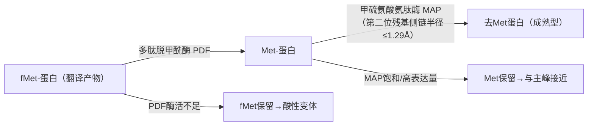
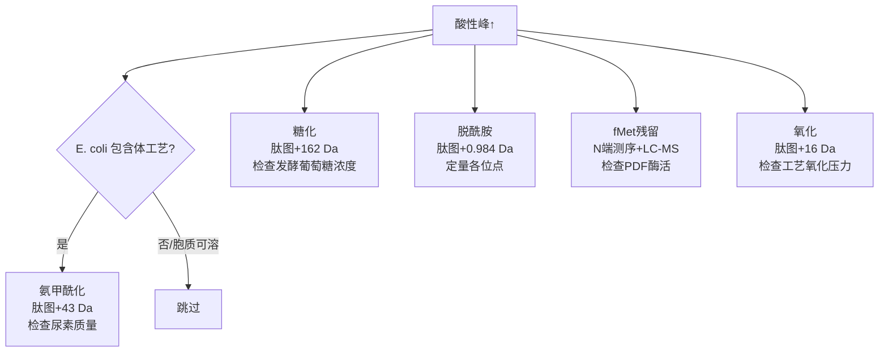

治疗性单抗（mAb）的质量控制依赖从分子结构到产品标准的全链条分析表征。本文先交代生物药表征的总体框架（发展历史、CQA 与参考品），再展开抗体结构基础、理化表征技术（糖型、尺寸变体、电荷变体、PTM 与高级结构），随后以 E. coli 表达系统为例讨论电荷变体的分子来源与排查策略，并介绍 ELISA 免疫学检测方法与 ASKB589 质量标准实例。凡含数字、单位、法规条款号、文献引用、超链接或图片引用的句子，均保留原始表述，未做改写或换算。

## 生物药表征框架：发展历史、CQA 与参考品

第一个重组生物药物：Humulin，由Genentech发明，礼来开发，1982上市；

> [!abstract] 摘要
> 本章为《Analytical Characterization of Biotherapeutics》导论章节，回顾重组蛋白药物的发展历史，介绍生物药分类体系，并总结通过糖基化修饰、Fc序列突变、亚型选择、稳定/可裂解linker连接等策略改造抗体以增强或调控药效的常见手段。

> [!summary] 核心要点
> - 首个重组生物药Humulin由Genentech发明、礼来开发，1982年上市，开启重组蛋白药物时代
> - 蛋白药物按结构/来源分类（见分类图）
> - 改造抗体效能的典型策略：糖基化修饰去岩藻糖化mAb（如Obinutuzumab）、Fc氨基酸序列突变（如ocaratuzumab）、采用不同人源亚型（Nivolumab用IgG4；Eculizumab用工程化IgG2m4，含H268Q/V309L/A330S/P331S四个关键突变）、稳定linker连接同型抗体、可裂解linker连接药物（ADC）、CAR-T及交联区域改造

**蛋白药物分类**[1]

*图源：《Analytical Characterization  of Biotherapeutics》*

**修改抗体药物的结构增加生物药的效能，下图展示抗体不同的机制**

1. Glycomodified afucosylated mAbs: Obinutuzumab;
2. Modifying the amino acid sequence of mAb Fc: ocaratuzumab;
3. use different human isotype: Nivolumab IgG4; Eculizumab采用IgG2m4[2]，含有IgG4的四个关键氨基酸(H268Q, V309L, A330S, and P331S)
4. link isotype to mAb with stable linker;
5. link drug to mAb with cleavable linker;
6. CAR-T;
7. Crosslink regions

**CQA**:  a physical, chemical, biological, or microbiological property or characteristic that should be within an appropriate limit, range, or distribution to ensure the desired product quality；

**Quality target product profile (QTPP)**： a prospective summary of the quality characteristics of a drug product that ideally will be achieved to ensure the desired quality, taking into account safety and efficacy of the drug product；

CQA来源于QTPP，随对产品和工艺的理解而变化；

抗体修饰PTM对其结构，稳定性和生物性质有深远的影响[9]；从监管机构的角度看，鉴定单抗上的PTM，并对PTM进行定位，不仅有助于理解蛋白结构和功能，还有助于鉴定影响总体纯度、活性和其他质量属性的非期望产物和降解物；

通过活细胞的生物合成途径生产的蛋白，其存在固有程度的结构异质性；因此，期望的产品是一种由期望翻译后修饰的形式组成的混合物；生产商应该定义期望产品的异质性类型，证明用于临床前研究和临床研究批次间的一致性；

> [!NOTE] Title
> According to ICH Q6B, an inherent degree of structural heterogeneity occurs in proteins due to the biosynthetic processes used by living organisms to produce them; therefore, the desired product can be a mixture of anticipated post-translationally modified forms (e.g., glycoforms)
> It is expected that the manufacturer should define the pattern of heterogeneity of the desired product and demonstrate consistency between lots used in preclinical and clinical studies.

**关于参考品**

- in-house reference material或者in-house reference standard (IRS)
- 作为表征的一部分，应当用生产批次样品建立参考品；
- 目的：用于中试规模和生产批次的理化和活性表征分析中的适用性测试（suitability test），用以评估数据质量；

## 抗体结构基础：可变区、铰链区、Fc 效应功能与命名

### 可变区与 CDR

抗体上结合抗原的部分：paratope或complementarity-determining regions (CDRs)；

- asparagine Asn (N), histidine (H), and tyrosine (Y)出现频率较高；
- 芳香氨基酸：phenyalanine (F), tyrosine (Y), and tryptophan (W)，出现在CDR中频率较高；

抗原上被抗体结合的部分：epitope或antigenic determinant；

### 铰链区：酶切敏感性与化学断裂

**铰链区酶切断裂**[3]

- matrilysin (referred to as MMP-7)：酶切下铰链区APEL/LGGP;
- stromelysin-1 (referred to as MMP-3)：
这两个酶能够在特定保守位点切割所有human IgG;

**铰链区酸碱催化断裂**

- 序列：–Asp–Lys–Thr– His–Thr– (–DKTHT–)
- 在pH8.0，62℃，10mM氯化铜，铜离子催化化学键断裂增加；断裂位点：DK/THT；

断裂相关的延伸文献：

Cohen SL, Price C, Vlasak J (2007) Beta-elimination and peptide bond hydrolysis: two distinct mechanisms of human IgG1 hinge fragmentation upon storage. J Am Chem Soc 129(22):6976–6977

Fragmentation of monoclonal antibodies - DOI: [10.4161/mabs.3.3.15608](https://doi.org/10.4161/mabs.3.3.15608)

### 恒定区与 Fc 效应功能

CH2结构域：

- 此结构域的疏水面被N297处的N糖遮住；
- ADCC：铰链区和CH2结构域与FcγR相互作用，激活效应细胞，释放细胞毒性颗粒中的分子，如perforin, granulysin, and granzymes；
	- 依赖于Fab与靶点间的结合亲和力；
	- 同时依赖于Fc与FcγR间结合亲和力；

CH3结构域

- 促进Fc的二聚化dimerization；
- CH2-CH3交界面与FcRn结合，增加抗体体内半衰期；

FcγR受体

> [!quote] **链接**
> 1. [Chapter 1—Antibody-dependent cellular cytotoxicity (ADCC)](https://reader-service.fcdn.sk/?source=5a526cd179f8a55ed4d02cd34ac5db97ec6ac428920ba23e5678912ef238658f&download_link=https%3A%2F%2Fzh.z-lib.fo%2Fdl%2F2204832%2F9d7dff)

High resolution mapping of the binding site on human IgG1 for Fc gamma RI, Fc gamma RII, Fc gamma RIII, and FcRn and design of IgG1 variants with improved binding to the Fc gamma R - DOI: [10.1074/jbc.M009483200](https://doi.org/10.1074/jbc.m009483200)

**调节抗体的效应器功能**

- ADCC
	- glycoengineering of the Fc N-glycans
		- 在岩藻糖化的多糖中，提高galacosyl- transferses表达，促进半乳糖化，提高G1F G2F比例；
		- 去岩藻糖：敲除fucosyltransferse, FUT-8；
	- engineering the Fc domain
		- S298A, K334A, E333A, and T256A，增加对FcγRIIIa的亲和力[4]；
- CDC
	- anti-CD20 Rituximab: 突变K326 and E333位点[5]；
	- 调节铰链区middle region的长度[6]

**Sequential numbering of the residues**

- Kabat numbering scheme：24-34,50-56,89-97
- Chotia numbering scheme：main chain conformations
- IMGT numbering scheme：无需对齐就可以比较不同序列的CDR和FR;
- AHo numbering scheme

### 治疗性单抗的演进与命名

首款抗体-Muromonab-CD3 (trade name Orthoclone OKT3，靶点：anti-CD3)，于985年上市，用于治疗减小肾移植排斥反应；

存在的问题：1.immunogenicity；2.cytokine release syndrome

首个chimeric antibody-Rituximab (Trade name: Mabthera/Rituxan, Genentech，靶点：CD20)，于1997年上市，获批用于难治性或复发性霍奇金淋巴癌；

humanized antibodies：将鼠源抗体的CDR嫁接到人抗上，替换掉人抗的CDR；

Human mAbs：利用转基因小鼠[7]或噬菌体展示技术[8]；首款人源单抗-Adalimumab(Trade name: Humira)，采用噬菌体展示技术，于2002年上市；

[**单抗命名**](https://www.who.int/docs/default-source/international-nonproprietary-names-%28inn%29/generalpoliciesmonoclonalantibodiesjan10.pdf)

prefix-substem A-substem B-suffix(mab)

- prefix：由厂家取；
- substem A: 描述靶点类型

- substem B: 描述序列来源种属

- suffix:一般为-mab；用于所有含免疫球蛋白可变区的产品；

嵌合抗体：Rituximab, Infliximab, and Cetuximab

人源化单抗：Trastuzumab, Bevacizumab, and Omalizumab

人源单抗：Adalimumab, Golimumab, and Ipilimumab

## 理化表征技术：糖型、尺寸变体、电荷变体、PTM 与高级结构

单抗的理化表征通常覆盖以下内容：

1. Physical properties: purity and residual process impurities;
	1. purity
		1. size variants
		2. charge variants
	2. process impurity: HCD/HCP
2. Structure
	1. primary structure
	2. higher order structure (HOS)
3. biological activity
4. PTM
5. Carbohydrate analysis
	1. glycan variants

Heterogeneity(异质性)：酶促反应，化学降解引入异质性；

- 研发早期阶段：上下游工艺的每一批都需要extensive characterization
	- size, charge and glycan heterogeneity
	- 目的：评估批间差异（batch to batch variability)
- 工艺变更、工艺优化：表征，确保批间一致性（ batch consistency)；
- 原料药或制剂后期生产或储存
	- 同样会引入异质性；
	- 同样需要表征，确保批次间一致性，尤其是用于临床前或临床批次；

### 糖型异质性分析

糖基化引入相当大的异质性；

糖基化的影响：

- safety/immunogenicity
- efficacy/biological activity
- clearance [pharmacodynamics/pharmacokinetic property (PD/PK)]

在上下游不同阶段，都需要监测糖性异质性，表征内容如下：

- carbohydrate content
	- 比较不同类型的糖型相对比例（测试样品和参考品间比较）[10] 
	- 检测方法：HILIC-HPLC-FLD
	- %afucosylation (G0+G1+G2)：去岩藻糖，增加Fc与FcγR结合，增强ADCC;
		- bisecting N-acetylglucosamine (GlcNAc)：增强ADCC；
	- %galactosylation (G1+G2+G1F+G2F): 高比例半乳糖化，增加与C1q结合，增强CDC；
	- %high mannose (M4+M5+M6+M7+M8)：影响PK，高比例高甘露糖，抗体清除越快；
	- %non-glycosylated heavy chain (NGHC)：影响抗体生物活性和效应器功能；
		- 采用R-CE-SDS检测
	- %sialylation content：对于MOA为ADCC的单抗，唾液酸通过抑制Fc与FcγRIII结合而减小ADCC
		- 定量NANA水平：单位mmol/mol;
- structure of the carbohydrate chain
- oligosaccharides and glycosylation sites

### 尺寸变体分析

高分子量（HMW）物种/聚集体与低分子量（LMW）物种/片段/降解产物。

**性质**：product related impurities

**影响**：引起免疫反应，影响免疫原性和成品的活性；因此，HMW and LMW定位为CQA；

#### Size exclusion chromatography

1. Hong P, Koza S, Bouvier ES. 2012. Size-Exclusion Chromatography for the Analysis of Protein Biotherapeutics and Their Aggregates. Journal of Liquid Chromatography and Related Technologies 35 (20): 2923–50.
2. Carpenter JF, Randolph TW, Jiskoot W, Crommelin DJ, Middaugh CR, Winter G. 2010. Potential Inaccurate Quantitation and Sizing of Protein Aggregates by Size Exclusion Chromatography: Essential Need to Use Orthogonal Methods to Assure the Quality of Therapeutic Protein Products. Journal of Pharmaceutical Sciences 99 (5): 2200–8.
3. Philo JS. 2009. A Critical Review of Methods for Size Characterization of NonParticulate Protein Aggregates. Current Pharmaceutical Biotechnology 10 (4): 359–72.

SEC-UPLC-ESI-MS[11]

> [!NOTE] 引用
> Furthermore, the native SEC-UV/MS method was able to resolve and detect the formation of aggregates and unbound light chain (LC) fragments in early stages of purification process

#### SEC 与聚集表征的延伸文献

REF1: Theory and Practice of Size Exclusion Chromatography for the Analysis of Protein Aggregates

REF2: Analytical Procedures for Recombinant Therapeutic Monoclonal Antibodies. USP General Chapter <129>. 2017.

ref3： Evaluation of Size Exclusion Chromatography Columns Packed With Sub-3μM Particles for the Analysis of Biopharmaceutical Proteins. J Chromatogr A.
     2017 May 19; 1498:80-89. doi: 10.1016/j.chroma.2016.11.056. Epub 2016 Nov 27. PMID: 27914608

ref4 Roberts, Christopher J. Therapeutic Protein Aggregation: Mechanisms, Design, and Control. Trends in biotechnology vol. 32,7 (2014): 372-80. doi:10.1016/j.tibtech.2014.05.005

ref5： Van der Kant R, Karow-Zwick AR, Van Durme J, et al. Prediction and Reduction of the Aggregation of Monoclonal Antibodies. J Mol Biol. 2017;429(8):1244-1261. doi:10.1016/j.jmb.2017.03.014.

REF: Fast, reproducible size-exclusion chromatography of biological macromolecules [doi.org/10.1016/0021-9673(96)00283-X](https://doi.org/10.1016/0021-9673(96)00283-X "Persistent link using digital object identifier")

REF：The critical role of mobile phase composition in size exclusion chromatography of protein pharmaceuticals [doi.org/10.1002/jps.21974](https://doi.org/10.1002/jps.21974 "Persistent link using digital object identifier")

REF: Unraveling the mysteries of modern size exclusion chromatography - the way to achieve confident characterization of therapeutic proteins [doi.org/10.1016/j.jchromb.2018.06.029](https://doi.org/10.1016/j.jchromb.2018.06.029 "Persistent link using digital object identifier")

Classification and characterization of therapeutic antibody aggregates - DOI: [10.1074/jbc.M110.160457](https://doi.org/10.1074/jbc.m110.160457)

Cromwell, M. E. M.; Hilario, E.; Jacobson, F. Protein Aggregation and Bioprocessing. AAPS J 2006, 8 (3), E572–E579.

#### Sodium dodecyl sulfate-polyacrylamide gel electrophoresis

monitor overall size fragmentation in the monoclonal antibody

可以用于判断聚集体是共价还是非共价的；

#### Capillary electrophoresis-sodium dodecyl sulfate

bare fused silica capillary (effective length 20.2 cm and internal diameter 50 μm)

存在thermal induced fragmentation，需要优化制样条件[12]

- 样品buffer：pH，烷基化需要较高的pH，另外，在酸性pH(低于6.5)SDS-蛋白复合物溶解性差，会导致主峰变宽；
- 烷基化试剂浓度：非还原CE-SDS中，需要加IAM，减少制样导致的碎裂；注意buffer pH：大于8.0；
- 孵育时间

### 电荷变体分析

Stanley Chung,Jun Tian,Zhijun Tan,et,al.Industrial bioprocessing perspectives protein charge variant profiles.Biotechnol Bioeng.2018 Jul;115(7):1646-1665.

**形成acidic species**

- Deamidation
- N-terminal pyroGlu
- cysteine variants
- glycation
- 唾液酸
- 氧化
- C-terminal lysine clipping

**形成basic species**

- C-terminal lysine
- C-terminal amidation
- Succinimide
- Isomerization of aspartate to isoaspartate

分析技术：

- 色谱：分离基于表面电荷；基于分离时间定义酸性组分和碱性组分；
	- CEX(阳离子交换)[13] [14]：文献重要
		- 出峰顺序，酸性峰-主峰-碱性峰；
		- 适用于抗体的电荷变体定性和定量分析；
		- 盐洗脱：buffer pH一般为6-7.5
		- pH洗脱：pH4-10
	- AEX（阴离子交换）：出峰顺序，碱性峰-主峰-酸性峰；
- 电泳：分离基于整体净电荷；基于pI定义酸性组分和碱性组分
	- cIEF[15] cIEF标准操作规程
		- 带涂层的毛细管
		- 两性电解质：ampholyte（pH3-10)（GE 货号17-0456-01），用于形成pH梯度；
		- 优化点：
			- 蛋白浓度：蛋白浓度高，溶解度差的蛋白会沉淀，导致重复性差；
			- 聚焦时间：确保形成完全的pH梯度；
			- 阴极稳定液和阳极稳定液：保持pH梯度稳定，阻止样品和两性电解质丢失；
			- 两性电解质（ampholytes）需要足够的浓度；但浓度过高，会产生噪音（焦耳热）；
			- 尿素：增强蛋白的溶解性，尤其是在pI附近；低溶解性导致蛋白沉淀和聚集，进一步导致分离可重复性差；
			- Methylcellulose (MC)浓度：一般采用0.35%；作为筛分基质减小电渗流，作为动态包膜介质阻止蛋白吸附到毛细管内壁；
	- capillary zone electrophoresis (CZE)[16] [17]
		- 毛细管
			- permanently coated capillary，阻止电渗流；
			- 裸管+dynamic coating=dynamically coated fused-silica capillary
		- CZE running buffer
			- 添加剂1：Epsilon amino caproic acid (EACA)，与毛细管壁的硅羟基结合，减小蛋白与硅羟基结合；
			- 添加剂2: Triethylenetetramine (TETA)，在毛细管壁上形成动态包膜，阻止蛋白与硅羟基结合；改善峰形和分离度；
			- 添加剂3：Hydroxypropyl methyl cellulose (HPMC)，粘度改善剂；
		- 使用场景：He Y[17]开发的CZE适用于**pI大于7的抗体**；对于pI较低的蛋白，需要方法开发；
		- 酸冲洗（acid conditioning）：0.1N HCI使得毛细管内壁硅羟基不会解离，便于HPMC吸附到中性表面，此外，EACA可以结合残留的硅羟基（解离）；

effect of charge heterogeneity on the structure, stability, binding kinetics and biological behavior (potency, immunogenicity) in therapeutics monoclonal antibodies varies from molecule to molecule, thus emphasizing on the need to characterize the heterogeneity and assuring batch to batch consistency to generate safe and efficacious antibody drugs.

需要深入理解形成酸性峰和碱性峰的PTM及其修饰位置和修饰程度，这对抗体开发很重要；

电荷变体表征的延伸文献：

Determination of Isoelectric Points and Relative Charge Variants of 23 Therapeutic Monoclonal Antibodies. J Chromatogr B Analyt Technol Biomed Life Sci. 2017 Oct 15;1065-1066:119-128. doi: 10.1016/j.jchromb.2017.09.033. Epub 2017 Sep 22. PMID: 28961486.

[Monoclonal Antibody Development and Physicochemical Characterization by High Performance Ion Exchange Chromatography | IntechOpen](https://www.intechopen.com/chapters/28723)

### 肽图与 PTM 鉴定

肽图(peptide mapping)

Simultaneous monitoring of oxidation, deamidation, isomerization, and glycosylation of monoclonal antibodies by liquid chromatography-mass spectrometry method with ultrafast tryptic digestion. mAbs. 2016;8(8):1477–1486.

Analytical similarity assessment of rituximab biosimilar CT-P10 to reference medicinal product. mAbs. 2018;10(3):380–396

PTM 定量与序列变体文献：

Quantification of protein posttranslational modifications using stable isotope and mass spectrometry I: principles and applications - DOI: [10.1016/j.ab.2011.12.004](https://doi.org/10.1016/j.ab.2011.12.004)

Quantification of protein posttranslational modifications using stable isotope and mass spectrometry. II. Performance - DOI: [10.1016/j.ab.2011.12.003](https://doi.org/10.1016/j.ab.2011.12.003)

Detecting low level sequence variants in recombinant monoclonal antibodies - DOI: [10.4161/mabs.2.3.11718](https://doi.org/10.4161/mabs.2.3.11718)

### 高级结构表征

secondary, tertiary, and quaternary structure

ICHQ5E中规定，生产工艺发生变化，应做高级结构检测，确保工艺变更后产品构象不会改变；

高级结构检测：不会在批放行检测，稳定性检测中做；但会在早期和后期产品表征以及相似性比较中做；

高级结构检测技术

- circular dichroism (CD)[18]
	- 利用分子对左旋、右旋偏振光差异性吸收；
	- Far-UV CD (190–250 nm)：检测二级结构；手性肽键非对称性堆积；
	- near UV-CD (250–350 nm)：检测三级结构；受芳香氨基酸的微环境和二硫键影响；
- Fourier transform infrared spectroscopy (FTIR)
	- 二级结构：α-helix, β-sheet (intramolecular and intermolecular), β turns and side chain vibrations
	- the amide-I bond (1600–1700 cm−1)：C=O 和C-N bond stretching vibration
	- amide-II bond (1550 cm−1)：N-H bending，C-N和C-C stretching vibrations
- intrinsic fluorescence
	- 监测Trp的环境，改变温度，检测intrinsic fluorescence
- extrinsic fluorescence
- differential scanning calorimetry (DSC)

不同批次抗体高级结构的可比性分析

## 电荷变体的分子机制：E. coli 表达蛋白的 PTM 谱与 IEX 分析

> [!abstract] 摘要
> 大肠杆菌（*E. coli*）是生物类似药重要的原核表达系统，其PTM谱与哺乳动物细胞（如CHO）存在本质差异。本文系统梳理 *E. coli* 表达蛋白的PTM类型，重点分析各修饰对IEX（离子交换色谱）电荷变体峰型的影响，并针对生物类似药酸性峰偏高问题给出排查思路。
>
> **详细叙述版（含完整机制解析）**见 大肠杆菌表达蛋白PTM与IEX电荷变体-详细报告。

> [!summary] 核心要点
> - 原液质量标准
> - 半成品与成品质量标准
> - 工作对照品质量标准
> - 安慰剂质量标准

### IEX 电荷变体概念

离子交换色谱（IEX）依据蛋白质**净电荷差异**分离电荷异质体。以阳离子交换色谱（CEX）为例：

| 峰类型 | 定义 | CEX行为 | AEX行为 |
|--------|------|---------|---------|
| **酸性变体** | pI 低于主峰，负电荷↑（正电荷↓） | 提前洗脱（前峰） | 滞后洗脱 |
| **主峰** | 主要物种 | — | — |
| **碱性变体** | pI 高于主峰，正电荷↑（负电荷↓） | 滞后洗脱（后峰） | 提前洗脱 |

> [!info] 参考方法
> IEX电荷变体分析参见 Charge variants电荷异质体 及 Peptide mapping。

电荷变体来源于细胞培养/发酵过程中的酶促与非酶促PTM、下游加工及储存中的降解。[19]

### E. coli 的 PTM 全景

> [!warning] 与哺乳动物系统的关键差异
> *E. coli* **缺乏N-糖基化能力**，在 *E. coli* 生物类似药中**不存在**。比较分析时须排除此因素。

#### N端修饰（*E. coli* 特有，至关重要）

##### N-甲酰甲硫氨酸（fMet）保留

*E. coli* 翻译以 N-甲酰甲硫氨酰-tRNA（fMet-tRNAi）起始。正常加工流程：

甲硫氨酸氨肽酶（MAP）切除N端Met（仅当第二位氨基酸侧链半径≤1.29 Å时，即Gly、Ala、Ser、Thr、Cys、Val、Pro）

**高表达时的问题**：MAP饱和或缺乏 Co²⁺/Mn²⁺ cofactor → N端异质性，fMet保留蛋白因α-氨基被甲酰基封闭而**偏向酸性**。[20][21][22]

**IEX影响**：

| 变体类型 | 相对电荷 | IEX峰位置 |
|---------|---------|-----------|
| +fMet（甲酰基封闭α-NH₂） | 负电荷↑ | 酸性峰 |
| +Met（α-NH₃⁺正常） | 等同主峰或微差 | 接近主峰 |
| −Met（去Met，暴露次级N端） | 取决于次级残基电荷 | 视蛋白而定

> [!example] 实验证据
> Rajagopalan等（2004）证明，加入PDF抑制剂 actinonin 后，*E. coli* 重组蛋白大量保留甲酰基，形成独立的**酸性前峰**。[22]

##### N端焦谷氨酸（pyroGlu）形成

若成熟蛋白N端为 **Gln（Q）** 或 **Glu（E）**，可发生环化反应：

| 起始残基 | 产物 | 电荷变化 | IEX结果 |
|---------|------|---------|--------|
| N-Gln（+1，α-NH₃⁺；侧链酰胺，中性） | pyroGlu（失去α-NH₃⁺，形成内酰胺环） | **−1 正电荷** | ==**酸性峰**== |
| N-Glu（α-NH₃⁺=+1；侧链 COO⁻=−1） | pyroGlu（失去NH₃⁺和侧链COO⁻） | **净失去−1负电荷** | ==**碱性峰**== |

> [!tip] 关键区分
> Dick等（2007）证明：质量变化相同（−17 Da），但 **来源于Gln→酸性峰**，**来源于Glu→碱性峰**。[23][24]

#### 脱酰胺化（Deamidation）— **最重要的酸性峰来源** ⭐⭐⭐

**机制**

$$\text{Asn} \xrightarrow{\text{pH 7.4, 37°C}} \text{succinimide} \xrightarrow{\text{水解}} \underbrace{\text{isoAsp（~75\%）} + \text{Asp（~25\%）}}_{\text{均带负电荷，pKa ≈ 3.5–4.0}}$$

- 每个脱酰胺事件引入 **−1 净电荷** → pI 下降 → ==**酸性变体**==
- 序列依赖：**Asn-Gly 速率最快**，Asn-Ser、Asn-Thr、Asn-Asn 次之
- Gln（Q）→ Glu（E）脱酰胺速率更慢，同样产生酸性偏移

**E. coli 重组蛋白中的证据**

以大肠杆菌表达的重组人生长激素（rhGH）为例：在40°C加速降解及4°C长期储存中，脱酰胺组分（I4）比例显著增加，CEX分析中表现为**酸性前峰**。[25][26]

> [!note] 检测方法
> 通过 肽图LC-MS 鉴定脱酰胺位点，质量偏移 +0.984 Da（Asn→Asp）。

#### 天冬氨酸异构化与琥珀酰亚胺中间体

| 形式 | 电荷 | IEX结果 |
|------|------|--------|
| Asp（正常，带COO⁻） | −1 | 主峰 |
| **Asu（琥珀酰亚胺，环状，失去COO⁻）** | 0 | ==**碱性峰**== |
| isoAsp（Asu水解产物） | −1 | 酸性或主峰附近 |

> [!example] 关键文献
> Becker等（1991）从 *E. coli* 表达的**甲硫氨酰-人生长激素（met-hGH）**中，首次分离出琥珀酰亚胺变体，经AEX分离为==碱性后峰==。[27]

#### 氧化修饰

| 位点 | 质量变化 | 电荷影响 | IEX结果 |
|------|---------|---------|--------|
| Met → Met-sulfoxide | +16 Da | 基本无直接电荷变化 | 蛋白特异，碱性或酸性均可 |
| Trp → 犬尿氨酸/羟色氨酸 | +4/+16 Da | 微弱负电荷 | 微弱酸性偏移 |
| His 氧化 | +16 Da | 降低His pKa | 微弱酸性偏移 |

> [!warning] 注意
> *E. coli* 包含体复性过程（氧化/还原环境）易引起氧化修饰。单纯Met氧化**不直接改变净电荷**，但可通过构象变化间接影响IEX保留。

#### 糖化（Glycation，非酶促 Maillard 反应）⭐⭐⭐

$$\text{Lys（ε-NH}_2\text{）+ 葡萄糖} \xrightarrow{\text{Maillard}} \text{糖化Lys（+162 Da）}$$

- 消耗 Lys 氨基正电荷（**−1**）→ ==**酸性变体**==
- *E. coli* 高密度发酵中葡萄糖浓度过高是主要风险
- Quan等（2019）证明，降低培养氧化应激可减少糖化及酸性变体比例[28]

#### 氨甲酰化（Carbamylation）— **E. coli 包含体工艺特有风险** ⭐⭐⭐

> [!danger] E. coli 特有酸性峰来源
> CHO/哺乳动物细胞原研药中**基本不存在**氨甲酰化，是与原研比较时酸性峰偏高的重要鉴别点。

$$\text{–NH}_2 + \text{KOCN（氰酸盐）} \xrightarrow{\text{尿素水解产物}} \text{–NH–CO–NH}_2 \quad (+43\ \text{Da})$$

- 发生位点：Lys ε-NH₂ 和 N端 α-NH₂
- 消耗氨基正电荷（**−1**）→ ==**酸性变体**==
- **风险因素**：尿素储液在室温久置（>24h）→ 氰酸盐浓度急剧升高
- LC-MS肽图质量偏移 +43.006 Da 可确认

#### 赖氨酸酰化（*E. coli* 内源PTM）

##### 赖氨酸乙酰化（Kac）

- Nε-乙酰化中和 Lys 正电荷（+1→0），质量 +42 Da → ==**酸性变体**==
- Weinert等（2013）在野生型 *E. coli* 鉴定 **782种蛋白的2803个Kac位点**[29]

##### 赖氨酸琥珀酰化（Ksuc）

- 将 Lys ε-NH₃⁺（+1）转变为带负电的琥珀酰胺（−1），净变化 **−2**
- 质量 +100 Da，是最强的酸性偏移赖氨酸修饰
- Zhang等（2011）在 *Nature Chemical Biology* 首次鉴定，*E. coli* 中 670种蛋白的 2580个位点[30]

#### 二硫键相关修饰

| 修饰类型 | 机制 | 电荷影响 | IEX结果 |
|---------|------|---------|--------|
| **半胱氨酸化（Cysteinylation）** | 游离Cys与蛋白巯基形成混合二硫键（+119 Da） | 添加游离Cys的COO⁻（微弱负电荷） | 微弱酸性偏移 |
| **二硫键错配（Disulfide Scrambling）** | 包含体复性中错误配对 | 构象改变，非直接电荷变化 | 异质峰 |

> [!info] 参考
> 关于 *E. coli* 二硫键形成机制，见 Jurado等（2011）综述[31]。

#### 磷酸化

- *E. coli* Ser/Thr/Tyr 激酶对异源蛋白的底物特异性较窄
- 每个磷酸化事件添加 **−2** 电荷（强烈酸性偏移）
- 实际发生率相对较低，通过 肽图 +80 Da 确认

### PTM 与 IEX 电荷变体汇总表

| PTM类型 | *E. coli* 相关性 | 电荷净变化 | IEX峰型 |
|---------|:--------------:|:--------:|:------:|
| **N-甲酰化Met（fMet）保留** | ★★★ | α-NH₂不可离子化，↓正电荷 | ==酸性峰== |
| **脱酰胺（Asn→Asp/isoAsp）** | ★★★ | −1/事件 | ==酸性峰== |
| **N端 pyroGlu（来自Gln）** | ★★ | −1正电荷 | ==酸性峰== |
| **N端 pyroGlu（来自Glu）** | ★★ | 净失去−1负电荷 | **碱性峰** |
| **糖化（Lys/N端）** | ★★★ | −1正电荷 | ==酸性峰== |
| **氨甲酰化（包含体复性尿素）** | ★★★（特有）| −1正电荷 | ==酸性峰== |
| **Asp琥珀酰亚胺（Asu）中间体** | ★★ | −1负电荷消失 | **碱性峰** |
| **Met氧化** | ★★ | ≈0（构象效应） | 蛋白特异性 |
| **Trp/His氧化** | ★ | 微弱负电荷 | 微弱酸性偏移 |
| **赖氨酸乙酰化（Kac）** | ★★ | −1正电荷 | ==酸性峰== |
| **赖氨酸琥珀酰化（Ksuc）** | ★★ | −2净变化 | ==酸性峰== |
| **半胱氨酸化** | ★ | 微弱负电荷 | 微弱酸性偏移 |
| **二硫键错配** | ★★（包含体工艺）| 非直接电荷 | 异质峰 |
| **磷酸化** | ★ | −2/事件 | ==酸性峰== |
| **N-糖基化/唾液酸化** | ✗（*E. coli* 无）| — | — |
| **C端Lys截切** | ★（CHO更常见）| +1 | **碱性峰** |

> ★★★ 高度相关 ｜ ★★ 中度相关 ｜ ★ 低度/偶发 ｜ ✗ 不存在

### 生物类似药酸性峰偏高的排查策略

> [!summary] 核心问题
> 大肠杆菌重组表达的生物类似药IEX酸性峰高于原研，需从以下维度排查：

#### 优先排查项（工艺相关）

| 排查顺序 | 可能原因 | 检测方法 | 质量偏移 |
|---------|---------|---------|--------|
| ① | **氨甲酰化**（包含体路径特有） | 肽图LC-MS | +43.006 Da |
| ② | **脱酰胺** | 肽图LC-MS | +0.984 Da（Asn→Asp） |
| ③ | **糖化** | 肽图LC-MS | +162.053 Da（Hex） |
| ④ | **fMet/formyl-Met 残留** | N端测序 + LC-MS | +28 Da（formyl） |
| ⑤ | **氧化** | 肽图LC-MS | +16 Da（Met/Trp/His） |

#### 参照物差异分析

若原研为 **CHO细胞表达**：

- 原研酸性峰可能主要来自**唾液酸化糖型**（*E. coli* 无此修饰），比较时应扣除
- 生物类似药酸性峰若主要来自**脱酰胺或氨甲酰化**，属于**质量差异**，需工艺优化控制

若原研也为 ***E. coli* 表达**：

- 主要来源于**工艺参数差异**（温度、pH、尿素质量、葡萄糖浓度、发酵时间）
- 建议开展多属性方法（MAM）同步定量各修饰

> [!note] 延伸阅读
> - Challenges and Strategies for a Thorough Characterization of Antibody Acidic Charge Variants. 2022. [PMC9687119](https://pmc.ncbi.nlm.nih.gov/articles/PMC9687119/)
> - Zhao J, et al. Understanding the pathway and kinetics of aspartic acid isomerization in peptide mapping methods for monoclonal antibodies. *Anal Chem*. 2021;93(12):5107–14. [PubMed:33543314](https://pubmed.ncbi.nlm.nih.gov/33543314/)
> - Large-scale analysis of post-translational modifications in *E. coli* under glucose-limiting conditions. *BMC Genomics*. 2017. [PMC5392934](https://pmc.ncbi.nlm.nih.gov/articles/PMC5392934/)
> - Expression of Recombinant Proteins with Uniform N-Termini. *PLoS One*. 2011. [PMC3107599](https://pmc.ncbi.nlm.nih.gov/articles/PMC3107599/)

## 免疫学检测方法：ELISA 的形式选择与操作要点

中国药典1103通则免疫学检查法-酶联免疫吸附测定(ELISA)，涵盖竞争法、夹心法等多种检测形式及操作要点。

### 竞争法 ELISA

**Competitive ELISAs**

1. direct antibody competitive ELISA
    - 检测的是抗原; 检测用的是抗体偶联物
    - 需要偶联酶的抗原特异性抗体；需要纯化的抗原；
    - 抗原包被在板子上，抗体偶联物与含抗原的样品混合孵育，再加入孔板上孵育，再洗掉未结合的抗体抗原结合物；加底物检测；
    - 对照组：不含抗原的buffer，加到孔板上；
    - 另一种形式：捕获抗体包被在板子上，标记的抗原和样品的抗原竞争结合捕获抗体；如 抗原生物素化标记，检测物是链霉亲和素标记的HRP；
2. direct antigen competitive ELISA
    - 检测的是抗体；检测用的是标记的抗原；
    - 抗体包被在板子上；
3. indirect antibody competitive ELISA
    - 检测的是抗原；检测用的是标记的anti-IgG 检测抗体；
4. indirect antigen competitive ELISA
    - 检测的是抗体；检测用的是标记的secondary antibody

### 夹心法 ELISA

**Sandwich ELISA**

1. direct sandwich ELISA: 需要两个抗体，分别结合抗原的==不同表位==
2. indirect sandwich ELISA：使用==anti-Ig antibody==替代标记的检测抗体；capture antibody 和detect antibody==来自不同种属==
3. bridging ELISA：捕获抗体和检测抗体是同一个抗体
    - 抗体是单抗的话，抗原上至少含两个相同的抗原结合位点，两个位点有一定的间距，避免空间位阻效应；
    - 抗体是多克隆抗体的话，要求抗原足够大，可以结合两个抗体分子；

## 质量标准实例：ASKB589 从原液到制剂的放行检测

>[!abstract] 摘要
>本笔记以图片形式汇总了ASKB589单抗产品从原液到制剂各阶段（原液、半成品、成品、工作对照品、安慰剂）的质量标准（放行检测项目及可接受标准）。

>[!summary] 核心要点
>- 原液质量标准
>- 半成品与成品质量标准
>- 工作对照品质量标准
>- 安慰剂质量标准

[原始文档链接](https://app.yinxiang.com/shard/s33/nl/1/384cf89e-ba5c-4fe3-8aa5-045427f2d657?title=589%E8%B4%A8%E9%87%8F%E6%A0%87%E5%87%86)

### 原液质量标准

### 半成品质量标准

### 成品质量标准

### 工作对照品质量标准

### 安慰剂质量标准

## 小结与延伸：表征策略的整合边界、工具与索引

综合各章：ICH Q6B 允许"期望产品"本身是多种翻译后修饰形式的混合物，但要求生产商定义异质性模式并在临床前/临床批次间证明一致性；IH Q5E 则将高级结构检测置于工艺变更场景中，而非常规批放行。理化表征的层级（尺寸、电荷、糖型、PTM、HOS）与免疫学检测（ELISA）分别回答"是什么"与"结合活性如何"两类问题，最终汇总为原液到成品的质量标准。E. coli 表达系统的电荷变体分析提醒我们，同样的酸性峰在不同表达系统中可能对应完全不同的分子机制（氨甲酰化、fMet 保留、糖化或脱酰胺），生物类似药比较时需要结合肽图 LC-MS 逐项确认。这正是参考品（IRS）与多属性方法（MAM）在单抗开发中不可替代的原因。本文的适用边界亦应明确：糖型与电荷异质性的具体组成因分子而异，charge heterogeneity 对 potency 与 immunogenicity 的影响需要个案评估；ELISA 的形式选择取决于待测物是抗原还是抗体、以及试剂是否标记；质量标准的具体可接受标准未在本文展开（图片内容见 ASKB589 实例）。

### 常用工具与在线资源

质谱数据处理：

1. 分子量（平均/单同位素）计算：[NIST Mass and Fragment Calculator Software | NIST](https://www.nist.gov/services-resources/software/nist-mass-and-fragment-calculator-software)
2. prospector： http://prospector.ucsf.edu/prospector/mshome.htm
3. 分子量和电荷数计算：[ESIprot Online (bioprocess.org)](http://www.bioprocess.org/esiprot/esiprot_form.php)
4. Expasy生物信息工具 [SIB Swiss Institute of Bioinformatics | Expasy](https://www.expasy.org/)
5. 肽图多肽预测：[PeptideMass (expasy.org)](https://web.expasy.org/peptide_mass/)
6. 糖型预测：[ExPASy - GlycoMod tool](https://web.expasy.org/glycomod/)
7. 糖型分子量计算：[GlycanMass (expasy.org)](https://web.expasy.org/glycanmass/)
8. 糖肽鉴定工具glycomod：[https://web.expasy.org/glycomod/](https://web.expasy.org/glycomod/)
9. eptideCutter酶切肽段预测 https://web.expasy.org/peptide_cutter/
10. GenScript Bioinformatics Workbench http://bio.genscript.com/gbf
11. 序列比对Multiple Sequence Alignment - CLUSTALW https://www.genome.jp/tools-bin/clustalw
     ESPript 3.x / ENDscript 2.x http://espript.ibcp.fr/ESPript/cgi-bin/ESPript.cgi
12. ExPASy - FindMod tool https://web.expasy.org/findmod/
13. Unimod  http://www.unimod.org/modifications_list.php?

Protocol 资源：

[UWPR (washington.edu)](https://proteomicsresource.washington.edu/methods.php)

蛋白组学资源：

蛋白组学blog：https://proteomicsnews.blogspot.com/

多肽碎裂：https://www.uab.edu/proteomics/pdf_files/2011/BMG744-01-14-11.pdf

### 相关笔记索引

- Analytical technology/antibody titer determination
- Analytical technology/ELISA Assay/相关性分析-Spearman's rank correlation
- Analytical technology/HPLC色谱柱相关知识
- Analytical technology/支原体检测-mycoplasma detection
- Antibody-Characterization/Characteriation of protein therapeutics using mass spectrometry/Chapter2 Quantitative Analysis of Therapeutic  and Endogenous Peptides using  LC-MSMS Methods
- Antibody-Characterization/Characteriation of protein therapeutics using mass spectrometry
- Antibody-Characterization总目录
- Charge variants电荷异质体
- PTM
- Peptide mapping
- 大肠杆菌表达蛋白PTM与IEX电荷变体-详细报告

## 参考文献

1. Carter PJ (2011) Introduction to current and future protein therapeutics: a protein engineering perspective. Experimental cell research 317(9):1261–1269
2. An Z, et al. (2009) IgG2m4, an engineered antibody isotype with reduced Fc function. mAbs 1(6):572–579
3. Selective cleavage of human IgG by the matrix metalloproteinases, matrilysin and stromelysin；- DOI: [10.1016/s0165-2478(01)00333-9](https://doi.org/10.1016/s0165-2478(01)00333-9)
4. High resolution mapping of the binding site on human IgG1 for Fc gamma RI, Fc gamma RII, Fc gamma RIII, and FcRn and design of IgG1 variants with improved binding to the Fc gamma R - DOI: [10.1074/jbc.M009483200](https://doi.org/10.1074/jbc.m009483200)
5. Engineered antibodies with increased activity to recruit complement. Journal of Immunology
6. Modulation of the effector functions of a human IgG1 through engineering of its hinge region. Journal of Immunology. 2006;177(2):1129–1138.
7. Molecular insights into fully human and humanized monoclonal antibodies: What are the differences and should dermatologists care?
8. Phage display for the generation of antibodies for proteome research, diagnostics and therapy. Molecules (Basel, Switzerland). 2011;16(1):412–426.
9. Characterization of glycosylation in monoclonal antibodies and its importance in therapeutic antibody development. Critical Reviews in Biotechnology. 2021a;4-1(2):300–315.
10. Analytical similarity assessment of rituximab biosimilar CT-P10 to reference medicinal product. mAbs. 2018;10(3):380–396
11. Rapid characterization of biotherapeutic proteins by size-exclusion chromatography coupled to native mass spectrometry. mAbs. 2016;8(2):331–339
12. Optimization and validation of a quantitative capillary electrophoresis sodium dodecyl sulfate method for quality control and stability monitoring of monoclonal antibodies. Analytical Chemistry. 2006;78(18):6583–6594.
13. Method development for the separation of monoclonal antibody charge variants in cation exchange chromatography, part I: salt gradient approach. Journal of Pharmaceutical and Biomedical Analysis. 2015a;102:33–44.
14. Method development for the separation of monoclonal antibody charge variants in cation exchange chromatography, part II: pH gradient approach. Journal of Pharmaceutical and Biomedical Analysis. 2015b;102:282–289.
15. Intercompany study to evaluate the robustness of capillary isoelectric focusing technology for the analysis of monoclonal antibodies. Chromatographia. 2011;73:1137–1144
16. Analysis of recombinant monoclonal antibodies by capillary zone electrophoresis. Electrophoresis. 2013;34(8):1133–1140.
17. He Y, Isele C, Hou W, Ruesch M. Rapid analysis of charge variants of monoclonal antibodies with capillary zone electrophoresis in dynamically coated fused-silica capillary. J Sep Sci. 2011;34:548-55. [https://doi.org/10.1002/jssc.201000719](https://doi.org/10.1002/jssc.201000719)
18. Accuracy of protein secondary structure determination from circular dichroism spectra based on immunoglobulin examples. Analytical Biochemistry. 2003;321(2):183–187.
19. Zhang Z, et al. Risk-Based Control Strategies of Recombinant Monoclonal Antibody Charge Variants. *Antibodies (Basel)*. 2022;11(4):68. [PMC9703962](https://pmc.ncbi.nlm.nih.gov/articles/PMC9703962/)
20. Frottin F, et al. The proteomics of N-terminal methionine cleavage. *Mol Cell Proteomics*. 2006;5(12):2336–49. [PMC5663234](https://pmc.ncbi.nlm.nih.gov/articles/PMC5663234/)
21. Liao YD, et al. Removal of N-terminal methionine from recombinant proteins by engineered *E. coli* methionine aminopeptidase. *Protein Sci*. 2004;13(7):1802–10. [PubMed:15215523](https://pubmed.ncbi.nlm.nih.gov/15215523/)
22. Rajagopalan PTR, et al. Expression of N-formylated proteins in *Escherichia coli*. *Anal Biochem*. 2004;328(2):241–3. [PubMed:14965779](https://pubmed.ncbi.nlm.nih.gov/14965779/)
23. Dick LW Jr, et al. Determination of the origin of the N-terminal pyro-glutamate variation in monoclonal antibodies using model peptides. *Biotechnol Bioeng*. 2007;97(3):544–53. [doi:10.1002/bit.21260](https://analyticalsciencejournals.onlinelibrary.wiley.com/doi/10.1002/bit.21260)
24. Rouby G, et al. Cyclization of N-Terminal Glutamic Acid to pyro-Glutamic Acid Impacts Monoclonal Antibody Charge Heterogeneity Despite Its Appearance as a Neutral Transformation. *J Pharm Sci*. 2019;108(9):2905–10. [PubMed:31145921](https://pubmed.ncbi.nlm.nih.gov/31145921/)
25. Perez-Almodovar EX, et al. Characterization of the aggregation propensity of charge variants of recombinant human growth hormone. *Int J Pharm*. 2022;621:121793. [PubMed:35504429](https://pubmed.ncbi.nlm.nih.gov/35504429/)
26. Stability study of somatropin by capillary zone electrophoresis. *J Pharm Biomed Anal*. 2010. [ScienceDirect](https://www.sciencedirect.com/science/article/pii/S1876619609004045)
27. Becker GW, et al. Isolation and characterization of a succinimide variant of methionyl human growth hormone. *J Biol Chem*. 1991;266(9):5494–501. [PubMed:1856190](https://pubmed.ncbi.nlm.nih.gov/1856190/)
28. Quan C, et al. Modulating cell culture oxidative stress reduces protein glycation and acidic charge variant formation. *MAbs*. 2019;11(3):518–33. [PubMed:30602334](https://pubmed.ncbi.nlm.nih.gov/30602334/)
29. Weinert BT, et al. Lysine succinylation is a frequently occurring modification in prokaryotes and eukaryotes and extensively overlaps with acetylation. *Cell Rep*. 2013;4(4):842–51. [PMC3861704](https://pmc.ncbi.nlm.nih.gov/articles/PMC3861704/)
30. Zhang Z, et al. Identification of lysine succinylation as a new post-translational modification. *Nat Chem Biol*. 2011;7(1):58–63. [doi:10.1038/nchembio.495](https://www.nature.com/articles/nchembio.495)
31. Jurado P, et al. Disulfide bond formation and its impact on the biological activity and stability of recombinant therapeutic proteins produced by *E. coli*. *Biotechnol Adv*. 2011;30(1):1–13. [PubMed:21824512](https://pubmed.ncbi.nlm.nih.gov/21824512/)