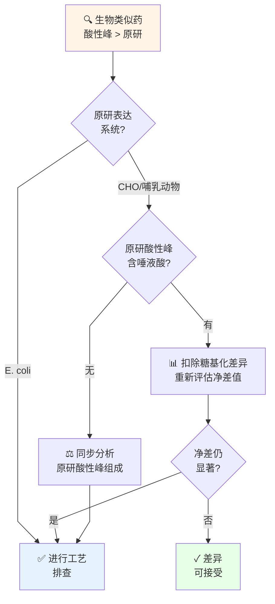

## PTM

本文汇总该主题下 11 篇笔记，分为若干部分。


> [!abstract]
> **核心内容**：对大肠杆菌表达系统中导致重组蛋白酸性峰升高的PTM进行全面分析，包括脱酰胺、琥珀酰化、氨甲酰化等非酶促修饰，以及N端甲酰化、磷酸葡萄糖酰化等大肠杆菌特有的修饰。通过IEX和LC-MS/MS正交分析，为生物类似药的工艺开发和优化提供指导。

# **大肠杆菌重组表达蛋白翻译后修饰全景及酸性电荷异质性形成机制深度研究报告**

## **绪论**

在现代生物制药领域，重组蛋白及生物类似药（Biosimilars）的开发需要对其物理化学性质进行极其严苛的表征，以确保产品在安全性、纯度和效价上与原研药物具有高度的一致性。根据国际人用药品注册技术协调会（ICH）Q6B指南的规定，蛋白质的电荷异质性（Charge Heterogeneity）是必须严格监控的关键质量属性（CQA）之一[^1]。在工业界，通常采用阳离子交换色谱（CEX）或阴离子交换色谱（AEX）来表征这些电荷变异体。当变异体的等电点（pI）低于主峰产品时，其在阳离子交换色谱中会更早洗脱，这类物质被统称为酸性峰（Acidic Species）；反之，等电点高于主峰的变异体则被称为碱性峰（Basic Species）[^3]。
大肠杆菌（*Escherichia coli*）作为生物类似药开发中最基础且高效的表达宿主之一，常被用于制备非糖基化的小分子重组蛋白、抗体片段（如scFv、Fab）以及部分激素类药物[^5]。在高密度发酵过程中，重组蛋白往往由于折叠机制受限而形成不溶性的包含体（Inclusion Bodies）[^7]。包含体工艺虽然具有蛋白表达量高、抗蛋白酶降解能力强等优势，但其下游处理极为复杂，必须经历高浓度变性剂（如尿素或盐酸胍）的溶解、氧化还原体系介导的体外复性（Refolding）以及多步色谱纯化[^9]。在这一系列严苛的理化条件下，重组蛋白极易发生各种酶促和非酶促的翻译后修饰（Post-translational Modifications, PTMs），从而导致电荷异质性的剧烈改变[^2]。针对自研产品在IEX图谱中酸性峰比例显著高于原研产品的问题，本报告基于详尽的蛋白组学文献，系统性地梳理了大肠杆菌表达系统内的所有PTM类型，并深度剖析了引起酸碱性电荷偏移的生化机制，旨在为生物类似药的工艺优化提供底层的理论支撑。

## **第一部分：大肠杆菌重组表达蛋白的翻译后修饰（PTMs）全景**

早期科学研究普遍认为，原核生物缺乏真核生物那样复杂的内质网和高尔基体网络，因此其进行蛋白质翻译后修饰的能力极其有限。这种局限性一度被认为是导致大肠杆菌重组蛋白可溶性低、容易聚集的主要原因[^11]。然而，随着高分辨率串联质谱技术（LC-MS/MS）和生物信息学搜索算法在泛蛋白组学（Pan-proteome）中的应用，科学界对大肠杆菌的修饰网络有了颠覆性的认识[^13]。近期的*E. coli* PeptideAtlas大型组学研究在超过7300万张质谱图中，鉴定出了大肠杆菌体内超过10,000个修饰位点，涵盖了数百种修饰类型[^15]。
大肠杆菌中的PTM可以从生物化学起源上分为酶促修饰（Enzymatic PTMs）和非酶促修饰（Non-enzymatic PTMs）两大核心类别[^17]。酶促修饰由特定的修饰酶（如激酶、甲基转移酶、乙酰转移酶）精确催化，具有高度的位点特异性；而非酶促修饰则是由于大肠杆菌在高密度发酵时，胞内代谢物（如高能硫酯类化合物、内酯类或活性氧分子）发生溢流，自发与蛋白质表面的亲核基团发生化学加成所致[^18]。在大肠杆菌表达重组蛋白的场景下，非酶促修饰由于缺乏严格的调控，往往是引发电荷异质性的主要源头。为了全面掌握大肠杆菌的修饰轮廓，下表汇总了已在文献中确证的大肠杆菌表达蛋白的所有主要PTM。

| 修饰名称 (Modification) | 催化类型 | 主要修饰靶点残基 | 分子量变化 (Δ Mass) | 修饰基团供体 / 生化起源 |
| :---- | :---- | :---- | :---- | :---- |
| **磷酸化 (Phosphorylation)** | 酶促 | Ser, Thr, Tyr, His, Asp | \+ 79.96 Da | ATP (激酶途径介导)[^15] |
| **乙酰化 (Acetylation)** | 酶促/非酶促 | Lys (N-ε), N端α-氨基 | \+ 42.01 Da | 乙酰辅酶A (Acetyl-CoA)[^19] |
| **琥珀酰化 (Succinylation)** | 非酶促/酶促 | Lys (N-ε) | \+ 100.01 Da | 琥珀酰辅酶A (TCA循环代谢物)[^19] |
| **甲基化 (Methylation)** | 酶促 | Lys, Arg, Glu | \+ 14.01 Da (单甲基化) | S-腺苷甲硫氨酸 (SAM)[^15] |
| **甲酰化 (Formylation)** | 酶促 | N端甲硫氨酸 (fMet) | \+ 27.99 Da | 10-甲酰四氢叶酸[^23] |
| **(磷酸)葡萄糖酰化 (Gluconoylation)** | 非酶促 | N端α-氨基 (常见于His-Tag) | \+ 178 Da / \+ 258 Da | 6-磷酸葡萄糖酸内酯 (PPP途径)[^25] |
| **氨甲酰化 (Carbamylation)** | 非酶促 | N端, Lys, Arg, Cys | \+ 43.01 Da | 异氰酸 (含尿素缓冲液的降解产物)[^27] |
| **脱酰胺 (Deamidation)** | 非酶促 | Asn, Gln | \+ 0.98 Da | 水解反应 (尤其是碱性pH下)[^9] |
| **谷胱甘肽化 (Glutathionylation)** | 非酶促 | Cys (形成混合二硫键) | \+ 305.06 Da | 氧化型谷胱甘肽 (GSSG)[^15] |
| **半胱氨酰化 (Cysteinylation)** | 非酶促 | Cys (形成混合二硫键) | \+ 119.00 Da | 游离胱氨酸/半胱氨酸[^31] |
| **氧化 (Oxidation)** | 酶促/非酶促 | Met, Cys, Trp | \+ 15.99 Da | 活性氧分子 (ROS) 或化学氧化[^4] |
| **瓜氨酸化 (Citrullination)** | 酶促 | Arg | \+ 0.98 Da | 蛋白质精氨酸脱亚胺酶 (PADs)[^21] |
| **正亮氨酸误掺 (Norleucine substitution)** | 翻译错误 | 替代甲硫氨酸 (Met) | \- 18.01 Da | 亮氨酸生物合成途径的副产物[^34] |

这些修饰的存在从根本上改变了多肽链的等电点和分子表面电荷分布，进而成为色谱分离中酸碱峰演变的物质基础。通过梳理这幅全景图谱可以发现，重组蛋白的理化异质性并非单一因素所致，而是大肠杆菌基础代谢网络和人工纯化工艺共同干预的复杂结果。

> [!tip] **核心发现**
> - 大肠杆菌中超过10,000个修饰位点涵盖数百种修饰类型
> - **非酶促修饰**是导致电荷异质性的主要源头（缺乏严格调控）
> - PTM的产生是发酵代谢 + 工艺条件的双重结果

## **第二部分：PTM引发酸性峰与碱性峰的电荷漂移机制**

蛋白质在溶液中的净电荷取决于其氨基酸序列中可解离基团在特定pH下的质子化或去质子化状态。典型的酸性基团包括多肽链的C端羧基、天冬氨酸（Asp）和谷氨酸（Glu）的侧链羧基；典型的碱性基团则包括N端游离氨基以及精氨酸（Arg）、赖氨酸（Lys）和组氨酸（His）的侧链[^36]。任何通过共价键修饰改变这些解离基团性质的PTM，都会引起等电点的偏移。酸性峰（Acidic species）在微观层面上源于分子净负电荷的增加或净正电荷的丧失；碱性峰（Basic species）则源于净正电荷的增加或净负电荷的丧失[^3]。

### **2.1 诱导重组蛋白形成酸性峰的PTM解析**

酸性峰的形成通常是由于蛋白质在细胞内或体外加工过程中，遭受了亲电试剂对碱性残基的修饰，或是发生了残基的侧链水解反应。综合前文的PTM图谱，以下几类修饰是导致重组蛋白酸性峰比例升高的核心驱动力。
**非酶促脱酰胺作用**（Deamidation）是生物技术药物中最普遍的降解途径之一，也是导致酸性峰的最常见原因。其机制是天冬酰胺（Asn）和谷氨酰胺（Gln）的侧链酰胺基团发生水解。在酸性条件下（pH小于4），反应通常通过直接的酸催化水解生成天冬氨酸。然而，在大多数包含体复性使用的中性至微碱性条件（pH 7-9）下，脱酰胺的反应速率急剧增加。此时，多肽主链的氮原子会亲核攻击天冬酰胺侧链的羰基碳，形成一个不稳定的环状琥珀酰亚胺（Succinimide）中间体。随后，琥珀酰亚胺环快速被水分子打开，形成天冬氨酸（Asp）和异天冬氨酸（isoAsp）的混合物[^30]。从电荷角度来看，中性的侧链酰胺基团转变为带有一个额外负电荷的解离羧基，这直接导致了分子等电点的下降，并在阳离子交换色谱中呈现为典型的酸性峰[^4]。
**赖氨酸残基的非酶促酰化反应**同样主导了酸性峰的生成。在发酵阶段，若胞内代谢导致**琥珀酰辅酶A**（Succinyl-CoA）浓度上升，其高反应性的硫酯键会自发攻击赖氨酸的ε-氨基，发生**琥珀酰化**（Succinylation）。这一修饰的电荷影响极其剧烈，因为它不仅去除了赖氨酸原有在生理pH下的一个正电荷，同时还在侧链末端引入了一个带负电的游离羧基，相当于造成了“净减二”（-2）的电荷偏移，从而**在IEX色谱中产生极其靠前的强酸性峰**[^19]。虽然乙酰化（Acetylation）也是通过乙酰辅酶A修饰赖氨酸或N端氨基，但由于**乙酰基**不带电，它仅仅是去除了一个正电荷（“净减一”），导致的酸性偏移程度相对温和[^17]。
**氨甲酰化**（Carbamylation）则是包含体纯化工艺特有的酸性峰诱因。在**高浓度尿素**存在的情况下，尿素分子会随时间和温度自发分解，与氰酸铵形成热力学平衡。水溶液中的异氰酸（Isocyanic acid）具有极强的亲电性，会不可逆地共价结合于蛋白质的N端游离氨基和赖氨酸的ε-氨基，将带有正电荷的赖氨酸转化为不带电的同型瓜氨酸（Homocitrulline）残基[^27]。由于失去了质子化氨基的正电荷，氨甲酰化后的蛋白分子同样向酸性方向发生显著漂移，且这种漂移随着尿素暴露时间的延长和温度的升高而呈时间依赖性加剧[^39]。
<mark style="background:#fff88f">在氧化折叠（Oxidative refolding）</mark>阶段，半胱氨酸相关修饰也是酸性峰的重要来源。如果在体外复性缓冲液中使用了还原型/氧化型谷胱甘肽（GSH/GSSG）作为氧化还原对（Redox couple），在二硫键重排不完全的情况下，目标蛋白游离的半胱氨酸残基会与谷胱甘肽发生二硫键交换反应，形成稳定的混合二硫键结合物，即发生谷胱甘肽化（Glutathionylation）[^31]。因为谷胱甘肽分子内含有谷氨酸残基，带有游离的γ-羧基，这种修饰不仅显著增加了蛋白的分子量（+305 Da），还直接引入了额外的负电荷，促成酸性变异体的产生[^31]。同时，当分子内部的二硫键发生错配或重排（Disulfide scrambling/mismatch）时，往往会改变蛋白质的局部高级结构，导致原本隐蔽在疏水核心区域的酸性氨基酸残基暴露于表面，这种空间构象的改变同样会影响其与离子交换树脂的相互作用，表现出更强的酸性保留特征[^31]。

### **2.2 诱导重组蛋白形成碱性峰的PTM解析**

碱性峰的出现多与不完全的蛋白水解加工或构象中间态相关。在重组蛋白的C端，尤其是对于抗体片段（如scFv或Fab），如果表达序列的尾端含有赖氨酸或精氨酸残基，且大肠杆菌胞内的天然羧肽酶（Carboxypeptidases）未能对其进行彻底的切除，就会导致这部分带正电荷的残基被保留下来[^1]。这种C端剪切的不完全性（C-terminal lysine retention），是工业界导致重组多肽和抗体出现多重碱性峰的最典型机制[^2]。此外，在脱酰胺反应的初期，天冬酰胺水解形成的中间产物——<mark style="background:#fff88f">琥珀酰亚胺</mark>（Succinimide），由于发生了脱水缩合形成紧凑的五元环，会引起局部表面电荷的改变。由于分子去除了侧链，在尚未水解为酸性产物前，其局部构象的改变通常会在色谱行为上呈现为弱碱性特征[^30]。

> [!warning] **工艺关键控制点**
> **酸性峰的三大来源：**
> 1. **脱酰胺** - Asn/Gln水解产生负电荷（最常见）
> 2. **琥珀酰化** - Lys被Succinyl-CoA修饰，净电荷-2（最强）
> 3. **氨甲酰化** - 尿素缓冲液中的异氰酸修饰（工艺特异）
>
> 这三类修饰在工艺中往往互相耦联，共同导致酸性峰升高。

## **第三部分：大肠杆菌特有的翻译后修饰体系**

在进行自研与原研药物比较时，若是通过大肠杆菌底盘表达，必须重点审视那些在大肠杆菌细胞代谢背景下<mark style="background:#fff88f">特有的</mark>、与哺乳动物细胞（如CHO）截然不同的修饰。这些大肠杆菌特有的PTM极大程度上解释了某些意料之外的电荷异质性。

### **3.1 N端甲酰化的保留（N-terminal Formylation Retention）**

原核生物与真核生物在蛋白质合成的翻译起始阶段存在根本分歧。大肠杆菌的所有新生多肽链均以<mark style="background:#fff88f">甲酰甲硫氨酰-tRNA</mark>（fMet-tRNA）作为翻译的起点，这一过程由甲硫氨酰-tRNA甲酰转移酶（FMT）利用10-甲酰四氢叶酸作为供体来完成[^23]。这就意味着，大肠杆菌表达的重组蛋白在合成之初，<mark style="background:#fff88f">N端天然带有一个甲酰基团（Formyl group）</mark>，其质量偏移为+28 Da[^23]。
在正常的生理负荷下，大肠杆菌通过内源性的肽去甲酰基酶（Peptide deformylase, PDF）在多肽链从核糖体脱落后迅速切除甲酰基，随后由甲硫氨酸氨肽酶（MAP）进一步切除起始的甲硫氨酸[^23]。由于PDF酶在其催化活性中心依赖于易被氧化的二价铁离子（Fe2+），其本身不仅具有不稳定性，更关键的是，在重组蛋白被强启动子高强度诱导过表达时（重组蛋白可达总菌体蛋白的30%-50%），内源的PDF和MAP酶系统会被严重饱和乃至过载（Overload）[^49]。这种酶系统的瓶颈导致大量重组蛋白分子<mark style="background:#fff88f">在尚未被脱除甲酰基时就已经聚集沉淀形成了包含体</mark>[^49]。甲酰基团共价修饰在多肽的N端α-氨基上，彻底封闭了该位点在生理条件下的正电荷，使得原本呈碱性的氨基发生中和，这是重组蛋白出现酸性峰群的一个极其重要的大肠杆菌源性因素。

### **3.2 磷酸葡萄糖酰化与葡萄糖酰化（Phosphogluconoylation and Gluconoylation）**

自研产品如果选用了经典的BL21或其衍生菌株作为表达宿主，则面临着一种特殊的非酶促修饰风险。研究表明，含组氨酸标签（His-tag）或其他带有特定N端序列（如Gly或Ser位于前两位）的重组蛋白在BL21菌株中极易发生自发的α-N-6-磷酸葡萄糖酰化（加合质量+258 Da）或水解后的葡萄糖酰化（加合质量+178 Da）[^26]。
这种修饰的根源在于大肠杆菌BL21(DE3)菌株基因组上存在一个天然的遗传缺陷：其编码6-磷酸葡萄糖酸内酯酶（6-phosphogluconolactonase）的*pgl*基因存在突变或缺失[^54]。该酶正常情况下负责将磷酸戊糖途径（PPP）产生的6-磷酸葡萄糖酸内酯（6-PGL）水解为6-磷酸葡萄糖酸。由于*pgl*的缺失，具有强亲电性内酯环的6-PGL在细胞内大量积累，并自发与重组蛋白N端游离的α-氨基发生非酶促酰化反应[^25]。随后，在胞内或提取过程中，连接在葡萄糖酰基上的磷酸基团可能会被宿主磷酸酶水解，形成分子量偏移+178 Da的终产物[^25]。无论是携带强烈负电荷的磷酸葡萄糖酰化，还是中和了N端氨基正电荷的葡萄糖酰化，都会诱发显著的酸性峰位移[^58]。由于该修饰极具大肠杆菌菌株特异性，如发酵条件促使PPP途径通量增加，自研产品的酸性峰将急剧上升。

### **3.3 正亮氨酸替代（Norleucine Substitution）**

在高密度发酵表达重组蛋白时，大肠杆菌因大量消耗内源性氨基酸以维持极高的翻译速率，容易导致某些氨基酸的局部耗竭。在甲硫氨酸（Met）供应不足且亮氨酸生物合成途径活跃时，大肠杆菌会将代谢副产物正亮氨酸（Norleucine）通过甲硫氨酰-tRNA合成酶误掺入正在合成的多肽链中，替代本应存在的甲硫氨酸位置34。虽然这种修饰产生的质量偏移除（-18 Da）较易被质谱捕捉，且属于大肠杆菌高表达时的典型翻译错误现象，但由于它是侧链异构体层面的取代，较少引起显著的宏观酸碱电荷位移，往往只引起色谱峰形展宽或疏水性改变。

> [!success] **大肠杆菌特异性PTM总结**
> 这三类修饰是与哺乳动物细胞表达产品最大的差异点：
>
> | 修饰 | 机理 | 可控性 | 与原研的差异 |
> |------|------|--------|-----------|
> | **N端甲酰化** | PDF酶过载 | ⚠️ 低 | 强表达导致甲酰化保留率高 |
> | **磷酸葡萄糖酰化** | pgl基因缺失 | 🔴 极低 | 仅BL21菌株存在，原研无此修饰 |
> | **正亮氨酸误掺** | 代谢压力 | 📊 中 | 可通过优化发酵条件降低 |
>
> 这些修饰往往是自研与原研产品"不相似"的根本原因。

## **第四部分：自研药物酸性峰异常升高的根因分析及应对策略**

通过对比大肠杆菌中所有的PTM网络及其产生电荷异质性的规律，我们发现在“包含体表达-复性”这种高度人为干预的工艺链中，酸性峰的飙升绝不是单一原因，而是**上游代谢调控**与**下游理化胁迫**共同作用的结果。如果自研产品的酸性峰显著高于原研，需要沿着以下三个维度的机理进行工艺排查并制定解决方案。

### **4.1 下游复性与溶解工艺诱导的非酶促修饰审查**

重组蛋白形成包含体后，通常使用高浓度的强变性剂（如6-8 M尿素）进行裂解和溶解，并在随后的透析或稀释复性过程中维持较长时间的体外反应61。工艺条件的微小偏差将极大地影响过程诱导型（Process-induced）修饰的程度。

1. **严查尿素缓冲液的配制及使用温度导致的氨甲酰化**： 尿素在水溶液中热力学极不稳定，其自发降解速率与温度及pH呈正相关39。如果自研工艺在配制尿素时进行了加热助溶，或者将配制好的缓冲液在室温下长时间放置，积累的异氰酸会迅速将蛋白N端或赖氨酸侧链氨甲酰化（转化为同型瓜氨酸），进而中和电荷并形成大量不可逆的酸性峰27。
   * **应对策略**：所有尿素缓冲液必须即配即用，并在冷室（4°C）中操作。为了进一步降低风险，配制后的尿素可以经过混合床离子交换树脂（如Bio-Rex 501-X8）进行去离子处理以脱除已生成的氰酸盐63。或者在缓冲液中添加游离的伯胺化合物（如甘氨酸）作为氰酸盐清除剂65；如果条件允许，可评估将尿素整体替换为盐酸胍，从根本上杜绝该修饰发生8。
2. **严控高pH复性条件下的脱酰胺与二硫键扰动**： 为了破坏错误的聚集结构并促进二硫键向天然构象重排，复性缓冲液常常设置在碱性pH区间（pH 8-10.5），并可能包含精氨酸等助溶剂和GSH/GSSG氧化还原对10。然而，正如机制所述，碱性环境是催化Asn脱酰胺的最强诱因9。长时间的碱性透析会使原本正常的脱酰胺速率指数级上升。与此同时，复性体系中未被消耗的谷胱甘肽若与未折叠正确的半胱氨酸结合，会造成稳定的谷胱甘肽化（引入谷氨酸负电荷），表现为强烈的酸性洗脱31。
   * **应对策略**：需要对复性的“pH-时间”动力学进行DOE实验优化。在保证蛋白质能够正确折叠并获得天然活性的最短时间内完成复性操作，并在完成后迅速通过调酸（将pH降低至中性或偏酸）或使用脱盐柱去除微环境中的强碱刺激9。针对二硫键错配，应重新评估氧化还原对的摩尔比，甚至尝试采用胱氨酸/半胱氨酸体系替代谷胱甘肽以规避额外酸性基团的引入68。

### **4.2 上游发酵代谢压力的溯源**

如果排除了所有下游包含体处理过程中的人工诱导修饰，自研产品的高酸性峰比例极有可能起源于上游宿主细胞本身的生理代谢修饰。

1. **工程菌株的遗传背景（pgl基因确认）**： 原研产品是否使用了特殊改造的无磷酸葡萄糖酰化修饰的表达菌株？如果自研毫无防备地采用了工业界常用的BL21(DE3)进行高表达，且质谱确证了+178 Da或+258 Da的加合物，那么无论下游如何优化纯化，这部分因*pgl*基因缺失带来的源头性酸性变体都无法消除54。
   * **应对策略**：可以通过在表达载体中并入一个额外拷贝的*pgl*基因以共表达6-磷酸葡萄糖酸内酯酶，或者直接切换至基因组完整的K-12衍生大肠杆菌菌株，切断内酯堆积的代谢源头26。
2. **翻译加工系统的过载**： 若高分辨质谱（MS）显示自研批次的甲酰化（+28 Da）留存率显著高于原研，这反映了发酵过程过于追求高单位体积产量（Titer），重组蛋白的翻译速度远超过了宿主肽去甲酰基酶（PDF）的处理极限49。
   * **应对策略**：可考虑降低诱导剂（IPTG）的浓度、降低诱导后的培养温度，刻意放缓蛋白质的合成速率，赋予PDF酶和MAP酶充足的反应窗口；如果该问题构成瓶颈，可尝试构建共表达PDF酶的质粒系统，或在后续体外工序中额外引入甲酰基酶处理49。

### **4.3 建立基于质谱的靶向表征闭环**

综上机制分析可见，IEX色谱由于仅反映宏观电荷总和，无法判定引发酸性峰增加的微观化学本质（例如，无法单凭色谱图区分是脱酰胺还是氨甲酰化）。在生物类似药可比性研究中，杜绝盲目试错的核心在于正交分析技术的引入。必须将酸性峰馏分收集后，应用液相色谱-高分辨串联质谱（LC-MS/MS）进行肽段图谱测定（Peptide Mapping）69。通过在搜库参数中精准设定包括质量偏移为+0.98 Da的脱酰胺、+43 Da的氨甲酰化、+28 Da的甲酰化、+305 Da的谷胱甘肽化以及+258/+178 Da的磷酸葡萄糖酰化等修饰库22，对发生修饰的氨基酸位点进行定性和定量分析。只有质谱彻底查明了多出的酸性峰在原子层面上归属于哪一种PTM类型，才能精准反推并验证上述在发酵、裂解或复性工序中提出的改进策略，最终保障自研产品与原研在关键质量属性上的高度相似性。

> [!success] **工艺优化决策树**
>
> **第1步：IEX色谱定位酸性峰**
> - 与原研比较，确定酸性峰升高幅度和保留时间
>
> **第2步：LC-MS/MS肽段图质谱鉴定**
> - 酸性峰来自：脱酰胺 ❓ 琥珀酰化 ❓ 氨甲酰化 ❓ 甲酰化 ❓
> - 定位修饰位点，评估各修饰的相对丰度
>
> **第3步：根因分析与工艺调整**
> - **脱酰胺主导** → 缩短高pH暴露时间，优化pH-时间动力学
> - **琥珀酰化主导** → 检查发酵条件，考虑进行代谢干预或菌株优化
> - **氨甲酰化主导** → 尿素缓冲液即配即用，4°C保存，考虑替换为盐酸胍
> - **甲酰化保留高** → 降低IPTG浓度，降低诱导温度，延长诱导时间，考虑共表达PDF酶
> - **磷酸葡萄糖酰化存在** → 更换至K-12衍生菌株或补充pgl基因
>
> **第4步：工艺调整与验证**
> - 单因素DOE优化关键参数
> - 至少重复3批确认稳定性与可重现性
> - 质谱再次验证，确保酸性峰降低至可接受范围

## 参考文献

[^1]: Charge Isoform Analysis by icIEF and IEX - BioPharmaSpec, https://biopharmaspec.com/protein-characterization-services/charge-and-isoform-pattern/
2. Charge Variant & Isoform Analysis \- Profacgen, [https://www.profacgen.com/charge-variant-isoform-analysis.htm](https://www.profacgen.com/charge-variant-isoform-analysis.htm)
3. Chromatographic analysis of the acidic and basic species of recombinant monoclonal antibodies \- PMC, [https://pmc.ncbi.nlm.nih.gov/articles/PMC3499298/](https://pmc.ncbi.nlm.nih.gov/articles/PMC3499298/)
4. Characterization of the Acidic Species of a Monoclonal Antibody Using Weak Cation Exchange Chromatography and LC-MS | Analytical Chemistry \- ACS Publications, [https://pubs.acs.org/doi/10.1021/acs.analchem.5b02385](https://pubs.acs.org/doi/10.1021/acs.analchem.5b02385)
5. Enhancing recombinant antibody yield in Chinese hamster ovary cells \- PMC \- NIH, [https://pmc.ncbi.nlm.nih.gov/articles/PMC11236083/](https://pmc.ncbi.nlm.nih.gov/articles/PMC11236083/)
6. Yields and product comparison between Escherichia coli BL21 and W3110 in industrially relevant conditions: anti-c-Met scFv as a case study \- PubMed, [https://pubmed.ncbi.nlm.nih.gov/37208750/](https://pubmed.ncbi.nlm.nih.gov/37208750/)
7. Refolding of Inclusion Body Proteins from E. Coli \- Creative BioMart, [https://www.creativebiomart.net/resource/articles-refolding-of-inclusion-body-proteins-from-em-e-coli-em-366.htm](https://www.creativebiomart.net/resource/articles-refolding-of-inclusion-body-proteins-from-em-e-coli-em-366.htm)
8. Inclusion Body Purification & Protein Refolding \- Profacgen, [https://www.profacgen.com/inclusion-body-purification-protein-refolding.htm](https://www.profacgen.com/inclusion-body-purification-protein-refolding.htm)
9. Strategies for the recovery of active proteins through refolding of bacterial inclusion body proteins \- PMC, [https://pmc.ncbi.nlm.nih.gov/articles/PMC517725/](https://pmc.ncbi.nlm.nih.gov/articles/PMC517725/)
10. Black Sea Journal of Engineering and Science \- DergiPark, [https://dergipark.org.tr/en/download/article-file/5495812](https://dergipark.org.tr/en/download/article-file/5495812)
11. Multiple Post-translational Modifications Affect Heterologous Protein Synthesis \- PMC \- NIH, [https://pmc.ncbi.nlm.nih.gov/articles/PMC3411053/](https://pmc.ncbi.nlm.nih.gov/articles/PMC3411053/)
12. Modified Recombinant Proteins Can Be Exported via the Sec Pathway in Escherichia coli, [https://pmc.ncbi.nlm.nih.gov/articles/PMC3418276/](https://pmc.ncbi.nlm.nih.gov/articles/PMC3418276/)
13. Large-scale analysis of post-translational modifications in E. coli under glucose-limiting conditions \- bioRxiv, [https://www.biorxiv.org/content/10.1101/051185v1.full.pdf](https://www.biorxiv.org/content/10.1101/051185v1.full.pdf)
14. Large-scale analysis of post-translational modifications in E. coli under glucose-limiting conditions \- PMC, [https://pmc.ncbi.nlm.nih.gov/articles/PMC5392934/](https://pmc.ncbi.nlm.nih.gov/articles/PMC5392934/)
15. The Escherichia coli PeptideAtlas Build: Characterizing the Observed Escherichia coli Pan-Proteome and Its Post-Translational Modifications \- ACS Publications, [https://pubs.acs.org/doi/10.1021/acs.jproteome.5c00902](https://pubs.acs.org/doi/10.1021/acs.jproteome.5c00902)
16. The E. coli PeptideAtlas Build: Characterizing the observed Escherichia coli pan-proteome and its post-translational modificatio \- bioRxiv, [https://www.biorxiv.org/content/10.1101/2025.09.11.675345v1.full.pdf](https://www.biorxiv.org/content/10.1101/2025.09.11.675345v1.full.pdf)
17. Post-translational modifications & cellular function \- Abcam, [https://www.abcam.com/en-us/knowledge-center/cell-biology/post-translational-modifications](https://www.abcam.com/en-us/knowledge-center/cell-biology/post-translational-modifications)
18. Biochemical genesis of enzymatic and non-enzymatic post-translational modifications \- PMC, [https://pmc.ncbi.nlm.nih.gov/articles/PMC9126990/](https://pmc.ncbi.nlm.nih.gov/articles/PMC9126990/)
19. Pathways of Non-enzymatic Lysine Acylation \- Frontiers, [https://www.frontiersin.org/journals/cell-and-developmental-biology/articles/10.3389/fcell.2021.664553/full](https://www.frontiersin.org/journals/cell-and-developmental-biology/articles/10.3389/fcell.2021.664553/full)
20. Post-translational Protein Acetylation: An Elegant Mechanism for Bacteria to Dynamically Regulate Metabolic Functions \- Frontiers, [https://www.frontiersin.org/journals/microbiology/articles/10.3389/fmicb.2019.01604/full](https://www.frontiersin.org/journals/microbiology/articles/10.3389/fmicb.2019.01604/full)
21. Functional analysis of protein post‐translational modifications using genetic codon expansion \- PMC, [https://pmc.ncbi.nlm.nih.gov/articles/PMC10031814/](https://pmc.ncbi.nlm.nih.gov/articles/PMC10031814/)
22. Identification of lysine succinylation as a new post-translational modification \- PMC \- NIH, [https://pmc.ncbi.nlm.nih.gov/articles/PMC3065206/](https://pmc.ncbi.nlm.nih.gov/articles/PMC3065206/)
23. TRAINSPOTTER: profiling nascent protein N-termini indicative of bacterial translation initiation via deformylation-assisted N-terminomics | Nucleic Acids Research | Oxford Academic, [https://academic.oup.com/nar/article/54/11/gkag587/8703694](https://academic.oup.com/nar/article/54/11/gkag587/8703694)
24. Formyl-methionine as a degradation signal at the N-termini of bacterial proteins, [https://www.researchgate.net/publication/283029618\_Formyl-methionine\_as\_a\_degradation\_signal\_at\_the\_N-termini\_of\_bacterial\_proteins](https://www.researchgate.net/publication/283029618_Formyl-methionine_as_a_degradation_signal_at_the_N-termini_of_bacterial_proteins)
25. Spontaneous alpha-N-6-phosphogluconoylation of a "His tag" in Escherichia coli: the cause of extra mass of 258 or 178 Da in fusion proteins., [https://www.semanticscholar.org/paper/Spontaneous-alpha-N-6-phosphogluconoylation-of-a-in-Geoghegan-Dixon/a37900e0a2c5598f6acc5dc65c4936e09270b38f](https://www.semanticscholar.org/paper/Spontaneous-alpha-N-6-phosphogluconoylation-of-a-in-Geoghegan-Dixon/a37900e0a2c5598f6acc5dc65c4936e09270b38f)
26. CN1798836B \- Methods of preventing protein glucoacylation \- Google Patents, [https://patents.google.com/patent/CN1798836B/en](https://patents.google.com/patent/CN1798836B/en)
27. TECHNICAL INFORMATION \- MP Biomedicals, [https://www.mpbio.com/media/document/file/datasheet/dest/m/p/\_/d/s/\_/0/4/8/2/1/MP\_DS\_04821530.pdf](https://www.mpbio.com/media/document/file/datasheet/dest/m/p/_/d/s/_/0/4/8/2/1/MP_DS_04821530.pdf)
28. Carbamylation of Proteins \- IonSource, [https://www.ionsource.com/Card/carbam/mono0005.htm](https://www.ionsource.com/Card/carbam/mono0005.htm)
29. Urea (U6504) \- Product Information Sheet \- Sigma-Aldrich, [https://www.sigmaaldrich.com/deepweb/assets/sigmaaldrich/product/documents/195/715/u6504pis.pdf](https://www.sigmaaldrich.com/deepweb/assets/sigmaaldrich/product/documents/195/715/u6504pis.pdf)
30. Asparagine Deamidation: pH-Dependent Mechanism from Density Functional Theory | Biochemistry \- ACS Publications, [https://pubs.acs.org/doi/10.1021/bi052438n](https://pubs.acs.org/doi/10.1021/bi052438n)
31. Cysteine in cell culture media induces acidic IgG1 species by disrupting the disulfide bond network \- PMC, [https://pmc.ncbi.nlm.nih.gov/articles/PMC7986432/](https://pmc.ncbi.nlm.nih.gov/articles/PMC7986432/)
32. WO2006047340A2 \- Methods for refolding of recombinant antibodies \- Google Patents, [https://patents.google.com/patent/WO2006047340A2/en](https://patents.google.com/patent/WO2006047340A2/en)
33. Formylation facilitates the reduction of oxidized initiator methionines \- PMC \- NIH, [https://pmc.ncbi.nlm.nih.gov/articles/PMC11572973/](https://pmc.ncbi.nlm.nih.gov/articles/PMC11572973/)
34. Biosynthesis and Incorporation into Protein of Norleucine by Escherichia coli, [https://www.researchgate.net/publication/20512695\_Biosynthesis\_and\_Incorporation\_into\_Protein\_of\_Norleucine\_by\_Escherichia\_coli](https://www.researchgate.net/publication/20512695_Biosynthesis_and_Incorporation_into_Protein_of_Norleucine_by_Escherichia_coli)
35. Melanotan 2 \- Peptide Forge, [https://peptideforge.com/melanotan-2-mfg](https://peptideforge.com/melanotan-2-mfg)
36. HPLC Columns for Charged Variant Analysis: Optimising Protein Separation in Biopharmaceuticals \- Crawford Scientific, [https://www.crawfordscientific.com/uk/chromatography-blog/post/hplc-columns-for-charged-variant-analysis](https://www.crawfordscientific.com/uk/chromatography-blog/post/hplc-columns-for-charged-variant-analysis)
37. Charge Heterogeneity in Recombinant Monoclonal Antibodies: Characterization, Impact, and Regulatory Strategies \- Creative Proteomics, [https://www.creative-proteomics.com/pronalyse/resource-charge-heterogeneity-recombinant-monoclonal-antibodies.html](https://www.creative-proteomics.com/pronalyse/resource-charge-heterogeneity-recombinant-monoclonal-antibodies.html)
38. PXD002277 \- Lysine succinylation is a frequently occurring modification in prokaryotes and eukaryotes and extensively overlaps with acetylation \- OmicsDI, [https://www.omicsdi.org/dataset/pride/PXD002277](https://www.omicsdi.org/dataset/pride/PXD002277)
39. Lysine carbamoylation during urea denaturation remodels the energy landscape of human transthyretin dissociation linked to unfolding \- PMC, [https://pmc.ncbi.nlm.nih.gov/articles/PMC11934213/](https://pmc.ncbi.nlm.nih.gov/articles/PMC11934213/)
40. Identification of the preferentially targeted proteins by carbamylation during whole lens incubation by using radio-labelled potassium cyanate and mass spectrometry \- PMC, [https://pmc.ncbi.nlm.nih.gov/articles/PMC3340761/](https://pmc.ncbi.nlm.nih.gov/articles/PMC3340761/)
41. Hypoxia-Induced Degenerative Protein Modifications Associated with Aging and Age-Associated Disorders \- Aging and disease, [https://www.aginganddisease.org/EN/10.14336/AD.2019.0604](https://www.aginganddisease.org/EN/10.14336/AD.2019.0604)
42. Recombinant Human SRXN1 Protein \- LD Biopharma Inc., [https://www.ldbiopharma.com/html/product425.html](https://www.ldbiopharma.com/html/product425.html)
43. Evidence of disulfide bond scrambling during production of an antibody-drug conjugate, [https://pmc.ncbi.nlm.nih.gov/articles/PMC6284598/](https://pmc.ncbi.nlm.nih.gov/articles/PMC6284598/)
44. Detecting and Preventing Disulfide Scrambling in Monoclonal Antibodies \- Rapid Novor, [https://www.rapidnovor.com/detecting-preventing-disulfide-scrambling-mabs/](https://www.rapidnovor.com/detecting-preventing-disulfide-scrambling-mabs/)
45. Optimization and application of protein C-terminal labeling by carboxypeptidase Y, [https://www.researchgate.net/publication/299176967\_Optimization\_and\_application\_of\_protein\_C-terminal\_labeling\_by\_carboxypeptidase\_Y](https://www.researchgate.net/publication/299176967_Optimization_and_application_of_protein_C-terminal_labeling_by_carboxypeptidase_Y)
46. ProteoSure™ Recombinant Carboxypeptidase B \- Marvelgent Biosciences, [https://marvelgent.com/products/carboxypeptidase-b-recombinant](https://marvelgent.com/products/carboxypeptidase-b-recombinant)
47. Expression of Escherichia coli Methionyl-tRNA Formyltransferase in Saccharomyces cerevisiae Leads to Formylation of the Cytoplasmic Initiator tRNA and Possibly to Initiation of Protein Synthesis with Formylmethionine \- PMC, [https://pmc.ncbi.nlm.nih.gov/articles/PMC133937/](https://pmc.ncbi.nlm.nih.gov/articles/PMC133937/)
48. Peptide Deformylase as an Antibacterial Drug Target: Target Validation and Resistance Development \- PMC, [https://pmc.ncbi.nlm.nih.gov/articles/PMC90425/](https://pmc.ncbi.nlm.nih.gov/articles/PMC90425/)
49. EP0917580B1 \- DEFORMYLATION OF f-MET PEPTIDES IN BACTERIAL EXPRESSION SYSTEMS \- Google Patents, [https://patents.google.com/patent/EP0917580B1/en](https://patents.google.com/patent/EP0917580B1/en)
50. Purification, Characterization, and Inhibition of Peptide Deformylase from Escherichia coli, [https://pubs.acs.org/doi/10.1021/bi971155v](https://pubs.acs.org/doi/10.1021/bi971155v)
51. Integrated Phylogenomics and Expression Profiling of the Peptide Deformylase Gene Family in Oryza sativa Reveals Their Role in Development and Stress Tolerance \- MDPI, [https://www.mdpi.com/1467-3045/48/4/396](https://www.mdpi.com/1467-3045/48/4/396)
52. Zinc Is the Metal Cofactor of Borrelia burgdorferi Peptide Deformylase \- PMC \- NIH, [https://pmc.ncbi.nlm.nih.gov/articles/PMC2151311/](https://pmc.ncbi.nlm.nih.gov/articles/PMC2151311/)
53. Peptide Deformylase: A New Type of Mononuclear Iron Protein \- ACS Publications, [https://pubs.acs.org/doi/10.1021/ja9734096](https://pubs.acs.org/doi/10.1021/ja9734096)
54. Suppressing Posttranslational Gluconoylation of Heterologous Proteins by Metabolic Engineering of Escherichia coli \- PMC, [https://pmc.ncbi.nlm.nih.gov/articles/PMC2258596/](https://pmc.ncbi.nlm.nih.gov/articles/PMC2258596/)
55. The NMR signature of gluconoylation: a frequent N-terminal modification of isotope-labeled proteins \- PMC, [https://pmc.ncbi.nlm.nih.gov/articles/PMC6441400/](https://pmc.ncbi.nlm.nih.gov/articles/PMC6441400/)
56. (PDF) The NMR signature of gluconoylation: a frequent N-terminal modification of isotope-labeled proteins \- ResearchGate, [https://www.researchgate.net/publication/330973874\_The\_NMR\_signature\_of\_gluconoylation\_a\_frequent\_N-terminal\_modification\_of\_isotope-labeled\_proteins](https://www.researchgate.net/publication/330973874_The_NMR_signature_of_gluconoylation_a_frequent_N-terminal_modification_of_isotope-labeled_proteins)
57. Improvements in large-scale production of Tobacco Etch Virus protease \- PMC \- NIH, [https://pmc.ncbi.nlm.nih.gov/articles/PMC11779577/](https://pmc.ncbi.nlm.nih.gov/articles/PMC11779577/)
58. Assessment of the impact of manufacturing changes on the physicochemical properties of the recombinant vaccine carrier ExoProtein A \- PMC, [https://pmc.ncbi.nlm.nih.gov/articles/PMC6525083/](https://pmc.ncbi.nlm.nih.gov/articles/PMC6525083/)
59. The Protein Science and Production Week, [https://www.chi-peptalk.com/docs/librariesprovider19/brochures/25/peptalk-2025-brochure.pdf?sfvrsn=29bed583\_25](https://www.chi-peptalk.com/docs/librariesprovider19/brochures/25/peptalk-2025-brochure.pdf?sfvrsn=29bed583_25)
60. A Retrospective Evaluation of the Use of Mass Spectrometry in FDA Biologics License Applications \- ACS Publications, [https://pubs.acs.org/doi/10.1007/s13361-016-1531-9](https://pubs.acs.org/doi/10.1007/s13361-016-1531-9)
61. Preparation and Extraction of Insoluble (Inclusion-Body) Proteins from Escherichia coli \- PMC, [https://pmc.ncbi.nlm.nih.gov/articles/PMC3518028/](https://pmc.ncbi.nlm.nih.gov/articles/PMC3518028/)
62. Handling Inclusion Bodies in Recombinant Protein Expression \- Sigma-Aldrich, [https://www.sigmaaldrich.com/US/en/technical-documents/protocol/protein-biology/protein-lysis-and-extraction/handling-inclusion-bodies](https://www.sigmaaldrich.com/US/en/technical-documents/protocol/protein-biology/protein-lysis-and-extraction/handling-inclusion-bodies)
63. Solubilization \- Bio-Rad, [https://www.bio-rad.com/webroot/web/pdf/lsr/literature/Bulletin\_6220.pdf](https://www.bio-rad.com/webroot/web/pdf/lsr/literature/Bulletin_6220.pdf)
64. Urea deionization does change pH? \- ResearchGate, [https://www.researchgate.net/post/Urea-deionization-does-change-pH](https://www.researchgate.net/post/Urea-deionization-does-change-pH)
65. Ion chromatographic quantification of cyanate in urea solutions: estimation of the efficiency of cyanate scavengers for use in recombinant protein manufacturing \- PubMed, [https://pubmed.ncbi.nlm.nih.gov/15063347/](https://pubmed.ncbi.nlm.nih.gov/15063347/)
66. Direct Determination of Cyanate in a Urea Solution and a Urea-Containing Protein Buffer \- cromlab-instruments.es, [https://cromlab-instruments.es/wp-content/uploads/2024/06/TFS-Assets\_CMD\_Application-Notes\_AN-200-Deterimination-Cyanate-Urea-Solution-Protein-Buffer-LPN2034\_compressed.pdf](https://cromlab-instruments.es/wp-content/uploads/2024/06/TFS-Assets_CMD_Application-Notes_AN-200-Deterimination-Cyanate-Urea-Solution-Protein-Buffer-LPN2034_compressed.pdf)
67. HIGH PH PROTEIN REFOLDING METHODS \- European Patent Office \- EP 3617220 A1 \- Googleapis.com, [https://patentimages.storage.googleapis.com/09/41/7d/277a9a3a0ce2d3/EP3617220A1.pdf](https://patentimages.storage.googleapis.com/09/41/7d/277a9a3a0ce2d3/EP3617220A1.pdf)
68. Can Cysteine/cystine redox couple be used in place of GSH/GSSG in protein refolding?, [https://www.researchgate.net/post/Can-Cysteine-cystine-redox-couple-be-used-in-place-of-GSH-GSSG-in-protein-refolding](https://www.researchgate.net/post/Can-Cysteine-cystine-redox-couple-be-used-in-place-of-GSH-GSSG-in-protein-refolding)
69. Practical solutions for overcoming artificial disulfide scrambling in the non-reduced peptide mapping characterization of monoclonal antibodies \- PMC, [https://pmc.ncbi.nlm.nih.gov/articles/PMC11520568/](https://pmc.ncbi.nlm.nih.gov/articles/PMC11520568/)
70. Characterization of carbamoylated lysine in a therapeutic recombinant protein using top-down electron fragmentation \- Agilent, [https://www.agilent.com/cs/library/posters/public/po-6545b-emsion-urea-proteomics-asms-2023-mp-613-en-agilent.pdf](https://www.agilent.com/cs/library/posters/public/po-6545b-emsion-urea-proteomics-asms-2023-mp-613-en-agilent.pdf)


# 大肠杆菌表达蛋白PTM与IEX电荷变体分析（详细报告）

> [!abstract] 摘要
> 大肠杆菌（*E. coli*）是生物类似药重要的原核表达系统，其翻译后修饰（PTM）谱与哺乳动物细胞（如CHO）存在本质差异——最关键的区别是 *E. coli* **完全缺乏N-糖基化能力**，因此CHO原研药中由唾液酸化（sialylation）引起的酸性峰在 *E. coli* 生物类似药中根本不存在。本报告系统梳理 *E. coli* 表达蛋白的PTM类型，结合文献证据逐一分析各修饰的生化机制及其对IEX（离子交换色谱）电荷变体峰型的影响，并针对生物类似药酸性峰偏高问题给出实际可操作的排查思路。
>
> **精简索引版**见 大肠杆菌表达蛋白PTM与IEX电荷变体。

---

## 一、背景：IEX电荷变体的基本概念

离子交换色谱（IEX）依据蛋白质净电荷差异分离电荷异质体。以阳离子交换色谱（CEX）为例，蛋白质在低pH下通过正电荷与树脂结合，随后通过盐梯度或pH梯度洗脱：

- **酸性变体（Acidic variants）**：pI 低于主峰，正电荷减少或负电荷增加；在CEX中**提前洗脱**（前峰），在AEX中滞后洗脱。
- **主峰（Main peak）**：最主要的蛋白质物种。
- **碱性变体（Basic variants）**：pI 高于主峰，正电荷增加或负电荷减少；在CEX中**延后洗脱**（后峰），在AEX中提前洗脱。

电荷变体来源于细胞培养/发酵过程中的酶促与非酶促PTM、下游加工以及储存过程中的降解[^1]。

> [!info] 相关笔记
> - IEX方法详见 Charge variants电荷异质体
> - 肽图LC-MS鉴定方法见 Peptide mapping
> - PTM综合概述见 PTM

---

## 二、*E. coli* 表达蛋白PTM全景

> [!warning] 与哺乳动物系统的关键差异
> *E. coli* **完全缺乏N-糖基化能力**，因此CHO原研药中由唾液酸化（sialylation）引起的酸性峰，在 *E. coli* 生物类似药中**根本不存在**。在与原研进行IEX图谱比较时，必须首先排除这一结构性差异，否则会导致对"酸性峰偏高"原因的误判。

### 2.1 N端修饰（*E. coli* 特有，至关重要）

#### 2.1.1 N-甲酰甲硫氨酸（fMet）保留与N端异质性

在 *E. coli* 中，蛋白质翻译以N-甲酰甲硫氨酰-tRNA（fMet-tRNAi）起始——甲硫氨酸的α-氨基被甲酰基转移酶（MTF）预翻译甲酰化。正常情况下，翻译完成后经历两步加工：

1. **多肽脱甲酰酶（PDF）** 脱除甲酰基 → 暴露出N端Met
2. **甲硫氨酸氨肽酶（MAP）** 切除N端Met，条件是第二位氨基酸侧链半径 ≤ 1.29 Å（即 Gly、Ala、Ser、Thr、Cys、Val、Pro）

在**高水平重组蛋白表达**时，MAP酶常因底物过量而饱和，或因缺乏必要的金属辅因子（Co²⁺ 或 Mn²⁺）而活力不足，导致：

- 部分蛋白质N端保留Met（+Met型），与成熟型（−Met型）混存
- 若PDF活力同样不足，则fMet（甲酰化Met）直接保留于最终产品

**电荷影响**：fMet的甲酰基（−CHO）共价修饰α-氨基，使其**不可离子化**（不能获得质子成为 −NH₃⁺），从而失去一个正电荷来源 → **偏向酸性**。

| 变体类型 | α-氨基状态 | 相对电荷 | IEX峰位置 |
|---------|-----------|---------|----------|
| +fMet（甲酰基封闭α-NH₂） | 不可离子化（中性） | 正电荷↓ | **酸性峰** |
| +Met（α-NH₃⁺正常暴露） | 正常质子化 | ≈主峰 | 接近主峰 |
| −Met（去Met，暴露次级N端残基） | 取决于次级残基性质 | 视蛋白序列而定 | 视蛋白而定 |

> [!example] 实验证据
> Rajagopalan等（2004）证明，在诱导表达时加入PDF抑制剂 actinonin，*E. coli* 重组蛋白可大量保留甲酰基，形成独立的**酸性前峰**，与去甲酰化蛋白可被IEX清晰分开[^4]。

> [!tip] 工艺控制要点
> 控制PDF/MAP表达水平或工程化提升其酶活，可显著减少N端异质性，是 *E. coli* 生物类似药工艺开发的常见优化方向[^2][^3]。

#### 2.1.2 N端焦谷氨酸（pyroglutamate, pyroGlu）形成

若重组蛋白成熟形式的N端残基为**谷氨酰胺（Gln/Q）**或**谷氨酸（Glu/E）**，可发生自发或酶促的环化脱水反应，生成**焦谷氨酸（pyroGlu）**。两者产物的质量变化相同（均为 −17 Da），但对IEX电荷的影响**截然相反**：

**来源于 N-Gln（Q）→ pyroGlu**：
- 正常N-Gln：α-NH₃⁺（+1 正电荷）；侧链酰胺（中性）
- 环化后：α-NH₂ 与侧链γ-酰胺缩合，形成五元内酰胺环，**失去α-NH₃⁺的正电荷**
- 净电荷变化：**−1 正电荷** → pI 下降 → ==**酸性峰**==

**来源于 N-Glu（E）→ pyroGlu**：
- 正常N-Glu：α-NH₃⁺（+1）+ 侧链 γ-COO⁻（−1），局部净贡献约为中性
- 环化后：α-NH₂ 与侧链 γ-COO⁻ 成酯/酰胺，**同时失去正电荷（NH₃⁺）和负电荷（COO⁻）**，但由于Glu侧链 COO⁻ 原本贡献 −1，消失后净结果为**失去一个负电荷**
- 净电荷变化：**失去 −1 负电荷** → pI 上升 → ==**碱性峰**==

> [!tip] 关键区分
> Dick等（2007）通过模型肽实验严格证明：pyroGlu 来源于 **Gln → 酸性峰**（CEX前峰），来源于 **Glu → 碱性峰**（CEX后峰），尽管两者的质量变化完全相同（均 −17 Da）[^5]。Rouby等（2019）进一步证明了来源于Glu的pyroGlu对单抗电荷异质性的影响，并指出其在碱性峰中的富集[^6]。

---

### 2.2 脱酰胺化（Deamidation）— 最重要的酸性峰来源 ⭐

脱酰胺化是重组蛋白中最普遍、研究最深入的化学降解途径，也是导致IEX酸性峰的**首要原因**。

#### 2.2.1 机制

天冬酰胺（Asn/N）在生理pH条件下，通过主链酰胺氮的亲核攻击侧链羰基，经**琥珀酰亚胺（succinimide）中间体**自发脱酰胺，最终水解生成：

$$\text{Asn} \xrightarrow{-\text{NH}_3} \text{succinimide} \xrightarrow{+\text{H}_2\text{O}} \underbrace{\text{isoAsp}(\approx75\%) + \text{Asp}(\approx25\%)}_{\text{均携带负电荷（COO}^-\text{），pKa} \approx 3.5\text{–}4.0}$$

每个脱酰胺事件在蛋白质上引入 **−1 净电荷**，使蛋白质pI降低，在CEX分析中提前洗脱，形成**酸性变体**。谷氨酰胺（Gln/Q）也可发生类似脱酰胺转化为谷氨酸（Glu/E），速率通常比Asn慢约10–100倍。

**序列依赖性**：脱酰胺速率高度依赖Asn后继残基：
- **Asn-Gly（NG）**：速率最快，因Gly无侧链，主链灵活性最大
- Asn-Ser（NS）、Asn-Thr（NT）、Asn-Asn（NN）：速率次之
- Asn-Pro：几乎不发生（Pro限制主链灵活性）

此外，pH升高、温度升高、离子强度增大均加速脱酰胺[^7]。

#### 2.2.2 在 *E. coli* 重组蛋白中的文献证据

以大肠杆菌表达的重组人生长激素（rhGH/somatropin，22 kDa）为代表案例：

- 在40°C加速降解条件下5天，及4°C长期储存研究中，脱酰胺组分（电泳图中I4条带，对应脱酰胺形式）比例显著增加
- CEX分析中表现为**酸性前峰**，可被肽图LC-MS定量定位至具体Asn脱酰胺位点
- 质量偏移：+0.984 Da（Asn → Asp 的精确质量差）[^8][^9]

> [!note] 检测方法
> 通过 肽图LC-MS 鉴定各脱酰胺位点并定量；灵敏度要求较高时应使用低pH消化缓冲液以减少样品制备过程中的人工脱酰胺。

---

### 2.3 天冬氨酸异构化与琥珀酰亚胺（Succinimide）中间体

天冬氨酸（Asp/D）本身也可发生类似的主链氮亲核反应，生成**环状琥珀酰亚胺中间体（Asu）**，随后水解为 Asp 或 isoAsp（约 70:30 比例）。

**电荷逻辑**：
- 正常 Asp：侧链 COO⁻ 携带 **−1 负电荷**
- Asu（环状，COO⁻ 消失，形成酯键）：失去 COO⁻，**净增 +1 相对电荷** → pI 升高
- isoAsp（Asu水解产物）：COO⁻ 恢复，回到 −1

| 分子形式 | 侧链电荷 | IEX结果 |
|---------|---------|--------|
| Asp（正常） | −1（COO⁻） | 主峰 |
| **Asu（环状琥珀酰亚胺）** | 0（中性环状结构） | ==**碱性峰**== |
| isoAsp（Asu水解）| −1（COO⁻ 恢复） | 酸性峰或接近主峰 |

> [!example] 里程碑文献
> Becker等（1991）从 **热应力处理的 *E. coli* 表达甲硫氨酰-人生长激素（met-hGH）**中，首次在完整蛋白水平分离并鉴定了琥珀酰亚胺变体。该变体经**高效阴离子交换色谱（HPAEC）**分离为**碱性后峰**，经水解后转化为isoAsp，质量变化 −18 Da（脱水），以此被严格确认[^10]。

> [!note]
> Zhao等（2021）系统研究了单抗肽图方法中 Asp 异构化的动力学路径与速率常数，为定量控制提供了方法学参考[^11]。

---

### 2.4 氧化修饰

*E. coli* 发酵及包含体复性过程中，蛋白质易暴露于氧化环境（H₂O₂、金属催化氧化）中。主要氧化位点：

#### 2.4.1 甲硫氨酸氧化（Met → Met-sulfoxide）

- 质量变化：**+16 Da**
- Met 侧链（硫醚）本身在生理pH下不带电荷（pKa极低），氧化后 Met-sulfoxide 同样不带电荷
- **单纯Met氧化不直接改变净电荷**，但可通过改变蛋白质局部疏水性和构象，间接影响IEX保留时间
- 文献报道Met氧化可在CEX中出现于碱性或酸性变体组分，具有蛋白质特异性[^1]

#### 2.4.2 色氨酸（Trp）和组氨酸（His）氧化

- Trp 氧化生成犬尿氨酸（kynurenine，+4 Da）或羟色氨酸（hydroxytryptophan，+16 Da）等，引起局部极性变化
- His 氧化（+16 Da）可降低其咪唑环 pKa，使其在生理pH下不再带正电荷 → 微弱**酸性偏移**

> [!warning] 工艺注意
> *E. coli* 包含体路径中，包含体的溶解与复性需要经历氧化还原电位的剧烈变化，Met 和 Trp 氧化较分泌表达系统更为常见。应在工艺中控制残余 H₂O₂ 水平和金属离子含量。

---

### 2.5 糖化（Glycation）— 非酶促 Maillard 反应 ⭐

#### 2.5.1 机制

赖氨酸（Lys）的ε-氨基（ε-NH₂）或蛋白质N端α-氨基（α-NH₂）与培养基/发酵液中的**还原糖**（葡萄糖、果糖、乳糖等）发生非酶促 Maillard 反应（糖化）：

$$\text{Lys–ε-NH}_2 + \text{Glucose (C}_6\text{H}_{12}\text{O}_6\text{)} \xrightarrow{\text{Maillard}} \text{Amadori产物（+162 Da, Hex）}$$

- 每个糖化事件**消耗一个氨基正电荷**（ε-NH₂ 被修饰，不再质子化为 ε-NH₃⁺）→ pI 下降 → ==**酸性变体**==
- *E. coli* **高密度发酵中葡萄糖浓度控制**是关键工艺参数，葡萄糖浓度过高或发酵时间过长均增加糖化风险
- Quan等（2019）通过降低细胞培养氧化应激，显著减少了重组蛋白的糖化程度和酸性变体比例[^12]

#### 2.5.2 检测方法

肽图LC-MS：赖氨酸肽段质量 +162.053 Da（己糖，Hex）；晚期 Maillard 产物可有进一步交联，但在生物药工艺中通常以早期Amadori产物为主。

---

### 2.6 氨甲酰化（Carbamylation）— *E. coli* 包含体工艺特有风险 ⭐

> [!danger] E. coli 特有酸性峰来源
> CHO/哺乳动物细胞工艺中原研药**基本不存在**氨甲酰化，这是 *E. coli* 生物类似药与原研比较时酸性峰偏高的**最重要鉴别点**之一，务必重点排查。

#### 2.6.1 机制

许多 *E. coli* 表达的含二硫键蛋白（如Fab、IFN、rhGH等）在胞质中形成包含体，需经**变性剂溶解（8 mol/L 尿素或 6 mol/L 盐酸胍）→ 稀释/透析复性**的工艺路线。

尿素在水溶液中持续分解生成**氰酸盐（KCNO/cyanate）**：

$$\text{H}_2\text{N–CO–NH}_2 \underset{\text{(水解)}}{\rightleftharpoons} \text{NH}_3 + \text{HNCO（氰酸, pKa≈3.7）}$$

氰酸根（CNO⁻）在中性/弱碱性pH下与蛋白质氨基反应：

$$\text{Protein–NH}_2 + \text{KCNO} \rightarrow \text{Protein–NH–CO–NH}_2 \quad (+43.006\ \text{Da, 氨甲酰基})$$

- **修饰位点**：Lys 的 ε-NH₂ 和 N端 α-NH₂
- **每个氨甲酰化事件消耗一个氨基正电荷** → pI 下降 → **酸性变体**
- 氨甲酰化程度与**尿素浓度 × 暴露时间 × 温度**正相关

**关键风险因素**：尿素储液在室温放置 >24 h 后，氰酸盐浓度可上升至足以引起显著氨甲酰化的水平。**新鲜配制尿素溶液、使用去离子水、储存于4°C并在4 h内使用**是控制该修饰的标准操作要求[^1]。

---

### 2.7 赖氨酸酰化修饰（*E. coli* 内源性PTM）

#### 2.7.1 赖氨酸乙酰化（Nε-acetylation, Kac）

- 由乙酰辅酶A（Acetyl-CoA）供体，赖氨酸乙酰转移酶（KAT）催化
- 将 Lys ε-NH₃⁺（+1 正电荷）中和为 ε-NH-COCH₃（0 电荷），质量 +42.011 Da
- 净效果：**失去一个正电荷** → ==**酸性偏移**==
- Weinert等（2013）在野生型 *E. coli* 中系统鉴定了**782种蛋白质上的2803个赖氨酸乙酰化位点**，证明这是 *E. coli* 蛋白质组的**普遍修饰**，并可响应代谢状态（如乙酰辅酶A水平）动态变化[^13]

#### 2.7.2 赖氨酸琥珀酰化（Ksuc）

- 将 Lys ε-NH₃⁺（+1 正电荷）转变为带负电荷的琥珀酰胺 ε-NH-CO-CH₂-CH₂-COO⁻（−1 电荷）
- 净电荷变化：从 +1 到 −1，即 **−2 净电荷变化**，质量 +100.016 Da
- 是所有已知赖氨酸修饰中对IEX行为影响**最显著的酸性偏移修饰**
- Zhang等（2011）在 *Nature Chemical Biology* 上首次将琥珀酰化描述为一种新型PTM，并在 *E. coli* 中鉴定了**670种蛋白质上的2580个位点**[^14]

---

### 2.8 二硫键相关修饰

#### 2.8.1 半胱氨酸化（Cysteinylation）

当蛋白质含有**游离（未成对）半胱氨酸**时，环境中的游离半胱氨酸可与其形成混合二硫键（Cys-S-S-Protein），质量 +119.004 Da（游离半胱氨酸净加成）。

游离半胱氨酸携带额外的 α-COO⁻（−1 电荷），因此半胱氨酸化在理论上引入微弱的**酸性偏移**，具体程度取决于该Cys的溶剂可及性与蛋白质整体pI。

在 *E. coli* 周质表达系统中，因周质为氧化性环境，半胱氨酸化发生风险较高。

#### 2.8.2 二硫键错配（Disulfide Scrambling）

*E. coli* 包含体复性过程中，蛋白质在还原展开状态下重新氧化折叠，易发生二硫键错配，形成**非天然二硫键连接体**。

- 本身不直接改变净电荷，但通过改变蛋白质三维构象，间接影响表面电荷分布和IEX保留行为
- 是 *E. coli* 产品生物活性和稳定性的重要质量属性，通常通过非还原性肽图或CE-SDS检测[^15]

---

### 2.9 磷酸化

*E. coli* 拥有丝氨酸/苏氨酸激酶（如YejO、WalK等His激酶类）和部分酪氨酸磷酸化活力。对于异源重组蛋白：

- 若含有细菌激酶的共识磷酸化序列，可能发生非预期磷酸化
- 每个磷酸化事件引入 **−2 净电荷**（HPO₄²⁻ 在生理pH下），质量 +79.966 Da（磷酸基）
- 为强烈酸性偏移修饰，但对大多数重组异源蛋白实际发生率较低
- 通过肽图LC-MS（+80 Da）或固定化金属亲和色谱（IMAC）富集后鉴定

---

## 三、PTM与IEX电荷变体影响汇总

| PTM类型 | *E. coli* 相关性 | 电荷净变化 | IEX峰型 | 质量偏移 | 检测方法 |
|---------|:--------------:|:--------:|:------:|:-------:|:------:|
| **N-甲酰化Met（fMet）保留** | ★★★ | 失去N端α-NH₃⁺正电荷 | ==酸性峰== | +28 Da | N端测序；LC-MS |
| **脱酰胺（Asn→Asp/isoAsp）** | ★★★ | −1/事件 | ==酸性峰== | +0.984 Da | 肽图LC-MS |
| **N端 pyroGlu（来自Gln）** | ★★ | −1正电荷 | ==酸性峰== | −17 Da | 肽图LC-MS |
| **N端 pyroGlu（来自Glu）** | ★★ | 净失去−1负电荷 | **碱性峰** | −17 Da | 肽图LC-MS |
| **糖化（Lys/N端，Maillard）** | ★★★ | −1正电荷/事件 | ==酸性峰== | +162 Da（Hex） | 肽图LC-MS |
| **氨甲酰化（尿素复性）** | ★★★（E. coli特有）| −1正电荷/事件 | ==酸性峰== | +43 Da | 肽图LC-MS |
| **Asp琥珀酰亚胺（Asu）** | ★★ | 失去−1负电荷 | **碱性峰** | −18 Da | 肽图LC-MS（碱处理） |
| **Met氧化** | ★★ | ≈0（构象效应） | 蛋白特异性 | +16 Da | 肽图LC-MS |
| **Trp/His氧化** | ★ | 微弱负电荷 | 微弱酸性偏移 | +4/+16 Da | 肽图LC-MS |
| **赖氨酸乙酰化（Kac）** | ★★ | −1正电荷/事件 | ==酸性峰== | +42 Da | 肽图LC-MS |
| **赖氨酸琥珀酰化（Ksuc）** | ★★ | −2净变化/事件 | ==酸性峰== | +100 Da | 肽图LC-MS |
| **半胱氨酸化** | ★ | 微弱负电荷 | 微弱酸性偏移 | +119 Da | 非还原肽图 |
| **二硫键错配** | ★★（包含体工艺）| 非直接电荷 | 异质峰 | 无质量差 | 非还原CE-SDS |
| **磷酸化** | ★（异源蛋白低频）| −2/事件 | ==酸性峰== | +80 Da | 肽图LC-MS；IMAC |
| **N-糖基化/唾液酸化** | ✗（*E. coli* 无） | — | — | — | — |
| **C端Lys截切** | ★（CHO更常见）| +1 | **碱性峰** | −128 Da | 肽图LC-MS |

> **注**：★★★ 高度相关；★★ 中度相关；★ 低度/偶发；✗ *E. coli* 不具备此修饰能力

---

## 四、生物类似药酸性峰偏高的排查策略

### 4.1 排查逻辑框架

> [!summary] 核心问题定位
> *E. coli* 重组表达的生物类似药IEX酸性峰高于原研，排查时应首先区分：
> 1. **表达系统差异**引起的结构性不同（如原研CHO有唾液酸化而生物类似药无）
> 2. **工艺参数控制**引起的修饰差异（脱酰胺、糖化、氨甲酰化等）

#### 4.1a 初步系统判断（确定根本原因归属）



#### 4.1b 工艺排查五大优先项（定位具体修饰来源）

| 优先级 | 修饰类型 | 质量偏移 | 检测方法 | 工艺控制方向 | 关键风险因素 |
|:---:|---------|---------|---------|-----------|-----------|
| **①** | 氨甲酰化 | +43 Da | 肽图LC-MS | 尿素新鲜度；4°C储存；4 h内使用 | 包含体路径特有；尿素分解产物 |
| **②** | 脱酰胺 | +0.984 Da | 肽图LC-MS | 降低pH；降低温度；缩短暴露时间 | 最普遍；序列依赖性（NG > NS/NT） |
| **③** | 糖化 | +162 Da | 肽图LC-MS | 控制发酵葡萄糖浓度；缩短发酵周期 | Maillard反应；高密度培养风险高 |
| **④** | fMet残留 | +28 Da | N端测序 + LC-MS | 优化PDF/MAP酶活；加Co²⁺/Mn²⁺；控制表达量 | 高水平表达时酶饱和 |
| **⑤** | 氧化 | +16 Da | 肽图LC-MS | 控制氧化还原电位；N₂保护；减少H₂O₂ | 包含体复性过程风险高 |

> [!note] 快速检查清单
> **包含体工艺路线**：必须检查 ① + ②③④⑤
> **分泌表达路线**：检查 ②③④⑤（跳过①）

### 4.2 优先排查项（按可能性排序）

| 优先级 | 可能原因 | 生化机制 | 检测方法 | 典型质量偏移 | 工艺干预方向 |
|--------|---------|---------|---------|------------|------------|
| **① 首要** | 氨甲酰化（包含体路径）| 尿素降解产物氰酸盐修饰Lys/N端 | 肽图LC-MS | +43.006 Da | 新鲜配制尿素；4°C储存；4 h内使用 |
| **② 重要** | 脱酰胺（Asn→Asp/isoAsp）| pH/温度/时间依赖的自发水解 | 肽图LC-MS | +0.984 Da | 控制发酵pH；降低温度；缩短暴露时间 |
| **③ 重要** | 糖化（Lys Maillard）| 葡萄糖与Lys氨基的非酶反应 | 肽图LC-MS | +162.053 Da | 控制发酵葡萄糖浓度 |
| **④ 中等** | fMet/formyl-Met残留 | PDF/MAP酶活不足，N端加工不完全 | N端测序 + LC-MS | +28 Da（甲酰基）| 优化培养基中Co²⁺/Mn²⁺；表达量控制 |
| **⑤ 中等** | 氧化（Met/Trp/His） | 工艺中的氧化应激 | 肽图LC-MS | +16 Da | 控制复性氧化还原电位；N₂保护 |

### 4.3 与原研的系统性差异分析

**若原研为CHO细胞表达**（如大多数单抗原研药）：
- 原研酸性峰主要成分往往是**唾液酸化糖型（sialylated glycoforms）**
- *E. coli* 生物类似药**完全无此修饰**，即使酸性峰百分比相似，组成也截然不同
- 应通过**糖型分析（Released Glycan Analysis）+ 比较IEX-MS联用**分别鉴定两者酸性峰的修饰组成，而非直接比较百分比数值
- 若生物类似药酸性峰主要来源于**脱酰胺或氨甲酰化**，而原研主要来源于唾液酸化，则属于**系统性质量差异**，需针对性工艺优化

**若原研也为 *E. coli* 表达**：
- 两者共享相同的PTM谱，差异主要源于**工艺参数控制**
- 可通过多属性方法（MAM, Multi-Attribute Method）同步定量各修饰水平，精确定位差异来源
- 重点比对：pH曲线、温度曲线、葡萄糖浓度控制、复性体系（尿素质量）、发酵总时长

---

## 五、参考文献

[^1]: Zhang Z, et al. Risk-Based Control Strategies of Recombinant Monoclonal Antibody Charge Variants. *Antibodies (Basel)*. 2022;11(4):68. [PMC9703962](https://pmc.ncbi.nlm.nih.gov/articles/PMC9703962/)

[^2]: Frottin F, et al. The proteomics of N-terminal methionine cleavage. *Mol Cell Proteomics*. 2006;5(12):2336–49. [PMC5663234](https://pmc.ncbi.nlm.nih.gov/articles/PMC5663234/)

[^3]: Liao YD, et al. Removal of N-terminal methionine from recombinant proteins by engineered *E. coli* methionine aminopeptidase. *Protein Sci*. 2004;13(7):1802–10. [PubMed:15215523](https://pubmed.ncbi.nlm.nih.gov/15215523/)

[^4]: Rajagopalan PTR, et al. Expression of N-formylated proteins in *Escherichia coli*. *Anal Biochem*. 2004;328(2):241–3. [PubMed:14965779](https://pubmed.ncbi.nlm.nih.gov/14965779/)

[^5]: Dick LW Jr, et al. Determination of the origin of the N-terminal pyro-glutamate variation in monoclonal antibodies using model peptides. *Biotechnol Bioeng*. 2007;97(3):544–53. [doi:10.1002/bit.21260](https://analyticalsciencejournals.onlinelibrary.wiley.com/doi/10.1002/bit.21260)

[^6]: Rouby G, et al. Cyclization of N-Terminal Glutamic Acid to pyro-Glutamic Acid Impacts Monoclonal Antibody Charge Heterogeneity Despite Its Appearance as a Neutral Transformation. *J Pharm Sci*. 2019;108(9):2905–10. [PubMed:31145921](https://pubmed.ncbi.nlm.nih.gov/31145921/)

[^7]: Challenges and Strategies for a Thorough Characterization of Antibody Acidic Charge Variants. 2022. [PMC9687119](https://pmc.ncbi.nlm.nih.gov/articles/PMC9687119/)

[^8]: Perez-Almodovar EX, et al. Characterization of the aggregation propensity of charge variants of recombinant human growth hormone. *Int J Pharm*. 2022;621:121793. [PubMed:35504429](https://pubmed.ncbi.nlm.nih.gov/35504429/)

[^9]: Stability study of somatropin by capillary zone electrophoresis. *J Pharm Biomed Anal*. 2010. [ScienceDirect](https://www.sciencedirect.com/science/article/pii/S1876619609004045)

[^10]: Becker GW, et al. Isolation and characterization of a succinimide variant of methionyl human growth hormone. *J Biol Chem*. 1991;266(9):5494–501. [PubMed:1856190](https://pubmed.ncbi.nlm.nih.gov/1856190/)

[^11]: Zhao J, et al. Understanding the pathway and kinetics of aspartic acid isomerization in peptide mapping methods for monoclonal antibodies. *Anal Chem*. 2021;93(12):5107–14. [PubMed:33543314](https://pubmed.ncbi.nlm.nih.gov/33543314/)

[^12]: Quan C, et al. Modulating cell culture oxidative stress reduces protein glycation and acidic charge variant formation. *MAbs*. 2019;11(3):518–33. [PubMed:30602334](https://pubmed.ncbi.nlm.nih.gov/30602334/)

[^13]: Weinert BT, et al. Lysine succinylation is a frequently occurring modification in prokaryotes and eukaryotes and extensively overlaps with acetylation. *Cell Rep*. 2013;4(4):842–51. [PMC3861704](https://pmc.ncbi.nlm.nih.gov/articles/PMC3861704/)

[^14]: Zhang Z, et al. Identification of lysine succinylation as a new post-translational modification. *Nat Chem Biol*. 2011;7(1):58–63. [doi:10.1038/nchembio.495](https://www.nature.com/articles/nchembio.495)

[^15]: Jurado P, et al. Disulfide bond formation and its impact on the biological activity and stability of recombinant therapeutic proteins produced by *E. coli*. *Biotechnol Adv*. 2011;30(1):1–13. [PubMed:21824512](https://pubmed.ncbi.nlm.nih.gov/21824512/)

[^16]: Large-scale analysis of post-translational modifications in *E. coli* under glucose-limiting conditions. *BMC Genomics*. 2017. [PMC5392934](https://pmc.ncbi.nlm.nih.gov/articles/PMC5392934/)

[^17]: Expression of Recombinant Proteins with Uniform N-Termini. *PLoS One*. 2011. [PMC3107599](https://pmc.ncbi.nlm.nih.gov/articles/PMC3107599/)


>[!abstract] 摘要
>本笔记记录了重组融合蛋白中常用的(GGGGS)n（G4S）linker容易发生O-Xylosylation（O-木糖基化）修饰这一现象，并附相关文献。

>[!summary] 核心要点
>- G4S linker上的丝氨酸/苏氨酸残基易发生O-Xylosylation修饰
>- O-木糖基化是糖胺聚糖（glycosaminoglycan）连接的起始步骤，木糖亚基可发生磷酸化

G4S linker容易发生O-Xylosylation修饰

参考文献1：Discovery and Investigation of <i>O</i> -Xylosylation in Engineered Proteins Containing a (GGGGS) <sub> <i>n</i> </sub> Linker

参考文献2：O-Glycosylation of glycine-serine linkers in recombinant Fc-fusion proteins: Attachment of glycosaminoglycans and other intermediates with phosphorylation at the xylose sugar subunit


>[!abstract] 摘要
>本笔记对比了Promega、NEB、Sigma、Takara Bio、Ludger、Thermo、Waters等厂家PNGase F脱糖酶产品的变性条件、货号，并整理了NEB Rapid PNGase F（一步法/两步法/非还原格式）等详细操作Protocol，用于N-连接糖蛋白脱糖实验方法选型。

>[!summary] 核心要点
>- 各厂家PNGase F产品变性条件与货号对比表（Promega/NEB/Sigma/Takara/Ludger/Thermo/Waters）
>- PNGase F作用机制：切割N-糖蛋白最内侧GlcNAc与Asn残基之间的糖肽键，不去除核心α-1,3-岩藻糖
>- NEB Rapid PNGase F一步法/两步法/非还原格式详细操作步骤
>- Thermo PNGase F（甘油保存）不兼容质谱分析

|            | denaturing condition                                         | 货号           |
| ---------- | ------------------------------------------------------------ | :------------- |
| promega    | 0.4%SDS,70mM DTT，95°5加热5min  ;  <br> 0.1% ProteaseMAX™ Surfactant | V483A 500u     |
| NEB        | DTT 80℃加热变性                                              | P0710S，P0711S |
| SIgma      | heating with SDS and 2‑mercaptoethanol                       | P7367-300UN    |
| Takara Bio | **Denaturing buffer:** 1% SDS / 1M Tris-HCl (pH 8.6; 500 μl) | 4450           |
| Ludger     | 0.1%SDS,50mM β-巯基乙醇，100°加热5min                        | E-PNG01        |
| Thermo     | 无介绍；**不兼容MS**                                         | A39245         |
| waters     | RapiGest SF表面活性剂 ,加热                                  |                |


###  [PNGaseF](https://www.uniprot.org/uniprot/P21163)

- 不会去除常见植物糖蛋白上含有核心α-(1,3)- 岩藻糖连接的寡糖
- 可在N- 连糖蛋白的高甘露糖、杂合和复合寡糖部分最内侧的 N- 乙酰葡萄糖胺(GlcNAc) 和天冬酰氨残基之间进行切割


###  1. promega

#### 1.1 Denaturing  Conditions for SDS-PAGE


#### 1.2 Non-Denaturing  Conditions for Mass Spectrometry


#### 1.3 Denaturing  Conditions for Mass Spectrometry

- 加 ProteaseMAX™ Surfactant至终浓度为0.1%
- 浓度：Surfactant at concentrations higher than those suggested may lead to loss of peptide signal due to precipitation of the  peptides
- acid-labile and should be dissolved in freshly prepared ammonium bicarbonate buffer  (pH~7.8).
- molecular weight ： 425.51Da；降解：a hydrophilic  zwitterionic species (M.W. = 139.17Da) and a neutral hydrophobic species (M.W. = 238.36Da),可以通过离心或SPE减少降解物（90-95%）
- ProteaseMAX™ Surfactant, Trypsin Enhance：表面活性剂，胰蛋白酶增强剂
- 货号：V2071   规格：1mg  价格：RMB 641; 规格：5mg 价格：2560

[a ProteaseMAX™ Surfactant-assisted single-step in-gel digestion protocol]([ProteaseMAX™ Surfactant, Trypsin Enhancer (promega.com.cn)](https://www.promega.com.cn/products/mass-spectrometry/proteases-and-surfactants/proteasemax-surfactant_-trypsin-enhancer/?catNum=V2071))

### 2. NEB

#### 2.1 Rapid™ PNGase F

货号： P0710S ，50个反应，价格457美金,    **buffer里含有DTT**


A variety of therapeutic monoclonal antibodies were used to validate Rapid PNGase F: **different subclasses (IgG 1 to 4), isotypes (IgA, IgM, IgE), organisms (mouse, human, and humanized), sources (CHO, murine myeloma), and structures (IgG, IgG-fusions).**

Rapid PNGase F can effectively remove all *N*-glycans from both **conserved (i.e. Fc Asn297) and non-conserved (i.e. Fab *N*-glycans) glycosylation sites**

##### 2.1.1  一步法

1. Combine up to 100 μg of antibody and H2O to a volume of 16 μl.
2. Add 4 μl of Rapid PNGase F Buffer (5X) to make a 20 μl total reaction volume.
3. Add 1 μl of [Rapid PNGase F.](https://www.neb.com/products/p0710-rapid-pngase-f)
4. Incubate 10 minutes at 50°C.
5. To prepare a deglycosylated protein for mass spectrometry analysis, exchange the buffer by micro dialysis or micro filtration.

##### 2.1.2 两步法

*Some antibodies (i.e. **Fab N-glycans**) require a preheating step for efficient deglycosylation.*

1. Combine up to 100 μg of antibody and H2O to a volume of 16 μl.
2. Add 4 μl of Rapid PNGase F Buffer (5X) to make a 20 μl total reaction volume.
3. Incubate at 80°C for 2 minutes, cool down.
4. Add 1 μl of Rapid PNGase F.
5. Incubate 10 minutes at 50°C
6. To prepare a deglycosylated protein for mass spectrometry analysis, exchange the buffer by micro dialysis or micro filtration.

### 2.2 Rapid™ PNGase F (non-reducing format)


\1.   Combine 10 μg of antibody and H2O to a volume of 8 μl
\2.   Add 2 μl of 5X Rapid PNGase F (non-reducing format) Buffer to make a 10 μl total reaction volume
\3.   Incubate 5 minutes at 75°C
\4.   Add 1 μl of Rapid PNGase F (non-reducing format)
\5.   Incubate 10 minutes at 50°C
\6.   Prepare antibody sample for SDS-PAGE or mass spectrometry analysis.

### 2.3  PNGase F (Glycerol-free), Recombinant (NEB  #P0705)


### 3. Thermo

Catalog Number A39245；PNGase F enzyme is stored in 50% glycerol，**不兼容MS**


### 4.Ludger

货号：**E-PNG01**

内容：

- PNGase F in 20 mM Tris-HCl, pH 7.5 - 60µL
- 5x Reaction Buffer 7.5 – 250 mM sodium phosphate, pH 7.5
- Denaturation Solution – **2% SDS**, 1 M Beta-mercaptoethanol
- Triton X-100 – 15% solution

**Protocol:**

1. Add up to 200 µg of glycoprotein to an Eppendorf tube. Adjust to 35 µL final volume with de-ionized water.
2. Add 10 µL 5x Reaction Buffer 7.5 and 2.5 µL of Denaturation Solution. Heat at 100°C for 5 minutes.
3. Cool. Add 2.5 µL of Triton X-100 and mix.
4. Add 2.0 µL of enzyme to the reaction. Incubate 3 hours at 37°C.

### 5. Takarabio

#### Components

- **Denaturing buffer:** 1% SDS / 1M Tris-HCl (pH 8.6; 500 μl)
- **Native buffer:** 1M Tris-HCl (pH 8.6; 500 μl)
- **Stabilized solution:** 5% NP-40 (500 μl)  终浓度2.5%
- **Control glycoprotein:** 10 mg/ml Bovine Fetuin (10 μl)


>[!abstract] 摘要
>本笔记系统梳理了蛋白翻译后修饰(PTM)的全景知识，分为酶促修饰（磷酸化、乙酰化、泛素化、SUMO化、甲基化、糖基化、棕榈酰化、肉豆蔻酰化、法尼基化、香叶基化、硫酸化、羟基化、C端赖氨酸丢失、Gly-loss+Amide、Met-loss）与化学修饰（氧化、脱酰胺、异构化、糖化、焦谷氨酸环化、氨甲酰化）两大类，逐项记录常见修饰位点、基序（motif）、Δmass及对抗体理化性质/生物学功能的影响，并附大量参考文献。

>[!summary] 核心要点
>- 酶促修饰约15种：磷酸化、乙酰化、泛素化、SUMO化、甲基化、糖基化、棕榈酰化、肉豆蔻酰化、法尼基化、香叶基化、硫酸化、羟基化、C端赖氨酸丢失（Carboxypeptidase D介导）、Gly-loss+Amide、Met-loss
>- 化学修饰约7种：氧化（Trp/Met/His）、脱酰胺（Asn）、异构化（Asp）、糖化（Glycation）、焦谷氨酸化（Pyro-Glu from E/Q）、氨甲酰化（Carbamylation）
>- 每种修饰均标注常见位点、易感基序（liable motif）、Δmass及对蛋白稳定性/结合活性的影响


>参考资料

>1. Ref：Post-translational modifications in proteins: resources, tools and prediction methods
>2.  Heterogeneity of monoclonal antibodies  -   DOI: [10.1002/jps.21180](https://doi.org/10.1002/jps.21180)
>3.  异质性与功能：Heterogeneity of recombinant antibodies: linking structure to function -   PMID: **16375256**
>4.  Post-translational modifications in the context of therapeutic proteins doi.org/10.1038/nbt1252

## 对蛋白的影响
1. 产生heterogeneity；
2. physical stability and biological activity；
3.
[Mascot database search: Modifications (washington.edu)](https://proteomicsresource.washington.edu/mascot/help/pt_mods_help.html)
修饰数据库
- [RESID Database [PIR - Protein Information Resource]](https://proteininformationresource.org/resid/resid.shtml)
-  Unimod

## 一、Enzymatic Modification
### 1.Phosphorylation
**常见位点**：Ser, Thr, Tyr and His residues；真核和原核生物蛋白都会发生；
**基团来源**：ATP;
**Δmass**：80Da
**功能**：cellular processes such as replication, transcription, environmental stress response, cell movement, cell metabolism, apoptosis and immunological responsiveness

### 2.Acetylation
**涉及的酶**：lysine acetyltransferase (KAT) and histone acetyltransferase (HAT)
**基团来源**：acetyl CoA
**常见位点**：ε-amino group of lysine side chains，一般为Nε-acetylation
**Δmass**：42.0367
**功能**：biological processes such as chromatin stability, protein–protein interaction, cell cycle control, cell metabolism, nuclear transport and actin nucleation

### 3.Ubiquitylation
**常见位点**：lysine；
>a covalent bond befalls between the C-terminal of an active ubiquitin protein (a polypeptide of 76 amino acids) and Nε of a lysine residue of the protein

**涉及的酶**：ubiquitin (Ub)–proteasome pathway-ubiquitin-activating (E1), ubiquitin-conjugating (E2) and ubiquitin ligase (E3) enzymes
**功能**：various cell activities such as proliferation, regulation of transcription, DNA repair, replication, intracellular trafficking and virus budding, the control of signal transduction, degradation of the protein, innate immune signaling, autophagy and apoptosis

### 4.SUMOylation
**常见位点**：ε-amino group of lysine residues
**涉及的酶**：4 enzymes, namely activating (E1), conjugating (E2) ， ligase (E3)，and SUMO；
**基序**：consensus motif WKxE (where W represents Lys, Ile, Val or Phe and X any amino acid)
**功能**：basic cellular processes like transcription control, chromatin organization, accumulation of macromolecules in cells, regulation of gene expression and signal transduction


### 5.Methylation
**发生位置**：细胞核中的核蛋白；
**常见位点**：lysine and arginine；一般为Nε-lysine methylation；
**基团来源**：S-adenosylmethionine
**涉及的酶**：methyltransferase enzyme
**Δmass**：14.0266
**功能**：fine tuning of various biological processes ranging from transcriptional regulation to epigenetic silencing via heterochromatin assembly
**表征**：

### 6.Glycosylation
**常见位点**：Ser, Thr, Asn and Trp residues
**涉及的酶**：glycosyltransferase enzyme
**分类**：N-glycosylation, O-glycosylation, C-glycosylation, S-glycosylation, phosphoglycosylation and glypiation (GPI-anchored)；
**功能**：biological processes such as cell adhesion, cell–cell and cellmatrix interactions, molecular trafficking, receptor activation, protein solubility effects, protein folding and signal transduction, protein degradation, and protein intracellular trafficking and secretion
**基础**：糖基化-Pert1.基础篇：糖生物学
**结构与功能**：糖基化-Part2.结构与功能
表征：糖基化-Part3.表征方法

### 7.Palmitoylation
**常见位点**：Cys, Gly, Ser, Thr and Lys
**涉及的酶**：Palmitoyltransferases (PATs)；
**基团来源**：16-carbon fatty acid chains, palmitate-Palmitoyl-CoA
**功能**：biological processes including protein function regulation, protein–protein interaction, membrane–protein associations, neuronal development, signal transduction, apoptosis and mitosis
**Δmass**：238.4088

### 8.Myristoylation
**生物**：mainly on cytoplasmic eukaryotic proteins.
**基团来源**：myristic acid
**位点**：the N-terminal **glycine** residue
**涉及的酶**：N-myristoyl transferase (NMT)
**基序**：Met-Gly-X-X-X- Ser/Thr motif
**功能**：regulating the cellular structure and many biological processes such as stabilizing the protein structure maturation, signaling, extracellular communication, metabolism and regulation of the catalytic activity of the enzymes
**Δmass**：210.3556

### 9.Farnesylation
**常见位点**：cysteine；
**基团来源**：farnesyl pyrophosphate (15carbon)；
**基序**：the motif is CAAX where C is cysteine, A is an aliphatic amino acid and X is any amino acid
**涉及的酶**：farnesyltransferase (FT)
**功能**：crucial physiological process for facilitating many cellular processes such as protein–protein interactions, endocytosis regulation, cell growth, differentiation, proliferation and protein trafficking
**Δmass**：204.3511

### 10.Geranylation
**常见位点**：cysteine；
**基团来源**：geranylgeranyl pyrophosphates (20-carbon)；
**基序**：the motif is CAAX where C is cysteine, A is an aliphatic amino acid and X is any amino acid
**涉及的酶**：geranyl transferases
**功能**：crucial physiological process for facilitating many cellular processes such as protein–protein interactions, endocytosis regulation, cell growth, differentiation, proliferation and protein trafficking
**Δmass**：

### 11.Sulfation[^15][^16][^17][^18]
**常见位点**：tyrosine
**基序特点**：Y两边有酸性氨基酸[^19]，且位于CDR区
**涉及的酶**：tyrosyl protein sulfotransferases 1 and 2 (TPST1 and TPST2)
**基团来源**：3-phospho adenosine 5-phosphosulfate
**功能**：biological processes like protein–protein interactions, leukocyte rolling on endothelial cells, visual functions and viral entry into cells
 **Δmass**：80.0632
 **预测工具**：Sulfinator

### 12.Hydroxylation
**常见位点**：Pro，Lys最常见；arginine, tyrosine, Trp, and phenylalanine其次；
**涉及的酶**：hydroxylase
**基序（for collagen）**：Xaa-Lys-Gly or Xaa-Pro-Gly

### 13.Loss of Lysine[^21] [^22] [^24]
#02分子表征/PTM/C-Terminal_Lysine
Chapter1 Determination of the NISTmAb Primary Structure#^601303

**Carboxypeptidase分类**(按照活性中心分类)
1. metallocarboxypeptidase：活性中心为Zn离子
2. serine carboxypeptidase：活性中心为Serine
3. cysteine carboxypeptidase：活性中心为Cysteine

**Carboxypeptidase分类**（按照底物分类）
1. carboxypeptidase A：shows a preference for aromatic or aliphatic amino acids；
2. carboxypeptidase B：the substrate preference is positively charged amino acids；


The cleavage of antibody heavy chain C-terminal lysine is solely mediated by the ==carboxypeptidase D== in CHO cells[^26]
Carboxypeptidase D涉及多种酶，一类：serine carboxypeptidases（活性中心：丝氨酸）；另一类：metallocarboxypeptidase（活性中心是锌离子），一般文献报道的Carboxypeptidase D==都为metallocarboxypeptidase==，而非serine carboxypeptidases；

Because Carboxypeptidase D is a zinc-binding enzyme, so ==fluctuation of Zn concentrations in a cell culture medium== can impact the ==enzyme activity== leading to C-terminal lysine level changes; 培养基中的Cu离子浓度升高，C-terminal lysine比例增加；Zn离子浓度升高，C-terminal lysine比例减小；

> 图片来源：文献 Probing of C-Terminal Lysine Variation in a Recombinant Monoclonal Antibody Production Using Chinese Hamster Ovary Cells With Chemically Defined Media

### 14.Gly-loss+Amide
Enzymatic glycine removal leaving an amidated C-terminus

### 15.Met-loss
**涉及的酶**：methionine aminopeptidase
**基序**：he residue following the methionine is Ala, Cys, Gly, Pro, Ser, Thr or Val
**Δmass**：131Da；

## 二、Chemical Modification
### 1.Oxidation
**常见位点**：芳香氨基酸，M, C;抗体可变区的W M为易氧化位点（Exposed Met, Trp, and His）
- W氧化

	1. 影响：cause color changes；reduce physical stability；oxidation of Trp residues in CDR loops can reduce binding affinity；
- M氧化 ：

	1. 两种途径-光照氧化和过氧化物氧化
	2. 影响：reduce conformational stability；generate hydrophilic variants；cause structural changes；affect antigen binding
- H氧化
	1. 两种机制：Photo-oxidation and metal-catalyzed oxidation


### 2.Asparagine (Asn) deamidation


**liable motif**[^9]: NG, NS, NN, NT, and NH；

**发生部位（常见）**[^9][^2]：CDR-H2 and CDR-L1 loops;beta-sheets发生概率最小

**反应条件**：pH≥6；

**脱酰胺途径**[^13]：

- 骨架氨基对侧链羰基的亲核反应：形成succinimide；
- 骨架羰基氧对侧链羰基的亲核反应：形成isoimide；
- 直接水解：pH小于4

**影响因素**[^12]：

- Flanking residues空间位阻
- secondary and tertiary structure
- solvent exposure
-  structural flexibility

Gaza-Bulseco G, Li B, Bulseco A et al (2008) Method to differentiate asn deamidation that occurred prior to and during sample preparation of a monoclonal antibody. Anal Chem 80:9491–9498

### 3.Isomerization


**liable motif**[^1][^3][^9]：DG, DS, DD, DT, and DH；
**化学本质**：nucleophilic attack on the carbonyl group of Asp by the ionized amine group at the n + 1(邻位) residue
**反应条件**：low pH[^4] 5-7；因为边链COOH需要质子，才能形成中间产物succinimide；
**影响因素**：

- dielectric constant for solvents介电常数越高，增加Asp的pKa值（pKa值越大，酸越弱，酸解离越少，那么COOH越多），边链的COOH形式越多，反应性越强，容易形成Isomerization[^7]；
- temperature：高温accelerate the rate of isomerization reactions；
- flanking residues, ionization state, and higher-order structure also influences isomerization[^8]
	- 空间位阻 Gly residues: lower steric hindrance;
	- 质子供体 Serine and threonine residues: act as proton donors during isomerization[^8]；如 H组氨  酸；
	- 静电作用 Positively charged residues at n + 1 or n-1 position can accelerate Asp isomerization due to electrostatic effects[^10]；
	- 高级结构：solvent exposure, secondary structure, nucleophilic attack (Cγ – Nn+1) distance, and hydrogen bonding；beta-sheets发生概率最小

**影响**：

- methyl group added to the peptide backbone，引起conformational changes，进而影响surface charge distribution or surface hydrophobicity[^5]；取决于发生的位置，可以产生basic，acidic，hydrophobic和hydrophilic variant；

- 如果发生在CDR区，则decrease the antigen-binding affinity[^6]

**工程化**：用glutamic acid替代Asp，活性可能降低；替代邻位氨基酸，可减少异构化，同时保持生物活性[^11]；

### 4.Glycation[^14] [^25]


**常见位点**：K和R；
**基团来源**：制剂buffer中的蔗糖（二糖，降解成还原糖）；细胞培养过程发生；
**基序**：KD, KXD, KXK, and KXE
**影响**：blocking the biologically functional site；induces aggregation
**影响因素**：制剂buffer，储存温度，存储时间

### 5.Pyro_glu from E[^23]
Pyro-glu from E
Δmass：-18.0153

### 6.Pyro-glu from Q[^20]

### 7.Carbamylation
**常见位点**：K或 R；
**反应条件**：尿素；
**Δmass**：43Da；


Carboxylation

## PTM数据库


### Reference

[^1]: Strohl WR, Strohl LM. Development issues: antibody stability, developability, immunogenicity, and comparability [Internet. In: Therapeutic antibody engineering. Elsevier: Woodhead Publishing; 2012. 377–595. DOI:10.1533/9781908818096.377
[^2]: Robinson NE, Robinson AB. Prediction of protein deamidation rates from primary and three-dimensional structure. Proc Natl Acad Sci U S A. 2001;98(8):4367–72. PMID: 11296285. doi:10.1073/pnas.071066498
[^3]: Wakankar AA, Borchardt RT. Formulation considerations for proteins susceptible to asparagine deamidation and aspartate isomerization. J Pharm Sci. 2006;95(11):2321–36. PMID: 16960822. doi:10.1002/jps.20740
[^4]: Yi L, Beckley N, Gikanga B, Zhang J, Wang YJ, Chih HW, Sharma VK. Isomerization of Asp-Asp motif in model peptides and a monoclonal antibody fab fragment. J Pharm Sci. 2013;102 (3):947–59. PMID: 23280575. doi:10.1002/jps.23423

[^5]: Beck A, Liu H. Macro- and micro-heterogeneity of natural and recombinant IgG antibodies. Antibodies. 2019;8(1):18. PMID: 31544824. doi:10.3390/antib8010018
[^6]: Harris RJ, Kabakoff B, Macchi FD, Shen FJ, Kwong M, Andya JD, Shire SJ, Bjork N, Totpal K, Chen AB. Identification of multiple sources of charge heterogeneity in a recombinant antibody. J Chromatogr B Biomed Sci Appl. 2001;752(2):233–45. PMID: 11270864. doi:10.1016/S0378-4347(00)00548-X.
[^7]: Wakankar AA, Liu J, Vandervelde D, Wang YJ, Shire SJ, Borchardt RT. The effect of cosolutes on the isomerization of aspartic acid residues and conformational stability in a monoclonal antibody. J Pharm Sci. 2007;96(7):1708–18. PMID: 17238195. doi:10.1002/jps.20823.
[^8]: Sreedhara A, Cordoba A, Zhu Q, Kwong J, Liu J. Characterization of the isomerization products of aspartate residues at two different sites in a monoclonal antibody. Pharm Res. 2012;29(1):187–97. PMID: 21809161. doi:10.1007/s11095-011-0534-2.
[^9]: Lu X, Nobrega RP, Lynaugh H, Jain T, Barlow K, Boland T, Sivasubramanian A, Vásquez M, Xu Y. Deamidation and isomerization liability analysis of 131 clinical-stage antibodies. MAbs. 2019;11(1):45–57. PMID: 30526254. doi:10.1080/ 19420862.2018.1548233.
[^10]: Yi L, Beckley N, Gikanga B, Zhang J, Wang YJ, Chih HW, Sharma VK. Isomerization of Asp-Asp motif in model peptides and a monoclonal antibody fab fragment. J Pharm Sci. 2013;102 (3):947–59. PMID: 23280575. doi:10.1002/jps.23423.
[^11]: Patel CN, Bauer SP, Davies J, Durbin JD, Shiyanova TL, Zhang K, Tang JX. N+1 engineering of an aspartate isomerization hotspot in the complementarity-determining region of a monoclonal antibody. J Pharm Sci. 2016;105(2):512–18. PMID: 26869414. doi:10.1016/S0022-3549(15)00185-9.
[^12]: Sydow JF, Lipsmeier F, Larraillet V, Hilger M, Mautz B, Mølhøj M, Kuentzer J, Klostermann S, Schoch J, Voelger HR, et al. Structurebased prediction of asparagine and aspartate degradation sites in antibody variable regions. PLoS One. 2014;9(6):e100736. PMID: 24959685. doi:10.1371/journal.pone.0100736
[^13]: Shire SJ. Stability of monoclonal antibodies (mAbs). In: Monoclonal antibodies. Elsevier: Woodhead Publishing; 2015, 45–92. DOI:10.1016/b978-0-08-100296-4.00003-8.
[^14]:Glycation of antibodies: Modification, methods and potential effects on biological functions
[^15]: Zhao J, Saunders J, Schussler SD, Rios S, Insaidoo FK, Fridman AL, Li H, Liu YH. Characterization of a novel modification of a CHO-produced mAb: evidence for the presence of tyrosine sulfation. MAbs. 2017;9(6):985–95. PMID: 28590151. doi:10.1080/19420862.2017.1332552.
[^16]: Tyshchuk O, Gstöttner C, Funk D, Nicolardi S, Frost S, Klostermann S, Becker T, Jolkver E, Schumacher F, Koller CF, et al. Characterization and prediction of positional 4-hydroxyproline and sulfotyrosine, two post-translational modifications that can occur at substantial levels in CHO cells-expressed biotherapeutics. MAbs. 2019;11(7):1219–32. PMID: 31339437. doi:10.1080/19420862.2019.1635865.
[^17]: Jiang H, Xu W, Liu R, Gupta B, Kilgore B, Du Z, Yang X. Characterization of bispecific antibody production in cell cultures by unique mixed mode size exclusion chromatography. Anal Chem. 2020;92(13):9312–21. PMID: 32497423. doi:10.1021/acs. analchem.0c01641.
[^18]: Gomez N, Lull J, Yang X, Wang Y, Zhang X, Wieczorek A, Harrahy J, Pritchard M, Cano DM, Shearer M, et al. Improving product quality and productivity of bispecific molecules through the application of continuous perfusion principles. Biotechnol Prog. 2020;36(4). PMID: 31991523. doi:10.1002/ btpr.2973.
[^19]: Teramoto T, Fujikawa Y, Kawaguchi Y, Kurogi K, Soejima M, Adachi R, Nakanishi Y, Mishiro-Sato E, Liu MC, Sakakibara Y, et al. Crystal structure of human tyrosylprotein sulfotransferase-2 reveals the mechanism of protein tyrosine sulfation reaction. Nat Commun. 2013;4(1). PMID: 23481380. doi:10.1038/ncomms2593.
[^20]:  Determination of the origin of the N-terminal pyro-glutamate variation in monoclonal antibodies using model peptides.-   DOI: [10.1002/bit.21260](https://doi.org/10.1002/bit.21260)
[^21]:  C-terminal lysine variants in fully human monoclonal antibodies: investigation of test methods and possible causes.-   DOI: [10.1002/bit.21855](https://doi.org/10.1002/bit.21855)
[^22]:  Processing of C-terminal lysine and arginine residues of proteins isolated from mammalian cell culture. -   DOI: [10.1016/0021-9673(94)01255-d](https://doi.org/10.1016/0021-9673(94)01255-d)
[^23]: N-terminal glutamate to pyroglutamate conversion in vivo for human IgG2 antibodies.-   DOI: [10.1074/jbc.M110.185041](https://doi.org/10.1074/jbc.m110.185041)
[^24]:  Probing of C-terminal lysine variation in a recombinant monoclonal antibody production using Chinese hamster ovary cells with chemically defined media.-   DOI: [10.1002/bit.24510](https://doi.org/10.1002/bit.24510)
[^25]: Rates and impact of human antibody glycation in vivo  -   DOI: [10.1093/glycob/cwr141](https://doi.org/10.1093/glycob/cwr141)
[^26]: Carboxypeptidase D is the Only Enzyme Responsible for Antibody C-Terminal Lysine Cleavage in Chinese Hamster Ovary (CHO) Cells DOI 10.1002/bit.25977


>[!abstract] 摘要
>本笔记介绍 ISOQUANT® Isoaspartate Detection Kit 基于 PIMT 酶反应间接定量蛋白/肽段中异天冬氨酸（isoaspartic acid）总体水平的检测原理。

>[!summary] 核心要点
>- 用途：仅提供 isoaspartic acid（脱酰胺产物之一）在Asn/Asp位点的全局（global）生成量，无法给出各位点单独定量信息。
>- 检测原理：PIMT（protein isoapartyl methyltransferase）催化反应消耗 SAM（S-adenosyl-methionine）生成 SAH（S-adenosyl-homocysteine），SAH生成量等于isoaspartic acid的量，通过色谱定量SAH间接反推isoaspartic acid含量。

## Quantitative Detection of Isoaspartic Acid Residues in Proteins and Peptides

ISOQUANT® Isoaspartate Detection Kit  货号：MA1010
**用途**：provide information regarding the<span style="background:#fff88f"> global formation</span> of isoaspartic acid residues at Asn and Asp sites, not at each site separately
**脱酰胺**


**检测原理：**


PIMT: protein isoapartyl methyltransferase;
SAM: S-adenosyl-methionine
SAH: S-adenosyl-homocysteine
<span style="background:#fff88f">SAH的量等于isoaspartic acid的，通过色谱测定SAH，来定量isoaspartic acid；</span>


>[!abstract] 摘要
>本报告基于 Google Drive「异构化Isomerization」文件夹中的 10 篇文献（1996—2019，含 3 篇综述、6 篇原始研究、1 篇个人笔记），系统梳理重组单抗互补决定区（CDR）中天冬氨酸（Asp）异构化与天冬酰胺（Asn）脱酰胺的分子机制、位点易感性规律、对抗原结合活性的定量影响、分析表征方法学，以及制剂与工艺控制策略。核心结论：两类反应共享琥珀酰亚胺（Asu）中间体但 pH 依赖性相反；降解热点几乎全部局限于 CDR loop，且一级序列 motif（DG/NG）仅是必要而非充分条件，局部构象柔性与溶剂可及性才是决定性因素；CDR 关键位点异构化可使抗原结合活性下降至主峰的 9%—30%，但影响幅度高度依赖修饰位点、修饰价数（单臂/双臂）与抗体作用机制（阻断型 vs 需二价交联型）。

>[!summary] 核心要点
>- **机制统一性**：Asn 脱酰胺与 Asp 异构化均经骨架氮亲核进攻侧链羰基形成 Asu 中间体，限速步为肽键氮去质子化；Asu 水解产生 isoAsp:Asp ≈ 3:1（体外肽模型）或 2:1（体内实测）。
>- **pH 依赖性相反**：脱酰胺在 pH 5—8 呈碱催化（最优稳定区 pH 3—5）；异构化在 pH 4—6 呈酸催化（最优稳定区 pH > 7）。这构成制剂 pH 选择的核心张力。
>- **序列 motif 是低特异性预测器**：131 抗体数据集中，CDRH2 的 NG motif 仅 47% 实际脱酰胺，DG motif 仅 19% 实际异构化；H61 位 DS motif 出现 37 次而异构化 0 次（结构性冷点）。
>- **活性影响量级**：Fab 层面 isoAsp 变体相对活性可低至 13%—30%；F(ab')₂ 单臂修饰约 42%—51%，双臂修饰降至 15%—22%；脱酰胺影响通常显著小于异构化（trastuzumab Asn30 脱酰胺仅降至主峰的 70%）。
>- **isoAsp 无质量、无净电荷变化**，需依赖 HIC/CEX 的构象与电荷取向差异、Asp-N 酶切抗性、Edman 降解封闭或 PIMT 酶法间接检测。
>- **控制策略**：低温储存（−80 °C 可完全阻断）、避开质子受体浓度高的缓冲体系、按主导降解通路选择 pH、早期序列筛查去除 CDR 热点。

---

## 一、研究问题与范围界定

### 1.1 研究问题（RQ）

**主问题**：在重组治疗性单抗的开发中，CDR 区 Asp 异构化与 Asn 脱酰胺的发生规律是什么？其对产品质量属性（尤其是效价）的影响能否被量化和预测，并通过制剂与工艺手段加以控制？

**子问题**：
1. 哪些结构与序列因素决定某个 Asn/Asp 残基是否成为降解热点？一级序列 motif 的预测力边界在哪里？
2. CDR 异构化/脱酰胺对抗原结合活性的定量影响区间是多少？影响幅度由什么决定？
3. 现有分析方法能否满足位点特异性定量与放行检测的需求？
4. 制剂 pH、缓冲体系、温度、辅料如何影响降解速率？控制策略的取舍点在哪里？

### 1.2 范围

| 维度 | 纳入 | 排除 |
|---|---|---|
| 分子类型 | 重组 IgG1/IgG2/IgG4 单抗、Fab/F(ab')₂ 片段、肽模型 | ADC、双抗、Fc 融合蛋白（仅 etanercept 作对照提及） |
| 修饰类型 | Asp 异构化（isoAsp/Asu）、Asn 脱酰胺 | 氧化、糖基化、糖化、二硫键异构（仅作电荷变体背景提及） |
| 区域 | 主要为可变区/CDR | 恒定区修饰仅作对比 |
| 时间跨度 | 1996—2019 | — |

### 1.3 语料来源与方法说明

本报告为**封闭语料综合**（closed-corpus synthesis），非开放式文献检索。语料为用户指定的 Google Drive 文件夹 `异构化Isomerization`（folder ID `1m0eZ8vF...`）下全部 10 篇 PDF，通过 Google Drive 服务端文本提取获取全文后逐篇精读。

> [!warning] 语料完整性与出入说明
> 1. **文件名与内容不符**：标注为 `2021-Understanding the pathway and kinetics of aspartic acid isomerization in peptide mapping methods for monoclonal antibodies.pdf` 的文件，实际内容为 **Sydow et al. (2014) PLOS ONE 9(6):e100736,《Structure-Based Prediction of Asparagine and Aspartate Degradation Sites in Antibody Variable Regions》**。本报告按实际内容引用。若确需 2021 年那篇肽图方法学论文，该文并不在此文件夹中。
> 2. **MinerU 通道不可用**：本次 PDF 解析未能使用常规的 MinerU `extract` 通道——其上传端点 `mineru.oss-cn-shanghai.aliyuncs.com` 在直连与代理下均 TLS 握手超时，`flash-extract` 同样受阻。已改用 Google Drive 服务端提取，正文与数值表提取完整，但**图表（Figure）内的数据点未被解析**，涉及图中趋势的表述已在文中标注。
> 3. 文件夹内 `异构化文献.gdoc` 为用户既有笔记，本报告将其作为研究意图输入，并在 §6.4 对其中三处文献归属出入作了订正。

### 1.4 证据分级

| 分级 | 定义 | 本语料中的文献 |
|---|---|---|
| **A 级** | 大样本系统性数据集（n ≥ 30 抗体），统一实验条件 | Lu 2019 (n=131)、Sydow 2014 (n=37) |
| **B 级** | 单/双分子深度机制研究，含结构与功能双重证据 | Cacia 1996、Harris 2001、Wakankar 2007、Dick 2009、Huang 2005 |
| **C 级** | 同行评议综述（二次整合，数据溯源至原始文献） | Wakankar & Borchardt 2006、Harris 2005、Du 2012 |

---

## 二、文献概览

| # | 文献 | 年份 | 类型 | 分子/样本量 | 核心贡献 |
|---|---|---|---|---|---|
| 1 | Cacia et al., *Biochemistry* 35:1897 | 1996 | 原始 | E25 (anti-IgE, 即 omalizumab 前体) | 首次建立 CDR Asp 异构化—亲和力损失的因果链；HIC 分离 Asp/isoAsp/cAsp 三态 |
| 2 | Harris et al., *J Chromatogr B* 752:233 | 2001 | 原始 | trastuzumab (rhuMAb HER2) | CEX 解析 7 种电荷变体并逐一结构归属 + 效价测定 |
| 3 | Huang et al., *Anal Chem* 77:1432 | 2005 | 原始 | 人源化 IgG1 (Lilly) | 首个体内（食蟹猴）脱酰胺动力学 LC-MS/MS 方法 |
| 4 | Harris, *Dev Biol (Basel)* 122:117 | 2005 | 综述 | trastuzumab / omalizumab | 结构异质性—功能关联的整体框架；omalizumab Fab 6 峰效价表 |
| 5 | Wakankar & Borchardt, *J Pharm Sci* 95:2321 | 2006 | 综述 | — | 制剂科学视角的系统总结：pH、介电、辅料、冻干 |
| 6 | Wakankar et al., *Biochemistry* 46:1534 | 2007 | 原始 | MAb I vs MAb II | 用晶体结构（溶剂可及性 + B 因子）解释同 motif 不同速率 |
| 7 | Dick et al., *Biotechnol Bioeng* 105:515 | 2009 | 原始 | mAb-A (Medarex) | 缓冲液净负电荷（质子受体）驱动异构化速率；Arrhenius 货架期预测 |
| 8 | Du et al., *mAbs* 4:578 | 2012 | 综述 | — | 酸性/碱性变体成因与影响的完整目录 |
| 9 | Sydow et al., *PLOS ONE* 9:e100736 | 2014 | 原始 | 37 mAbs (Roche) | 建立基于同源模型结构参数的 in silico 预测方法 |
| 10 | Lu et al., *mAbs* 11:45 | 2019 | 原始 | 131 临床阶段 mAbs (Adimab) | 迄今最大规模化学稳定性图谱；热点/冷点定位到具体编号位 |

---

## 三、机制层面的综合

### 3.1 共享的 Asu 中间体通路

Asn 脱酰胺与 Asp 异构化在化学上是同一反应骨架的两个入口（Geiger & Clarke 机制，经 Cacia 1996、Wakankar 2006、Sydow 2014、Lu 2019 一致确认）：

```
Asn --(脱氨)--> ┐                    ┌--> isoAsp (β-连接，主产物)
                ├--> Asu (琥珀酰亚胺) ┤
Asp --(脱水)--> ┘                    └--> Asp (α-连接，次产物)
```

- **限速步**：C 端相邻残基的骨架酰胺氮去质子化，随后该氮负离子亲核进攻 Asn/Asp 侧链羰基碳（Dick 2009 明确论证，并据此解释缓冲液效应）。
- **产物比例**：体外肽模型 isoAsp:Asp ≈ 3:1（Wakankar 2007、Cacia 1996 引 Geiger & Clarke）；Huang 2005 在食蟹猴体内实测该比值稳定为 **2:1**，且在 312 h 观察窗内不随时间漂移——后者构成一条重要推论：**isoAsp 与 Asp 变体的体内清除速率相近**，否则比值会随循环时间变化。
- **平行通路**：Asn 还可经直接水解（Asn → Asp，不经 Asu）或异酰亚胺（isoimide）中间体降解（Sydow 2014 Fig.1；Lu 2019 讨论）。Harris 2001 观察到 trastuzumab LC Asn30 脱酰胺产物**是 Asp 而非 isoAsp**，明确提示该位点走的是非 Asu 通路——这是本语料中最直接的平行通路实证。

### 3.2 pH 依赖性的对立

这是全套文献中最具操作意义的机制结论（Wakankar 2006 Table 1；Lu 2019 据此设计双 pH 应激方案）：

| 反应 | 催化性质 | 速率最低（最稳定）pH | 实际制剂推荐 pH |
|---|---|---|---|
| Asn 脱酰胺 | pH 5—8 碱催化 | 3—5 | 接近 5 |
| Asp 异构化 | pH 4—6 酸催化 | > 7 | 6 < pH < 8 |

pH 5.5 与 8.5 因此成为分别"放大"异构化与脱酰胺的标准应激条件（Lu 2019：pH 5.5/40 °C/2 周 → 异构化；pH 8.5/40 °C/1 周 → 脱酰胺）。低 pH 下 Asu 中间体水解减慢而得以累积（pH 4—5 最稳定），这正是异构化可通过 −18 Da 质量变化间接检出的化学基础。

> [!note] 机制的一个隐含推论
> 由于两类反应的 pH 最优区间不重叠，**当同一分子同时携带脱酰胺热点与异构化热点时，制剂 pH 无法同时优化两者**，只能按主导风险位点（通常是位于 CDR、对效价影响大的那个）取舍。这一点在全部三篇综述中都未被明确点破，但可由数据直接推出。

---

## 四、位点易感性：从序列到结构

### 4.1 一级序列 motif —— 必要而非充分

经典易感 motif 已被反复确认：异构化为 **DG > DS > DD/DT/DH**，脱酰胺为 **NG > NS > NT/NN/NH**（Lu 2019 §Comparison to historical data；Sydow 2014）。

但大样本数据揭示了序列预测的**高假阳性率**：

| 数据来源 | motif | 实际发生修饰的比例 |
|---|---|---|
| Sydow 2014 (37 mAbs) | NG | 占全部 hotspot 的 67% |
| Sydow 2014 | DG | 占全部 hotspot 的 36% |
| Lu 2019 (131 mAbs) | CDRH2 中的 NG | **47.0% (8/17)** |
| Lu 2019 | CDRH2 中的 DG | **19.0% (4/21)** |
| Lu 2019 | CDRH3 中的 DG | 53.8% (7/13) |
| Sydow 2014 引 37 mAb 前期数据 | NG / NS | 67% / 21% |
| Sydow 2014 | DG / DS | 36% / 13% |

Sydow 2014 的全局统计更为醒目：37 个 mAb 的 Fv 区共 559 个 Asn/Asp 残基，仅 **60 个（11%）**出现可定量修饰，其中真正的 hotspot（≥3% 修饰）只有 21 个。

**结论**：仅凭序列扫描 DG/NG motif 做风险清单，会产生大量假阳性，不足以作为分子筛选的单一依据。

### 4.2 结构因素才是决定性的

三条相互独立的证据链共同指向局部构象：

**(a) 同一分子内的差异对照（Cacia 1996）**
E25 抗体在 CDR-L1（Asp-L32-Gly33）和 CDR-H2（Asp-H55-Gly56）各有一个 Asp-Gly，处于同一溶液环境，但**只有 CDR-L1 位点发生异构化**。晶体结构比对显示：CDR-H2 在 5 个同源结构中构象高度一致，4/5 具有 I 型反转角，且 54 位侧链接受来自 56 位骨架 >NH 的氢键——构象被"锁死"，无法形成环状中间体；CDR-L1 则构象松散。

**(b) 跨分子的定量结构—速率关联（Wakankar 2007）**
MAb I（Asp32 易变）与 MAb II（Asp30 易变）同属 anti-IgE、同在 CDR-L1、后接残基同为 Gly。若一级序列决定一切，两者速率应相近。实测结果恰恰相反且方向反转：

| 参数 | MAb I (Asp32) | MAb II (Asp30) |
|---|---|---|
| 溶剂可及性参数 | **71.3%** | **39.1%** |
| β 碳 B 因子（MAb II 内部对照） | — | 30 位 50.3±6 < 32 位 66.4±6 |
| 侧链羰基—酰胺氮距离 | 5.1 Å | 5.4 Å（相近，不解释差异） |
| MAb 异构化速率 | **快**（全 pH 段） | 慢 |
| 对应肽模型速率 | VDYDG **慢** | VDGEG 快 |

蛋白与肽模型的速率排序**完全反转**，直接证伪"一级序列充分论"。差异由溶剂可及性与局部柔性解释。

**(c) 近缘序列对的天然实验（Lu 2019）**
CDRH2 序列完全相同或仅差 2—3 个残基的抗体对，化学稳定性显著不同：

| 抗体对 | CDRH2 关系 | H54 脱酰胺量 |
|---|---|---|
| rituximab / ocrelizumab | CDRH2 序列**完全相同** | 9.8% vs 3.5% |
| gemtuzumab / lintuzumab | 仅 H58、H65 两处不同 | 17.3% vs 未检出 |
| pembrolizumab / ozanezumab | H50、H59、H65 三处不同，NG motif 同在 H54 | 16.9% vs 未检出 |
| tabalumab / patritumab / zanolimumab | 整个 CDRH2 **完全相同**（NH motif） | 4.3% vs 0% vs 0% |

Lu 2019 由此提出一个对当前预测模型的尖锐批评：这些抗体对在现有预测方法（二级结构、溶剂可及性、Cγ—N 距离）的描述符上取值**极其接近**，因此现有编码方式很可能**不足以区分修饰与非修饰实例**；分子的全局动力学（而非局部静态结构）可能才是差异来源。

### 4.3 热点与冷点的位置图谱（Lu 2019，A 级证据）

**热点（三处，解释了绝大部分修饰事件）**

| 位置 | 所属 CDR | 贡献占比 |
|---|---|---|
| **H54** | CDRH2 | 该 CDR 内 63.6% (7/11) 脱酰胺、50% (3/6) 异构化 |
| **H98** | CDRH3 | 该 CDR 内 33% (4/12) 异构化；经典 motif 中 67% (4/6) 被修饰 |
| **L30—L30F**（插入亚区） | CDRL1 | 该 CDR 内 88.9% (16/18) 脱酰胺、87.5% (7/8) 异构化 |

值得注意：CDRL1 的 18 个脱酰胺事件中有 13 个落在 L30A—L30F，即**只在 CDRL1 长度 ≥12 个氨基酸的抗体中发生**——提示 loop 长度带来的柔性是促发因素。

**冷点（一处）**
**H61 位的 DS motif**：在 131 个抗体中出现 **37 次，异构化事件 0 次**。对 942 个 PDB 抗体结构的分析表明，H61—H63 在绝大多数结构中构成二级结构转角（含 DS motif 的 185 例中有 181 例），结构约束使 Asu 无法形成。

**绝对阻断因素**
n+1 位为 **脯氨酸（Pro）** 时反应被完全阻断——Pro 缺少 N 端骨架酰胺氢，Asu 无从形成。Lu 2019 数据集中 H52A 位有 59/131 序列为 Pro，对应位置无一发生修饰。同理，kappa 型 CDRL3（长度 9）中 L95 位的胚系 Pro 具有保护作用：49 个含 N/D 的此类抗体中 47 个有 L95 Pro 且全部未修饰，仅有的两个例外（anifrolumab 缺 Pro → 8.8% 异构化；lirilumab 缺 Pro → 2.1% 脱酰胺）恰好印证规则。

### 4.4 降解仅发生在 CDR

Sydow 2014 的一条强结论：**全部 21 个 hotspot 无一例外位于 CDR loop**，CH1/CL 结构域与 Fv framework 构成稳定骨架。Lu 2019 同样因框架区修饰频率过低而将其排除在主分析之外。Harris 2001 在 trastuzumab 上的发现完全一致——三个易变残基（Asn30、Asn55、Asp102）全部落在 CDR。

这既是坏消息（降解恰好发生在最影响功能的地方），也是好消息（风险评估可聚焦于有限的 6 个 CDR）。

---

## 五、对生物活性的定量影响

这是 CQA 风险评估的核心证据基础。以下数值**全部直接引自原始文献表格**，并标注归一化基准，因为基准不同会导致同一数据被表述为不同的"下降幅度"。

### 5.1 异构化：Fab / F(ab')₂ 层面（Cacia 1996，E25 anti-IgE）

**Fab 片段相对结合亲和力**（基准 = 未修饰 Asp 型 Fab-I = 100）

| 变体 | 相对亲和力 | 等价表述 |
|---|---|---|
| Fab-I（Asp-L32） | 100 ± 3.9 | 基准 |
| **Fab-II（isoAsp-L32）** | **13 ± 0.7** | 下降 87% |
| **Fab-III（cAsp/succinimide-L32）** | **16 ± 2.6** | 下降 84% |

**F(ab')₂ 相对结合亲和力**（基准 = Asp-Asp 双臂未修饰 = 100）

| 双臂状态 | 相对亲和力 | 解读 |
|---|---|---|
| Asp–Asp | 100 ± 3.8 | 基准 |
| **Asp–isoAsp（单臂）** | **42 ± 1.5** | 约减半 |
| **Asp–cAsp（单臂）** | **51 ± 0.6** | 约减半 |
| **isoAsp–isoAsp / isoAsp–cAsp（双臂）** | **15 ± 0.5** | 再减半 |
| **cAsp–cAsp（双臂）** | **22 ± 0.7** | 再减半 |

> [!important] 价数效应
> 单臂修饰≈50% 活性、双臂修饰≈20% 活性，呈清晰的**每修饰一个结合位点活性折半**规律。这解释了为什么"同一修饰"在文献中会呈现 50%—90% 的不同下降幅度——**取决于测的是 Fab 还是完整抗体、单臂还是双臂**。

**定点突变对照**（同文 Table 4，说明 Asp-L32 侧链本身对结合的贡献）

| 突变体 | 改变 | 相对亲和力 |
|---|---|---|
| V100 | Asp-L32 → Ala | 27 ± 2.7 |
| V104 | Asp-L32 → Glu | 33 ± 2.1 |
| V103 | Asp-L32→Ala + Asp-H55→Ala + His-H105→Ala | 56 ± 2.0 |
| V10 | Asp-L30/L32/L34 → Ala | < 1.0 |

工程学含义：把易变 Asp 突变掉虽可消除化学不稳定性，但 Ala/Glu 替换本身即造成 3—4 倍亲和力损失，**并不优于原分子**——这是抗体工程"去热点"的经典权衡案例。

### 5.2 异构化与脱酰胺：完整抗体层面（Harris 2001，trastuzumab）

BT-474 细胞抗增殖效价，基准 = 未分级参考品 = 100%：

| CEX 峰 | 结构归属 | 峰面积 | 比活性（vs 参考品） | vs 主峰 |
|---|---|---|---|---|
| IEX-1 | 单条轻链 Asn30 → Asp（脱酰胺） | 13.6% | 98% | 70% |
| **IEX-3（主峰）** | 未修饰 | **73.8%** | **141%** | 100% |
| **IEX-4** | **单条重链 Asp102 → isoAsp** | **8.5%** | **12—30%** | **9—21%** |
| IEX-C | 单条重链 Asp102 succinimide | 0.7% | 未测 | — |
| IEX-A | 双轻链 Asn30 → Asp | 0.5% | 未测 | — |
| IEX-B | 单条重链 Asn55 → isoAsp | 1.1% | 未测 | — |
| IEX-2 | Asn30 脱酰胺 + Asp102 异构化 | 1.7% | 未测 | — |

三条关键判读：
1. **脱酰胺 ≠ 异构化的风险等级**。同一分子上，Asn30 脱酰胺（CDR-L1）几乎不影响效价（98%），而 Asp102 异构化（CDR-H3）使效价跌至个位数—二十几个百分点。位点比修饰类型更重要。
2. **IEX-1 虽占 13.6% 却无需在纯化中去除**——因其比活性与未分级物料相当，对总池效价无实质影响。这是"高含量低风险"与"低含量高风险"变体分级管理的范例。
3. IEX-4 的剂量曲线**与标准品不平行**，故效价只能给出区间（12—30%）而非点值——这是效价方法学在表征严重受损变体时的固有局限。

**机制补充**：Harris 2005 指出，trastuzumab 的抗增殖活性**要求二价结合**，因此单个 Fab 修饰即可造成效价大幅损失；而阻断型抗体（如 anti-IgE）若另一个 Fab 完好，仍可能保留较高活性。**抗体的作用机制（MoA）是判断修饰后果的必要输入。**

### 5.3 omalizumab Fab 多变体效价谱（Harris 2005，Table 2）

该表同时解析了 Asp32 状态与 VH 环内 Cys22–Cys96 二硫键状态：

| Fab 峰 | Asp32 状态 | Cys22–Cys96 | 游离巯基/mol | 效价 |
|---|---|---|---|---|
| 未分级 | 混合 | 混合 | 0.9 | 112 ± 11% |
| 峰 1 | Aspartate | 二硫键 | 0.2 | **136 ± 20%** |
| 峰 2 | Aspartate | **游离巯基** | 1.9 | **40 ± 10%** |
| 峰 3 | **Isoaspartate** | 二硫键 | 0.2 | **30 ± 6%** |
| 峰 4 | Isoaspartate | 游离巯基 | 2.2 | — |
| 峰 5 | **Succinimide** | 二硫键 | 0.3 | **56 ± 13%** |
| 峰 6 | Succinimide | 游离巯基 | 1.7 | — |

要点：isoAsp32（30%）与未配对半胱氨酸（40%）是**两个相互独立的效价损失来源**，且量级相当；succinimide 中间态（56%）的损失小于终产物 isoAsp——这与 Cacia 1996 中 cAsp（16%）比 isoAsp（13%）略好的趋势一致，但两文的绝对值差异较大（见 §6.2）。

### 5.4 脱酰胺的影响

| 位点 | 分子 | 影响 | 出处 |
|---|---|---|---|
| **HC Asn55（CDR-H2, Asn-Gly）** | 人源化 IgG1 | 抗原亲和力降低 **14 倍**（BIAcore，N55D 突变体验证） | Huang 2005 |
| HC Asn55（单条重链 isoAsp55 或 Asp55） | — | 完整抗体仅 **20%** 效价；Fab 仅 **50%** 结合亲和力 | Du 2012 汇总 |
| LC Asn30（CDR-L1, Asn-Thr） | trastuzumab | 效价 98%（vs 主峰 70%） | Harris 2001 |
| LC CDR1 Asp30/Asn30 | — | 为 Asn/Asn30 的 **70%** 效价 | Du 2012 汇总 |
| LC CDR1 isoAsp30 vs Asp30 | — | isoAsp30 结合亲和力 60%、Asp30 39%（相对 Asn30） | Du 2012 汇总 |
| HC Asn55 低水平脱酰胺组分 | — | **对效价无影响** | Du 2012 汇总 |

**热稳定性的伴随变化**（Du 2012 引 DSC 数据）：Fab 携带 Asp30 时 Tm **高于**原始 Asn30，而 isoAsp30 的 Tm **最低**。即化学降解与构象稳定性并非同向变化，isoAsp 同时损害结合与热稳定性。

### 5.5 结合动力学的分解（Dick 2009，SPR）

单条重链 CDR2 异构化的 mAb-A：

| 参数 | 天然 mAb-A | iso-mAb-A | 变化 |
|---|---|---|---|
| kₐ (1/Ms) | 4.2 × 10⁴ | 2.3 × 10⁴ | 结合变慢 ~1.8× |
| k_d (1/s) | 8.1 × 10⁻⁵ | 1.7 × 10⁻⁴ | 解离变快 ~2.1× |
| **K_D** | **1.92 × 10⁻⁹** | **7.6 × 10⁻⁹** | **亲和力降低 ~4 倍** |

这是本语料中唯一将亲和力损失分解为 on-rate 与 off-rate 双重贡献的研究。总结合量约为天然的一半，与 §5.1 的单臂修饰规律吻合。

**方法学警示**：Dick 2009 明确指出，当异构化抗体占比 **< 20%** 时，常规 ELISA 结合分析**难以检出**差异——这直接影响放行检测的策略选择。

### 5.6 综合定量图景

将上述证据整合为可用于 CQA 风险评估的分层判断：

| 情形 | 相对活性区间 | 证据强度 |
|---|---|---|
| CDR 核心位点异构化，**Fab/单价**层面 | **13%—30%** | 强（Cacia 1996、Harris 2005、Harris 2001 一致） |
| CDR 位点异构化，**完整抗体单臂**修饰 | **42%—51%** | 强（Cacia 1996；Dick 2009 SPR 半数结合量佐证） |
| CDR 位点异构化，**完整抗体双臂**修饰 | **15%—22%** | 中（单一研究 Cacia 1996） |
| 需二价交联的 MoA，单臂 isoAsp | **9%—30%** | 中（Harris 2001 trastuzumab） |
| succinimide 中间态 | **16%—56%** | 中（两文差异较大） |
| CDR 边缘位点脱酰胺 | **70%—98%** | 强（Harris 2001、Du 2012） |
| CDR 核心位点脱酰胺（Asn55） | **20%**（或亲和力降 14 倍） | 中（Huang 2005、Du 2012） |

> [!tip] 对用户既有笔记中"50%—90% 下降"经验区间的校准
> 该区间在**完整抗体、CDR 核心位点、单臂至双臂修饰**的场景下是成立的（对应本报告 15%—51% 剩余活性）。但需注意两点边界：（1）若测的是 **Fab/单价**体系，下降幅度会达到 **70%—87%**，超出该区间上界；（2）若修饰位于 **CDR 边缘位点或为脱酰胺**，下降可能仅 **2%—30%**，低于该区间下界。建议在风险评估文件中**按"修饰类型 × 位点 × 价数 × MoA"四维分层**给出区间，而非使用单一经验值。

---

## 六、跨文献的证据冲突与张力

严谨的综述必须报告分歧而非只呈现共识。本语料中存在四处实质性张力。

### 6.1 缓冲液是否催化异构化？（直接冲突）

| 立场 | 出处 | 证据 |
|---|---|---|
| **无显著缓冲催化** | Wakankar & Borchardt 2006, Table 1 | 明确记述："No evidence for a significant degree of buffer catalysis has been reported"（针对 Asp 异构化；同表指出磷酸盐/Tris/碳酸盐在 pH>7 对**脱酰胺**有一般碱催化） |
| **缓冲液净负电荷是主导因素** | Dick 2009 | 系统改变缓冲种类/浓度/pH，提出 `mM × z`（可作质子受体的净负电荷浓度）指标，与 1 周异构化增量线性相关 **R² = 0.87**；叠加 pH 的三维拟合 **R² = 0.89**；加 NaCl 不改变速率，排除离子强度效应 |

**评估**：这不是简单的矛盾，而是**综述滞后于后续实验**。Wakankar 综述发表于 2006 年，Dick 的系统性缓冲液研究发表于 2009 年。Dick 的机制论证亦自洽：既然限速步是肽键氮**去质子化**，质子受体浓度理应直接影响速率。且 Dick 强调，在实际制剂中 **pH 的可调范围远小于缓冲液种类与浓度的可调范围**，因此净负电荷是"更可操作"的控制杠杆。

**采信**：以 Dick 2009 为准，并将 Wakankar 2006 的相应表述视为已被更新的历史结论。制剂开发中应将**缓冲液种类与浓度**（而非仅 pH 与离子强度）纳入异构化 DoE 因子。同 pH 下琥珀酸盐体系慢于柠檬酸盐/磷酸盐体系。

### 6.2 succinimide 变体的活性：16% 还是 56%？

- Cacia 1996：E25 Fab-III（cAsp-L32）= **16 ± 2.6%**
- Harris 2005：omalizumab Fab 峰 5（succinimide32 + 二硫键完整）= **56 ± 13%**
- Du 2012 汇总同一体系：Fab succinimide32 结合亲和力 **16%**，效价 **~42%**（Asp 峰 136%、succinimide 峰 56% → 56/136 ≈ 41%）

**解释**：三者并不真正矛盾，而是**基准与终点不同**。Du 2012 的换算揭示了关键——Harris 2005 的 56% 是相对未分级参考品的**效价**，若改以纯 Asp 峰（136%）为基准则约为 41%；而 Cacia 的 16% 是相对纯 Asp Fab 的**结合亲和力**。此外 succinimide 在中性/碱性下不稳定，样品在收集与测定过程中会持续水解（Harris 2001 明确记录 IEX-C 收集时已有 17% 降解），不同实验的实际组成不同。

**采信**：succinimide 变体活性介于 isoAsp 与天然 Asp 之间，但**因其固有不稳定性，任何单点测值都应视为混合物的表观值**。报告此类数据时必须同时说明基准、终点与样品处理时序。

### 6.3 蛋白结构是抑制还是促进反应？

主流认识是三级结构**减慢**降解（相对柔性肽模型），Wakankar 2006 与 Sydow 2014 均持此说，Wakankar 2007 中 MAb II 也确实慢于其肽模型 VDGEG。

但 **MAb I 在 pH > 6 时快于其肽模型 VDYDG**（Wakankar 2007，Fig. 6）。作者提出的解释是：MAb I 晶体结构显示有一个 **Tyr 残基位于易变 Asp 的氢键距离内**，在 Asp 处于电离态（pH > pKa ≈ 4）时可能起催化作用；而柔性肽模型无法维持稳定氢键，故无此效应。

**评估**：这是单一分子的观察 + 结构推断，**未经突变实验验证**（未构建 Tyr→X 突变体检验催化假说）。应作为**假说而非定论**引用。但其含义重要：蛋白结构既可通过刚性化抑制反应，也可通过提供氢键供体催化反应，方向取决于具体微环境。

### 6.4 用户既有笔记中的文献归属订正

`异构化文献.gdoc` 中三处归属需要修正（原始出处以本报告 §5 表格为准）：

| 笔记中的表述 | 实际情况 |
|---|---|
| "文献2 Harris 2005：单链异构化 F(ab')₂ 结合活性仅剩 42%" | 该数值出自 **Cacia 1996 Table 3**（peak 4′，Asp–isoAsp = 42 ± 1.5）。Harris 2005 引用了 Cacia 的工作但未重新测定 F(ab')₂ |
| "文献3 Huang 2005 / Wakankar 2007：含 isoAsp102 变体活性 9%—21%" | isoAsp**102** 是 **trastuzumab** 的位点，数据出自 **Harris 2001**（IEX-4，相对主峰 9—21%）。Huang 2005 研究的是 **Asn55 脱酰胺**（亲和力降 14 倍）；Wakankar 2007 未做效价测定 |
| "纯化后 isoAsp Fab 相对生物学效价仅剩约 23%" | 未在本语料任一文献中检索到该数值。最接近的是 Harris 2005 Table 2 的 **30 ± 6%**（isoAsp32 + 二硫键 Fab）或 Cacia 1996 的 **13%** |

---

## 七、分析方法学

### 7.1 核心挑战

isoAsp 相对 Asp **既无质量差异，也无净电荷差异**，仅骨架多一个亚甲基。这使其成为最难检测的常见 PTM 之一（Harris 2005 称之为"路灯效应"的反面——糖基化与 C 端 Lys 因易检测而被过度关注，异构化因难检测而被忽视，但后者对效价的影响远大于前者）。

### 7.2 方法矩阵

| 方法 | 检测原理 | 能力 | 局限 | 主要出处 |
|---|---|---|---|---|
| **HIC**（常配合 papain 酶切） | 异构化改变 Fab 表面结构 → 疏水性差异 | 可分离 Asp/isoAsp/Asu 三态；**可制备**用于效价测定 | 需酶切；分辨率依赖柱与梯度优化 | Cacia 1996、Wakankar 2007、Dick 2009、Harris 2005 |
| **CEX** | 电荷取向改变（非净电荷改变） | 高分辨；trastuzumab 可分 7 峰；isoAsp102 晚于 Asp 洗脱（碱性侧） | 与 C 端 Lys 异质性共洗脱，需 CpB 预处理消除干扰 | Harris 2001、Du 2012 |
| **IEF/cIEF** | 等电点差异 | 可验证脱酰胺（真实电荷改变） | **无法分辨 isoAsp**（IEX-3 与 IEX-4 在 IEF 上同位置） | Harris 2001、Harris 2005 |
| **肽图 LC-MS/MS** | 脱酰胺 +1 Da；Asu −18 Da | 位点特异性定量；Asu 可作异构化的替代标志物 | isoAsp/Asp 同质量，需靠保留时间区分；分离不足 → 假阴性 | Lu 2019、Sydow 2014、Huang 2005 |
| **Asp-N 酶切图谱** | isoAsp 对 Asp-N 切割高度抗性 | 可确证 isoAsp | 需二次酶切；耗样 | Harris 2001 |
| **Edman 降解** | isoAsp 处测序反应终止 | 直接定位 | 通量低 | Cacia 1996、Harris 2001 |
| **碱性羟胺裂解 + N 端测序** | 在 Asu 位点特异断裂 | 确证 succinimide 位置 | 仅对 Asu 有效 | Harris 2001、Harris 2005 |
| **SPR / BIAcore** | 结合动力学 | 分解 kₐ / k_d | 需纯化组分 | Dick 2009 |
| **ELISA 效价** | 功能读出 | 直接质量属性 | **异构体 < 20% 时难以检出差异** | Dick 2009 |

### 7.3 方法学的三条实践结论

1. **正交组合是必需的**。Harris 2001 用 CEX 分离 + 胰蛋白酶肽图 + Asp-N 肽图 + papain/HIC + 羟胺裂解/Edman + IEF **六种方法**才完成 7 个峰的全部结构归属。单一方法无法胜任。
2. **色谱分辨率直接决定假阴性率**。Lu 2019 明确承认：当修饰肽与未修饰肽色谱不分离时会产生假阴性，而穷尽验证（合成全部可能的修饰肽比对保留时间）在 131 抗体规模下不可行。该研究亦展示 UPLC 相比 HPLC 在分辨率上的显著优势。
3. **高 pH 应激下存在消旋化混淆**。Lu 2019 发现高 pH（8.5）下观察到的 17 个"异构化"事件中有 **10 个在低 pH 下无对应**，与异构化速率的已知 pH 依赖性（pH 8→5 速率增 10 倍）矛盾。作者推断这些很可能是**消旋化（L→D）**——同样无质量变化、同样表现为保留时间位移，且在碱性条件下加速。该研究因此将这 10 例排除出异构化分析。**这是一个在方法开发中极易被误判的陷阱。**

---

## 八、制剂与工艺控制策略

### 8.1 pH

按主导降解通路选择（§3.2）：以脱酰胺为主则趋近 pH 5，以异构化为主则 pH 6—8。Wakankar 2006 同时提醒：脱酰胺理论最优区（pH 3—5）在实际中不可用，因低 pH 会引发**聚集与水解**风险。

### 8.2 缓冲体系（Dick 2009，本语料中最具操作性的发现）

- 控制变量为**可作质子受体的净负电荷浓度 `mM × z`**，而非离子强度。
- 同 pH（5.8）下速率：**琥珀酸盐 < 柠檬酸盐 ≈ 磷酸盐**。
- 加入 NaCl 提高离子强度**不改变**速率——排除离子强度机制。
- pH 效应：pH 5 > pH 6 > pH 7，且 pH 5→6 的差异大于 pH 6→7。
- 实践含义：在 mAb 制剂中 pH 通常被限定在窄的微酸区间，而缓冲液种类与浓度可调空间大，因此**净负电荷是更现实的控制杠杆**。

### 8.3 温度与储存

| 条件 | 观察 | 出处 |
|---|---|---|
| **−80 °C，4 年** | 异构化**完全不增加** | Dick 2009 |
| 2—8 °C | T₀ ≈ 6.9% → 1 年 12.3% → 此后约 **+6%/年** | Dick 2009 |
| Arrhenius 外推（4 °C，21 天模型最优） | 起始 6% → 1 年 13% → 2 年 19% → 3 年 26% → **4 年 32%** | Dick 2009 |
| 40 °C 加速 | 实测点与 7 天模型预测吻合 | Dick 2009 |

**货架期推论**：若异构体活性减半，则 4 年后产品效价下降约 **16%**。Dick 由此论证异构化预测可直接用于**有效期设定**与产品质量风险评估。

> [!warning] 一个重要的反常识发现
> Dick 2009 的 mAb-A **在终产品中即已含约 7% 异构体，且在常规冷藏条件下持续增长**——这与此前文献（Cacia 1996、Harris 2001、Wakankar 2007）中"需高温低 pH 加速条件才能产生可观异构化"的印象相反。作者归因于该抗体特殊的局部二级结构。**含义：不能假设常规储存条件下 CDR 异构化必然可忽略，必须逐分子实测。**

### 8.4 工艺

Dick 2009 在纯化流程 4 个节点取样，异构体水平稳定在 **6.6%—8.3%** 无显著变化 → **下游纯化既不引入也不去除**该修饰。这意味着控制点必须前移至分子设计与制剂，而非依赖纯化。

### 8.5 辅料与溶剂介电（Wakankar 2006）

- 醇/甘油等共溶剂降低水的介电常数 → **显著抑制 Asn 脱酰胺**（环化步骤的离子中间体失去稳定化）。
- 对 **Asp 异构化效应弱得多**：共溶剂使 Asp 的 pKa 上升 → 反应性更强的羧酸形式比例增加，恰好**抵消**了环化速率的下降。
- 但 Wakankar 2006 引其未发表数据称，在 MAb I 及其肽模型 VDYDG 上，介电效应对 Asp 反应性**仍然显著**——该点未经公开发表验证，应谨慎引用。
- **蔗糖/甘油的双面性**：Dick 2009 引 Wakankar 等的工作指出，蔗糖与甘油虽稳定抗体构象，却使某个 Asp 残基**更易**异构化。物理稳定与化学稳定可能冲突。
- **缓冲液温度系数**：胺类缓冲液（如 Tris）温度系数大，储存温度波动会引起 pH 漂移，进而改变 Asx 反应性。
- **冻干**：存在 "pH memory"（固态 pH 等于冻干前溶液 pH）；分子流动性降低带来额外稳定化。trastuzumab 采用冻干剂型，Lu 2019 认为这与其在应激下相对较高的降解水平相呼应。

### 8.6 分子设计层面

- **序列去热点**存在权衡：Cacia 1996 的突变体系列表明，简单替换易变 Asp 会同时损失 3—4 倍亲和力，未必优于保留原分子并加强制剂控制。
- **n+1 位 Pro 是天然的绝对保护**（Lu 2019），可作为工程设计的可行方向之一，但受 CDR 结构约束。
- **早期筛查优先**：Lu 2019 与 Sydow 2014 均主张在先导筛选阶段即纳入化学稳定性评估，而非留待工艺开发阶段补救。

---

## 九、可开发性预测的现状与边界

### 9.1 已建立的预测方法

**Sydow 2014**：以 37 个 mAb 的统一应激数据（pH 6.0/40 °C/2 周）为训练集，用同源模型导出的结构参数——**构象柔性、C 端侧翼残基大小、二级结构参数**——与降解倾向作定量关联，构建 CDR 区 Asn/Asp 降解的 in silico 预测方法。

**Lu 2019**：131 抗体的实测图谱，为预测模型提供了迄今最大的公开基准数据集（含全部 INN 名称、序列、修饰位点与定量值）。

### 9.2 预测能力的三重边界

1. **序列层面不足**（§4.1）：motif 假阳性率 50%—80%。
2. **现有结构描述符可能不足**（§4.2c）：Lu 2019 指出 tabalumab/patritumab/zanolimumab 三者 CDRH2 序列完全相同，同源模型在二级结构、溶剂可及性、Cγ—N 距离三个关键描述符上取值极为接近，**无法解释 4.3% vs 0% vs 0% 的实测差异**。
3. **热稳定性不是替代指标**：Lu 2019 在三对近缘抗体中观察到"化学稳定性较差者 Fab Tm 也略低"的趋势，但在**全数据集上 Tm 与化学稳定性的相关性未达统计显著**。不能用 Tm 筛选化学稳定性。

### 9.3 两大数据集的交叉验证

Lu 2019 与 Sydow 2014 有 12 个共同抗体：

- 9 个在两组数据中**均无**脱酰胺/异构化 → 一致；
- natalizumab、trastuzumab 的修饰在**相同 CDR 与相同 motif** 上被一致检出 → 一致；
- nimotuzumab 存在**位点归属分歧**：Sydow 定位于 H100 (DS)，Lu 定位于 H100W (DG)，Lu 认为其 MS/MS 数据支持后者。

一致性总体良好，且 Sydow 用的是真实临床物料、Lu 用的是统一 IgG1 骨架的重表达样品，这一致性反过来说明**表达体系与恒定区背景对可变区化学稳定性的影响有限**——这是 Lu 2019 方法学有效性的重要佐证。

### 9.4 一个耐人寻味的时间趋势

Lu 2019 发现：**已批准抗体的脱酰胺事件反而多于 II/III 期在研抗体**。作者归因于研发年代——许多已批准分子立项于 20 年前，当时尚无化学稳定性早期筛查。序列层面的分析显示，自 2000 年代初以来 CDR 中经典脱酰胺 motif 的出现频率在下降，但 DG（异构化）motif 呈**相反趋势**，且含化学易变位点的抗体总数**并未随时间明显减少**。

含义：行业对脱酰胺的规避已产生效果，但对异构化的规避尚未体现在分子设计中。

---

## 十、知识缺口

1. **全局动力学与局部降解的关联缺失**。Lu 2019 提出"分子整体动力学可能造成 CDR 局部结构差异"的假说，但现有静态同源模型无法捕获。需要 MD 模拟或 HDX-MS 等动力学实测手段介入。
2. **氢键催化假说未经验证**（§6.3）。Wakankar 2007 的 Tyr 催化假说缺少突变体对照实验。
3. **isoAsp 的免疫原性风险几乎无数据**。Wakankar 2006 与 Wakankar 2007 均提及 isoAsp 作为"非天然氨基酸"可能触发自身免疫反应，Huang 2005 提及抗原性改变的可能，但本语料中**无任何一项实测免疫原性研究**。这是从 CQA 到临床风险链条上最大的空白。
4. **体内降解数据极度稀缺**。仅 Huang 2005 一项（食蟹猴，n=3/组，仅 Asn55 一个位点）。CDR **异构化**的体内速率数据在本语料中完全缺失。
5. **消旋化被系统性忽视**。Lu 2019 意外揭示高 pH 下可能有大量消旋化事件被误判为异构化，但缺乏专门的分析方法（需同位素标记或手性色谱）与风险评估。
6. **succinimide 的表观测值问题**（§6.2）无标准化解决方案。
7. **构效关系的定量模型缺失**。目前只能对"修饰是否发生"作预测，无法预测"修饰后活性损失多少"——后者仍完全依赖逐分子实测。

---

## 十一、对 CQA 与控制策略的实践建议

基于上述证据，提出分层建议（明确标注证据支持强度）：

### 11.1 风险评估阶段

1. **不要只做 motif 扫描**。DG/NG 清单假阳性率 50%—80%（强证据）。应结合结构模型评估溶剂可及性与局部柔性，并**以实测应激数据为准**。
2. **优先排查三个热点位置**：H54、H98、L30—L30F 插入亚区（强证据，Lu 2019）。
3. **将 MoA 纳入判断**：需二价交联的抗体（如 trastuzumab 类），单臂修饰即造成显著效价损失；阻断型抗体对单臂修饰更耐受（中等证据，Harris 2005）。
4. **区分修饰类型的风险等级**：同一分子上，CDR 异构化的效价风险通常显著高于脱酰胺（强证据，Harris 2001）。

### 11.2 分析方法开发

5. **正交方法组合**：CEX/HIC 分离 + 制备 → 肽图 LC-MS/MS 定位 → Asp-N 或羟胺裂解确证 → 分离组分效价测定（强证据）。
6. **CEX 前用 CpB 消除 C 端 Lys 干扰**（强证据，Harris 2001/2005）。
7. **不要依赖 IEF/cIEF 检测异构化**——isoAsp 无净电荷改变（强证据）。
8. **警惕高 pH 应激下的消旋化混淆**，必要时以低 pH 应激数据交叉验证（中等证据，Lu 2019）。
9. **效价方法的检出限意识**：异构体 < 20% 时 ELISA 可能无法分辨（中等证据，Dick 2009）。必要时以 SPR 或分离组分测定补充。

### 11.3 制剂与工艺

10. **将缓冲液种类与浓度（净负电荷 `mM × z`）纳入异构化 DoE**，而非仅考察 pH 与离子强度（中等-强证据，Dick 2009）。
11. **按主导降解通路取舍 pH**，并明确记录取舍理由（强证据）。
12. **不要假设常规冷藏条件下异构化可忽略**——存在终产品即含 7% 且逐年 +6% 的真实案例（中等证据，Dick 2009）。
13. **建立 Arrhenius 模型支持有效期设定**（中等证据，Dick 2009 已验证 4 °C 与 40 °C 双向预测有效）。
14. **注意物理稳定与化学稳定的潜在冲突**（蔗糖/甘油案例，中等证据）。
15. **控制点前移**：下游纯化对异构化水平无影响（中等证据，Dick 2009），依赖纯化去除不可行。

---

## 十二、局限性说明

1. **语料为用户指定的封闭集合**，非系统性检索结果，未执行 PRISMA 流程。可能遗漏 2019 年之后的重要进展（本语料最新原始研究为 2019 年，而当前为 2026 年，**存在约 7 年的文献空窗**）。
2. **语料存在明显的机构与谱系集中**：10 篇中 4 篇来自 Genentech（Cacia、Harris ×2、Wakankar 2007），且多围绕 anti-IgE（E25/omalizumab）与 trastuzumab 两个分子。结论向这两个分子体系的偏倚不可排除。
3. **PDF 图表内数据未被解析**（见 §1.3），涉及 Figure 中趋势的表述已尽量以正文与表格数据为依据。
4. **未做原始文献的独立可及性核验**：本报告的引文信息取自 PDF 内文，未逐条回溯 DOI/PubMed 验证。
5. **部分定量数据来自综述的二次汇总**（Du 2012），已在表中标注"汇总"，其原始出处未逐条回溯至一次文献。
6. **无 meta 分析**：各研究的应激条件、效价方法与归一化基准互不统一，不具备定量合并的前提。§5.6 的区间是描述性汇总而非统计合并。

---

## 十三、参考文献

1. Cacia, J., Keck, R., Presta, L. G., & Frenz, J. (1996). Isomerization of an aspartic acid residue in the complementarity-determining regions of a recombinant antibody to human IgE: Identification and effect on binding affinity. *Biochemistry, 35*(6), 1897–1903. https://doi.org/10.1021/bi951526c

2. Harris, R. J., Kabakoff, B., Macchi, F. D., Shen, F. J., Kwong, M., Andya, J. D., Shire, S. J., Bjork, N., Totpal, K., & Chen, A. B. (2001). Identification of multiple sources of charge heterogeneity in a recombinant antibody. *Journal of Chromatography B, 752*(2), 233–245.

3. Huang, L., Lu, J., Wroblewski, V. J., Beals, J. M., & Riggin, R. M. (2005). In vivo deamidation characterization of monoclonal antibody by LC/MS/MS. *Analytical Chemistry, 77*(5), 1432–1439. https://doi.org/10.1021/ac0494174

4. Harris, R. J. (2005). Heterogeneity of recombinant antibodies: Linking structure to function. In A. R. Mire-Sluis (Ed.), *State of the art analytical methods for the characterization of biological products and assessment of comparability* (Developments in Biologicals, Vol. 122, pp. 117–127). Karger.

5. Wakankar, A. A., & Borchardt, R. T. (2006). Formulation considerations for proteins susceptible to asparagine deamidation and aspartate isomerization. *Journal of Pharmaceutical Sciences, 95*(11), 2321–2336. https://doi.org/10.1002/jps.20740

6. Wakankar, A. A., Borchardt, R. T., Eigenbrot, C., Shia, S., Wang, Y. J., Shire, S. J., & Liu, J. L. (2007). Aspartate isomerization in the complementarity-determining regions of two closely related monoclonal antibodies. *Biochemistry, 46*(6), 1534–1544. https://doi.org/10.1021/bi061500t

7. Dick, L. W., Jr., Qiu, D., Wong, R. B., & Cheng, K.-C. (2010). Isomerization in the CDR2 of a monoclonal antibody: Binding analysis and factors that influence the isomerization rate. *Biotechnology and Bioengineering, 105*(3), 515–523. https://doi.org/10.1002/bit.22561

8. Du, Y., Walsh, A., Ehrick, R., Xu, W., May, K., & Liu, H. (2012). Chromatographic analysis of the acidic and basic species of recombinant monoclonal antibodies. *mAbs, 4*(5), 578–585. https://doi.org/10.4161/mabs.21328

9. Sydow, J. F., Lipsmeier, F., Larraillet, V., Hilger, M., Mautz, B., Mølhøj, M., Kuentzer, J., Klostermann, S., Schoch, J., Voelger, H. R., Regula, J. T., Cramer, P., Papadimitriou, A., & Kettenberger, H. (2014). Structure-based prediction of asparagine and aspartate degradation sites in antibody variable regions. *PLOS ONE, 9*(6), e100736. https://doi.org/10.1371/journal.pone.0100736
   *（注：该文在源文件夹中被命名为「2021-Understanding the pathway and kinetics…」，文件名与内容不符）*

10. Lu, X., Nobrega, R. P., Lynaugh, H., Jain, T., Barlow, K., Boland, T., Sivasubramanian, A., Vásquez, M., & Xu, Y. (2019). Deamidation and isomerization liability analysis of 131 clinical-stage antibodies. *mAbs, 11*(1), 45–57. https://doi.org/10.1080/19420862.2018.1548233

---

## AI 使用声明

本报告由 AI 辅助研究工具（Claude Opus 5, Claude Code）完成语料提取、逐篇精读、跨文献综合与撰写。全部定量数据均直接取自所列 10 篇文献的正文与表格，未使用语料外的知识补充数值。文献解析通过 Google Drive 服务端文本提取完成（MinerU 通道因网络原因不可用，详见 §1.3）。报告中的推论性表述（如 §3.2 的"隐含推论"、§6 的冲突评估）已明确标注为分析判断而非文献原文结论。所有引文的独立可及性未经逐条回溯核验，使用前建议核对原文。

---

>[!Reference] 相关笔记
>1. iso-aspartic acid定量
>2. Charge variants电荷异质体
>3. ../Inbox-待处理/1996-Isomerization of an aspartic acid residue in the complementarity-determining regions of a recombinant antibody to human IgE identification and effect on binding affinity
>4. 电荷异质性
>5. 大肠杆菌表达蛋白PTM与IEX电荷变体


## 脱糖方法

>[!abstract] 摘要
>本篇笔记对比抗体（IgG）完全脱糖的多种前处理方案，结论指出单纯热变性或RapiGest前处理均不能实现完全脱糖，而羧化表面活性剂（月桂酰肌氨酸钠LS或脱氧胆酸钠SDC）联合DTT和PNGase F可实现完全脱糖；另介绍对native IgG具有专属性、无需变性即可脱糖的EndoS（IgGZero）酶。

>[!summary] 核心要点
>- 方案对比：单纯热变性（55℃10min）+PNGase F不能完全脱糖；热变性+DTT还原联合PNGase F效果有限；RapiGest前处理+PNGase F同样不能实现完全脱糖。
>- 完全脱糖方案：抗体样品含DTT（20mM）+LS（0.5% w/v）或DTT（4mM）+SDC（2% w/v），55℃10min或80℃2min变性后加Rapid PNGase F 50℃酶切5min，可实现完全脱糖。
>- EndoS（商品名IgGZero）能特异性切割多种物种IgG糖链的几丁二糖核心，适用于复杂型（±核心岩藻糖化）N-聚糖，但不适用于高甘露糖型或杂合型糖链；其对native IgG专属性高，脱糖无需蛋白变性。

> 参考资料：
>
> 1. NEB专利：DEGLYCOSYLATION REAGENTS AND METHODS，Pub. No.: US 2015/0346194A1
> 2. Detergents: A handbook and Selection Guide to Detergents and Detergent Removal’   -- G-Biosciences
> 3. Detergents and Solubilization reagents
> 4. [gbiosciences书籍](https://info2.gbiosciences.com/technical_handbooks?__hstc=&__hssc=&hsCtaTracking=0d5578cc-3a90-4403-adf8-07ebdd7a5a36%7C984ada08-b984-4604-9230-2c2f81c35fe3)

#02分子表征/de-glycosylation
**脱糖前HC质谱图**


#### 1.Heat-denaturation+incubation with PNGase F

结论：Pre-Treatment of an Antibody by **Mild Heat Alone** Prior to PNGase F Treatment does not Produce a Completely De-glycosylated Antibody

**前处理：**

1. 将样品稀释到1mg/ml，55℃加热10min；
2. 4℃冷却；
3. 加1ul Rapid PNGase F (**蛋白：酶=36ug：1ul**)，37℃酶切1h OR 16h；

**质谱实验（ESI-TOF)**：10 mM DTT for 30 minutes at room temperature, and formic acid was added to 0.1%.

- **酶切1小时结果**


- **酶切16小时结果**


#### 2.Pre-Treatment of an Antibody by Heat Denaturation in Combination with a Reducing Agent

**前处理：**

1. 将样品稀释到1mg/ml，含30mM DTT；
2. 55℃加热10min；
3. 加500U ofPNGase F Glycerol Free ，37℃酶切1h OR 16h；

-  **酶切1h结果**


- **酶切16h结果**


#### 3.RapiGest（Waters）+incubation with PNGase F for 1  hour

结论：Treatment with the Commercial Reagent RapiGest<sup>TM</sup> Prior to PNGase F De-glycosylation does not Produce Completely De-glycosylated Antibody

**前处理：**

1. 20ul 抗体样品（64ug），含0.1% RapiGest ，55℃加热10min；
2. 加10ul反应buffer；
3. 加1ul Rapid PNGase F  ，37℃酶切1h；

**酶切结果：**


#### 4.A carboxylated surfactant lauroylsarcosine (LS), DTT and PNGaseF

**结论**：==Complete De-glycosylation== of an Antibody Using a Carboxylated Surfactant in a Range of Concentrations

**前处理：**

1. 20ul 抗体样品（36ug），其中==DTT终浓度20 mM， LS终浓度0.5%（w/v）==或者==DTT终浓度4 mM，SDC终浓度2%（w/v）==；
2. 55℃加热10min 或者80℃ 2min；
3. 加1ul Rapid PNGase F，50℃酶切5min；

**变性剂**

- **月桂酰肌氨酸钠（Lauroylsarcosine，LS）**，又名**十二烷基肌氨酸钠**（sarkosyl，SKL）：浓度0.5%（w/v）；


- **脱氧胆酸钠（SDC)**：变性蛋白时用量2-5%；其CMC为4-8mM;


**glycoprofile** ：include identity, structure, composition and/or quantity ofany one or more glycans, the glycosylation site(s) or location(s) on a glyco-molecule, and/or glycan occupancy on a glyco-molecule.


-----
I**gGZero (EndoS)**
The enzyme cleaves the chitobiose core of the glycan on IgG from various sources, such as human, rabbit, mouse, Rhesus monkey, goat, sheep, rat, horse, dog, porcine, and more; EndoS allows processing of complex-type N-linked glycans +/- core fucosylation ==but not
oligomannose or hybrid-type glycans==
> Goodfellow JJ, Baruah K, Yamamoto K, Bonomelli C, Krishna B, Harvey DJ, Crispin M, Scanlan CN, Davis BG. 2012. An Endoglycosidase with Alternative Glycan Specificity Allows Broadened Glycoprotein Remodelling. J. Am. Chem. Soc.. 134(19):8030-8033. [http://dx.doi.org/10.1021/ja301334b](http://dx.doi.org/10.1021/ja301334b)


对native IgG具有很高的专属性，脱糖无需蛋白变性


>[!abstract] 摘要
>收录两个指向同一篇文献(Antibody Structure and Function: The Basis for Engineering Therapeutics, PMC6963682)的参考链接，供后续查阅单抗框架区常见PTM及抗体结构功能基础。

>[!summary] 核心要点
>- 文献来源：Antibody Structure and Function: The Basis for Engineering Therapeutics (PMC6963682)
>- 第一个链接指向文中Table 2——单抗框架分子常见翻译后修饰(PTM)汇总表
>- 第二个链接为文章全文，介绍抗体结构与功能基础

[Common post-translational modifications to amino acids in monoclonal antibody framework molecules](https://www.ncbi.nlm.nih.gov/pmc/articles/PMC6963682/table/antibodies-08-00055-t002/?report=objectonly)
[Antibody Structure and Function: The Basis for Engineering Therapeutics - PMC (nih.gov)](https://www.ncbi.nlm.nih.gov/pmc/articles/PMC6963682/)


>[!abstract] 摘要
>详解碱催化β消除法释放O-连接糖及O糖修饰位点鉴定策略，重点介绍BEMAD法(Michael加成衍生化+亲和纯化)与chemoenzymatic化学酶法两种位点鉴定方案，以及CID/ETD碎裂方式对O糖位点鉴定的适用性差异。

>[!summary] 核心要点
>- β消除释放O糖需加还原剂(NaBH4)防止碱性条件下的peeling reaction降解，S质量减16Da，T质量减16Da
>- BEMAD法：β消除产生α,β-不饱和羰基，经DTT或BAP衍生化后亲和纯化富集，可用于位点鉴定，但需去磷酸化等步骤排除假信号
>- Chemoenzymatic法：将化学handle转移到GlcNAc/GalNAc上，再连接biotin进行亲和富集，需用可裂解linker解决强biotin-avidin结合难洗脱问题
>- CID可产生oxonium离子鉴定O糖但无法定位点；ETD可保留糖基化位点信息，但对肽段电荷态要求较高(≥+3)

> 综述：Proteomic approaches for site-specific O -GlcNAcylation analysis


  
  This unit describes release of oligosaccharides that are attached to polypeptides through an N-acetylgalactosamine (GalNAc) linkage to the hydroxyl groups of serine or threonine.


**反应条件1**：β-ELIMINATION IN THE PRESENCE OF SODIUM BOROHYDRIDE（碱性条件+还原剂-NaBH4）[^1]
    - ==加还原剂的原因==：还原剂-硼氢化钠可以瞬间把释放的寡糖还原成还原型寡糖；这一步是很有必要的，原因就是：自由的寡糖在碱性条件性下会进一步β消除而降解-peeling reaction；这种碱降解（Alkaline degradation, peeling reaction）只会从还原端发生β消除断裂糖苷键，生成新的还原端，再进一步降解；采用还原剂把还原端的醛基转变成羟基，才不会降解；
    - S（105）>A（89），质量减少16Da；T>α-aminobutyric acid，质量减少16Da；
    - 这个方法可以定量释放出寡糖，但得不到完整的多肽；

**反应条件2**：碱性
   -  this method does not allow quantitative recovery of the released glycans
    - 生成dehydroamino acids，质量减少18Da；

### 1.O糖位点鉴定
#02分子表征/PTM/糖基化/O-glycan
#### 1.1 Michael addition with dithiothreitol (BEMAD)+affinity chromatography+ LC-MS/MS[^2]
**基本原理**：β消除产生α，β-unsaturated carbonyl，再用亲和试剂跟前者反应，产生一些tag，可以用来富集，同时这个tag也会给分析物增加特定质量；利用这些可以鉴定map修饰位点；
**存在的问题**：丝氨酸或苏氨酸的修饰，alkylated cysteines，如果容易发生β消除，会产生一些假信号；增加专属性的方法如下：
    - 在BEMAD前，进行alkaline phosphatase treatment ，去磷酸化；
    - 在BEMAD前，β-N-acetylglucosaminidase treatment；
    - 加内控样品，spiked samples with known O-GlcNAc-modified and O-phosphorylated peptides as internal controls for specificity of the BEMAD method
**反应条件**： 1% triethylamine, 0.1% NaOH, 0–20% ethanol ,and 10 mM DTT (or 25 mM BAP)，最终pH12（用三乙胺），50度孵育2.5h，反应结束后用TFA猝灭（终浓度1%）；
**脱盐和有机试剂**：多肽通过reverse-phase C18 spin columns，脱掉反应试剂，用0.1%TFA 70%ACN洗脱，再真空干燥；
**亲和纯化-富集**：
- DTT-modified peptides==（质量增加：154-18=136Da）==：用activated thiol-Sepharose (thiol column)纯化，其平衡buffer为PBS/EDTA；用相同的buffer溶解样品，再上样；然后用含20mM DTT的PBS/EDTA洗脱；
    - DTT衍生的多肽在MS/MS过程中稳定，不裂解；
    - DTT and the thiol column便宜；且DTT有商业化的标记试剂deuterated (d10) DTT[^5]
- BAP-derivatized peptides(==质量增加：328-18=310Da==): 用avidin affinity columns富集
    - biotin pentylamine-BAP：本身可以携带电荷；其次其在MS/MS过程中容易断裂，不稳定；图谱复杂，难以解释；
    


**试剂盒**：BlotGlycoTM O-Glycan

----

#### 1.2 Chemoenzymatic methods

 
**具体过程**[^4]：
- the chemical handle is transferred to GlcNAc or GalNAc in vitro or in vivo；
    1. chemical handle: ketogalactose, azidogalactose;
    2. 酶：engineered GalT1 enzyme with a Y289L mutation
- the chemical handle is linked to a biotin；
- Enrichment step: Avidin–biotin chromatography
    - 存在问题：the elution of biotinylated O-GlcNAc peptides from avidin chromatography is often difficult owing to the strong biotin–avidin interaction；
    - **解决方案**: cleavable linkers
        1. disulfide linker
        2. acid cleavable linker
        3. azobenzene linker
        4. photocleavable linker[^3]

#### Direct detection methods using different dissociation modes
- CID: O糖断裂，有oxonium ion信号，可以用来鉴定O糖；但不能鉴定位点；
- ETD：能保留糖基化位点；但trypsin酶切产物一般较短，电荷较少（一般+2），而ETD对电荷要求较高，一般+3，否则ETD成功鉴定概率小；


### Ref
[^1]:  Beta-elimination for release of O-GalNAc-linked oligosaccharides from glycoproteins and glycopeptides
[^2]: Mapping Sites of _O_-GlcNAc Modification Using Affinity Tags for Serine and Threonine Post-translational Modifications
[^3]: Wang ZH, Udeshi ND, O’Malley M, Shabanowitz J, Hunt DF, Hart GW. Enrichment and site mapping of O-linked N-acetylglucosamine by a combination of chemical/enzymatic tagging, photochemical cleavage, and electron transfer dissociation mass spectrometry. Mol Cell Proteomics. 2010; 9(1):153–160. First article on the chemoenzymatic approach for introducing a chemical handle in O-GlcNAc enrichment. [PubMed: 19692427]
[^4]: Khidekel, Nelly, Scott B. Ficarro, Eric C. Peters, and Linda C. Hsieh-Wilson. "Exploring the O-GlcNAc proteome: direct identification of O-GlcNAc-modified proteins from the brain." *Proceedings of the National Academy of Sciences* 101, no. 36 (2004): 13132-13137
[^5]: Vosseller K, Hansen KC, Chalkley RJ et al (2005) Quantitative analysis of both protein  expression and serine/threonine post-translational modifications through stable isotope labeling with dithiothreitol. Proteomics 5:388–398


>[!abstract] 摘要
>治疗性抗体翻译后修饰(PTM)相关参考文献索引页，收录三篇PTM综述/专著，用作后续PTM详细笔记的入口。

>[!summary] 核心要点
>- 参考资料：Co- and post-translational modifications of therapeutic antibodies and proteins
>- 参考书籍：Post-translational Modification of Protein Biopharmaceuticals (Gary Walsh)
>- 参考资料：Analysis of Protein Post-Translational Modifications by Mass Spectrometry

```toc
```

> [!quote] **参考资料和链接**
> 1. Co- and post-translational modifications of therapeutic antibodies and proteins
> 2. Post-translational Modification of Protein Biopharmaceuticals (Gary Walsh)
> 3. Analysis of Protein Post-Translational Modifications by Mass Spectrometry
