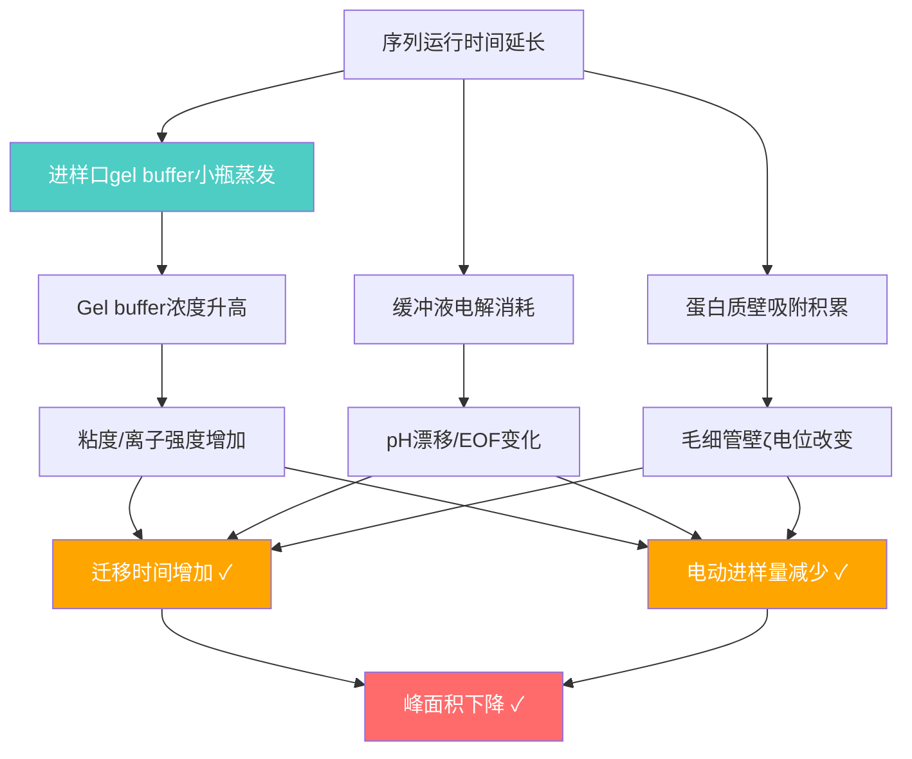
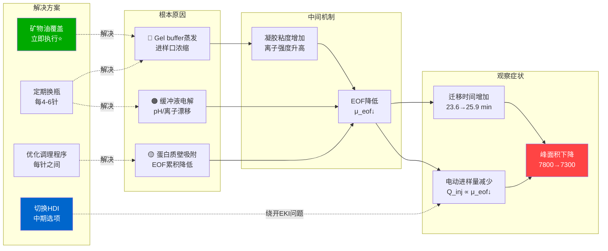

本文围绕 IgG Purity CGE 方法中 F(ab)₂ 片段在序列运行中出现的峰面积下降与迁移时间漂移现象，按“文献证据 → 机制分析 → 备选方案 → 实施建议”的脉络展开。分析聚焦电动进样条件优化，结合行业已知问题、电动进样与 EOF 的理论模型，最终给出矿物油覆盖、定期更换 gel buffer、以及流体动力进样（HDI）等分层解决方案。

## 问题现象与已排除因素

> [!abstract] 背景与问题描述
> **平台方法**：IgG Purity CGE（毛细管凝胶电泳）
> **样品**：F(ab)₂片段（IdeS酶切IgG）
> **进样方式**：电动进样（Electrokinetic Injection, EKI）
> **样品制备**：酶切产物 + 100 mM Tris-HCl pH 9.0, 0.1% SDS + IAM，65°C 孵育4 min
>
> **问题现象**：
> - F(ab)₂校正峰面积：7800 → 7300（均值7300，RSD 3.3%），总峰面积同步下降
> - 迁移时间：23.6 min → 25.9 min（序列运行中持续增加）
> - **两个实验室独立重现**
>
> **已排除因素**：仪器硬件问题（电极、检测器、毛细管、光路、托瓶器）、上机前样品溶液不稳定性

上述现象的特征是趋势性变化：迁移时间在整个序列运行中持续增加，峰面积同步下降。两个实验室独立重现说明问题源于方法学层面的系统性因素，而非单台仪器的偶发故障。

## 文献证据与根因归纳

### SCIEX/MedImmune 技术报告：行业公认问题

> [!tip] SCIEX/MedImmune 技术报告（最关键文献）
> **标题**：*Simplifying CE-SDS Data Processing: Approach for Mitigating Product Peak Migration Time Drift*
> **作者**：Samuel Shepherd（MedImmune, Cambridge, UK）& SCIEX
> **来源**：SCIEX Technical Note
> **URL**：https://sciex.com/content/dam/SCIEX/pdf/tech-notes/all/Medimmune_TN.pdf
>
> **核心发现**：
> > “An industry known issue with CE-SDS is drift over time of the product peaks, giving rise to complications in data analysis, peak identification, and comparability. During each experiment it was observed that the **inlet gel buffer vials are subject to evaporation**.”
>
> **与用户问题的直接对应**：
> - 进样口gel buffer小瓶在序列运行中发生**蒸发**
> - 蒸发 → gel buffer浓缩 → 粘度/离子强度升高 → 迁移时间增加 + 电动进样量减少 → 峰面积下降
> - **完全符合用户观察到的迁移时间23.6→25.9 min增加模式**
>
> **解决方案**：在gel buffer小瓶液面上加盖**矿物油（mineral oil）**层，有效防止蒸发，显著改善迁移时间稳定性

### CASSS 行业故障排查报告

> [!info] CASSS CE-Pharm 2015 故障排查研讨会报告
> **标题**：*Troubleshooting CE-SDS: Baseline Disturbances, Peak Area Repeatability and the Presence of Ghost Peaks*
> **作者**：Cari Sänger-van de Griend, Timothy Blanc 等（Regeneron, Roche, Merck, Eli Lilly）
> **来源**：CASSS CE-Pharm 2015 Troubleshooting Workshop
> **URL**：https://www.casss.org/docs/default-source/ce-pharm/reports-troubleshooting-workshops/troubleshooting-ce-sds---baseline-disturbances---peak-area-repeatability-and-the-presence-of-ghost-peaks.pdf
>
> **直接涉及**：CE-SDS峰面积重现性（peak area repeatability）问题的系统性故障排查，涵盖基线干扰、幽灵峰、峰面积波动等多种异常

### IdeS 消化 + CGE 的方法参考

McClain et al. (2022) 采用 IdeS 消化 + CE-SDS 分析 F(ab)₂ 与 Fc，与本文场景完全一致，其方法参数可作为对照：

| 项目 | 内容 |
|------|------|
| **标题** | *Using Digestion by IdeS Protease to Improve Quantification of Degradants in Monoclonal Antibodies by Non-Reducing Capillary Gel Electrophoresis* |
| **期刊** | *Analytical Chemistry*, 94(50):17388–17395 |
| **DOI** | [10.1021/acs.analchem.2c02630](https://doi.org/10.1021/acs.analchem.2c02630) |
| **PMID** | 36472948 / PMC: PMC9774260 |

**关键方法参数**：
- 样品缓冲液：100 mM Tris-HCl pH 9.0，1% SDS，IAM烷基化
- 电动进样：−5 kV，20 sec
- 分离：−15 kV
- 描述了校正峰面积计算方法

### Gel buffer 浓度对电动进样的直接影响

> [!warning] 关键数据
> Geurink等发现：**gel buffer稀释至70%时，校正峰面积比90%浓度时低约2倍**
> 反推：gel buffer因蒸发而浓缩时，同样会造成可检测的峰面积变化
> 此研究明确指出：对于定量分析，**流体动力进样（HDI）优于电动进样**

### 方法验证与重现性文献

| 文献 | DOI/PMID | 核心内容 |
|------|----------|---------|
| Li et al. (2021) *Electrophoresis* | DOI: [10.1002/elps.202000396](https://doi.org/10.1002/elps.202000396) | CE-SDS单克隆抗体分析多实验室方法验证 |
| Zhang et al. (2010) *J Pharm Biomed Anal* | DOI: [10.1016/j.jpba.2010.07.029](https://doi.org/10.1016/j.jpba.2010.07.029) | mAb CE-SDS方法开发与验证，含稳健性数据 |
| Wagner et al. (2020) *J Pharm Biomed Anal* | DOI: [10.1016/j.jpba.2020.113166](https://doi.org/10.1016/j.jpba.2020.113166) | 已批准治疗性抗体的CE-SDS大小变体测定 |
| Cianciulli et al. (2012) *Electrophoresis* | DOI: [10.1002/elps.201200177](https://doi.org/10.1002/elps.201200177) PMID: 22969056 | CGE精确蛋白定量；HDI vs EKI精密度对比 |

### 根本原因归纳



## 电动进样影响因素分析

### 电动进样基本方程

$$Q_{inj} = \pi r^2 \cdot (\mu_{ep} + \mu_{eof}) \cdot E' \cdot t \cdot C$$

其中：
- $Q_{inj}$：进样量（mol）
- $r$：毛细管内径半径
- $\mu_{ep}$：溶质电泳迁移率
- $\mu_{eof}$：电渗流迁移率
- $E'$：样品区间的有效电场强度（$E' = E \times \kappa_{BGE}/\kappa_{sample}$）
- $t$：进样时间
- $C$：溶质浓度

> [!important] 核心推论
> 电动进样量与 $(\mu_{ep} + \mu_{eof})$ **成正比**。任何导致 $\mu_{eof}$ 降低的因素，都将直接减少进样量，进而导致峰面积下降。

### 影响电动进样量的因素

#### 因素1：施加电压与进样时间

$$Q_{inj} \propto V \cdot t$$

标准PA800 Plus方法：−5 kV，20 sec。仪器电压稳定性良好时，此因素变异性低。

#### 因素2：电渗流迁移率 μeof

SDS-CGE中，SDS包覆的蛋白质具有相似的电荷/质量比，电泳迁移率差异小，$\mu_{eof}$ 成为决定进样量差异的主要变量。任何导致 $\mu_{eof}$ 随时间降低的因素，都会造成系统性峰面积下降趋势。

#### 因素3：样品基质电导率 vs BGE电导率（最关键因素之一）

$$E'_{sample} = E \times \frac{\kappa_{BGE}}{\kappa_{sample}}$$

> [!warning] 用户系统的特殊风险
> 用户样品基质为 **100 mM Tris-HCl pH 9.0**，这是**高电导率**基质。
>
> 当 $\kappa_{sample} > \kappa_{BGE}$ 时：$E'_{sample} < E$（**反场放大效应，即场强降低**）
>
> 后果：电动进样时，实际进入毛细管的蛋白质量**少于低电导率样品**。
>
> 若每次进样后样品基质中的离子因电解而逐渐耗尽或重分布，$\kappa_{sample}$会发生变化，导致进样量不稳定。

文献依据：Shihabi (1999) *J Chromatogr A*, 853(1-2):3-9. DOI: [10.1016/S0021-9673(99)00316-7](https://doi.org/10.1016/S0021-9673(99)00316-7) — 盐对场放大进样的影响

#### 因素4：毛细管表面状态（调理程度）

毛细管内壁硅羟基（silanols）的质子化状态影响 $\mu_{eof}$；蛋白质或SDS在壁上的吸附改变表面电荷密度。每次运行之间若调理不充分，表面状态逐渐漂移，导致 $\mu_{eof}$ 趋势性变化。文献依据：Nowak et al. (2017) *Anal Bioanal Chem*, 409:4383-4393. DOI: [10.1007/s00216-017-0382-y](https://doi.org/10.1007/s00216-017-0382-y) PMID: 28484810

#### 因素5：样品粘度

$$Q_{inj} \propto \frac{1}{\eta_{sample}}$$

样品粘度随温度或SDS浓度变化时进样量相应改变，标准化样品制备可控制此因素。温度每升高1°C，粘度约降低2-3%（进样量相应增加约2-3%）。

#### 因素6：温度

温度通过粘度间接影响 $\mu_{eof}$ 和 $\mu_{ep}$。PA800 Plus配备液体循环冷却系统，可将温度控制在±0.1°C。文献依据：SepScience CE技术资料——温度每变化1°C，进样体积变化2-3%

#### 因素7：样品瓶液面变化（蒸发）

序列运行中样品瓶内样品体积因蒸发而减少，液面下降使毛细管末端相对位置改变，影响有效电场。解决方案：使用密封瓶盖，或在样品制备后尽快上机。

#### 因素8：毛细管内电流波动

电动进样期间电流不稳定（如气泡、凝胶不均匀）导致进样量波动。Petersen (2012) *Electrophoresis* DOI: [10.1002/elps.201100551](https://doi.org/10.1002/elps.201100551) —— 研究了电流漂移对CE重现性的影响。

#### 因素9：样品连续电动进样的耗尽效应

> [!warning] 重要机制
> SepScience技术资料明确指出：**对同一样品小瓶只能进行一次有效的电动进样**。
>
> 原因：电动进样本质上是离子在电场中的定向迁移，每次进样会选择性地将高迁移率组分优先“抽取”出样品瓶，导致后续进样时样品组成已发生改变。
>
> **如果用户对同一份F(ab)₂样品重复进行多次电动进样**，这将是峰面积持续下降的重要原因。

### 样品制备加热变性不充分的潜在影响

> [!question] 65°C, 4 min是否足够使F(ab)₂充分变性与SDS结合？

| 因素 | 分析 |
|------|------|
| 温度充分性 | SDS-PAGE通常推荐95°C/5 min；65°C为温和变性条件 |
| F(ab)₂特殊性 | F(ab)₂的二硫键未还原，空间结构更紧密，可能需要更长/更高温度的变性 |
| IAM的作用 | IAM（碘乙酰胺）用于烷基化游离巯基，封闭SH基团，与SDS结合无直接关系 |
| CGE-SDS的要求 | 非还原条件下，蛋白质需在SDS中保持足够变性以维持SDS-蛋白复合物的均一性 |

若变性不充分，部分F(ab)₂可能未完全与SDS结合，SDS结合量不足导致电荷密度不一致、电泳迁移率差异，使电动进样存在选择性偏差。但此因素更可能导致峰形异常（不对称峰、出现新峰），而非系统性的趋势性下降。结论：变性不充分不太可能是导致序列运行中峰面积持续下降的主要原因，但不能完全排除其对定量精度的影响。文献参考：McClain et al. (2022) DOI: [10.1021/acs.analchem.2c02630](https://doi.org/10.1021/acs.analchem.2c02630) 描述了相同的65°C变性条件，未报告变性不充分问题。

## 电渗流漂移机制与稳定化策略

### EOF 基本理论

$$\mu_{eof} = \frac{\varepsilon \cdot \zeta}{4\pi\eta}$$

$$v_{eof} = \mu_{eof} \cdot E = \frac{\varepsilon \cdot \zeta}{4\pi\eta} \cdot \frac{V}{L}$$

### 影响 μeof 的因素

#### 因素1：毛细管壁硅羟基及其质子化状态

裸熔融石英毛细管内壁富含Si-OH基团（pKa ≈ 6.3 和 9-10），pH升高使更多silanols去质子化（Si-O⁻），表面负电荷增加，$\zeta$ 绝对值增大，$\mu_{eof}$ 增大。标准CE-SDS通常在pH 8-9运行，EOF较高。文献：Towns & Regnier (1992) *Anal Chem*, 64:2473-2478 — 蛋白质吸附与异常洗脱

#### 因素2：缓冲液pH

pH < 3 时silanols几乎完全质子化，EOF ≈ 0；pH 3-7 时EOF随pH升高而增大；pH > 7 时EOF接近最大值并趋于稳定。序列运行中缓冲液电解（阳极氧化、阴极还原）导致pH漂移 → EOF变化。文献：Novotný & Gaš (2019) *Electrophoresis*, 41(7-8). DOI: [10.1002/elps.201900411](https://doi.org/10.1002/elps.201900411)

#### 因素3：离子强度/电导率

$$\kappa \uparrow \Rightarrow \text{Debye length} \downarrow \Rightarrow |\zeta| \downarrow \Rightarrow \mu_{eof} \downarrow$$

离子强度增大 → 双电层压缩（Debye长度缩短）→ $\zeta$ 电位降低 → $\mu_{eof}$ 降低。这与gel buffer蒸发的关联最为直接：蒸发 → gel buffer浓缩 → 离子强度升高 → $\mu_{eof}$ 降低 → 迁移时间增加。文献：Mosher (1998) *Anal Chem*. DOI: [10.1021/ac970513x](https://doi.org/10.1021/ac970513x)

#### 因素4：温度

$$T \uparrow \Rightarrow \eta \downarrow \Rightarrow \mu_{eof} \uparrow$$

每升高1°C，$\mu_{eof}$ 约增大2-3%。PA800 Plus的液体冷却系统可将温度波动控制在很小范围内。

#### 因素5：蛋白质在毛细管壁上的吸附（时间依赖性变化）

> [!danger] 高度相关因素
> **机制**：蛋白质（F(ab)₂、Fc、IgG等）通过静电/疏水相互作用吸附于毛细管内壁
>
> **后果**：
> 1. 吸附的蛋白质层改变毛细管壁的有效表面电荷密度
> 2. 随着序列运行中吸附积累，EOF **逐渐降低**
> 3. 造成迁移时间趋势性增长（与用户观察一致：23.6→25.9 min）
>
> **量化数据**（Nowak et al. 2017，PMID: 28484810）：
> - 裸硅毛细管中，蛋白质（HSA）吸附在8-12次进样后导致毛细管堵塞
> - EOF波动是迁移时间不稳定性的主要来源
> - 动态涂层（CEofix）将迁移时间RSD从3.5%降低到0.5%

文献：Bossi et al. (2000) *J Chromatogr A*, 868(1):85-99. DOI: [10.1016/S0021-9673(99)01207-8](https://doi.org/10.1016/S0021-9673(99)01207-8) — 蛋白质向裸硅壁吸附的定量研究；Lucy et al. (2008) *J Chromatogr A*, 1184:81-105. DOI: [10.1016/j.chroma.2007.10.114](https://doi.org/10.1016/j.chroma.2007.10.114) — 防止蛋白质壁吸附的非共价涂层方法

#### 因素6：SDS对毛细管壁的影响

SDS是阴离子表面活性剂，低浓度时可抑制蛋白质-壁相互作用（Ermakov et al. 2000）。在CE-SDS体系中，SDS包覆蛋白质并与壁面相互作用，整体效果取决于SDS/蛋白质比例。样品缓冲液中0.1% SDS相对于1% SDS的浓度较低，保护效果可能有限。文献：Ermakov et al. (2000) *J Chromatogr A*, 894(1-2):281-289. DOI: [10.1016/S0021-9673(00)00664-6](https://doi.org/10.1016/S0021-9673(00)00664-6)

#### 因素7：凝胶基质粘度

CGE中的凝胶（如SDS Gel Buffer中的筛分聚合物）大大增加了介质粘度，$\eta$ 增大 → $\mu_{eof}$ 降低（SDS-CGE中EOF比CZE中小得多）。凝胶蒸发/浓缩 → 粘度进一步增加 → EOF进一步降低。

#### 因素8：缓冲液耗竭（电解）

长序列运行中，两端缓冲液/凝胶缓冲液因持续电解而pH改变：阳极端（+）水氧化产生H⁺，pH降低；阴极端（−）水还原产生OH⁻，pH升高。pH变化 → silanol质子化程度改变 → $\mu_{eof}$ 漂移。Agilent技术报告（文号：5990-3411EN）指出缓冲液电解是迁移时间不稳定的主要原因之一，推荐每次进样后更换新鲜缓冲液。

#### 因素9：施加电压

EOF与施加电压成线性关系，实际中电场强度不影响 $\mu_{eof}$，但影响 $v_{eof}$。电压稳定性对迁移时间一致性至关重要。

#### 因素10：动态涂层 vs 裸硅毛细管

CE-SDS通常使用裸硅毛细管，EOF可变性更大；动态涂层（如在gel buffer中添加聚乙二醇等）可稳定EOF，但同时也是筛分介质的一部分。文献：Nowak et al. (2017) DOI: [10.1007/s00216-017-0382-y](https://doi.org/10.1007/s00216-017-0382-y) — 比较10种不同毛细管内表面对EOF重现性的影响

### 用户假设的合理性评估

> [!success] 核心假设评估结论：**合理且有充分文献支持**
>
> **假设链**：迁移时间增加 → EOF在分离过程中降低 → 进样时EOF也随时间降低 → 进样量持续减少 → 峰面积下降
>
> **评估**：
>
> ✅ **迁移时间增加** → 多种机制均可导致EOF降低，文献有充分记录
>
> ✅ **EOF降低** → 分离时迁移时间增加（与观察一致）
>
> ✅ **进样时EOF降低** → 根据电动进样方程 $Q \propto (\mu_{ep}+\mu_{eof})$，进样量直接减少
>
> ✅ **峰面积下降** → 进样量减少的直接后果
>
> ✅ **两个实验室重现** → 方法系统性问题（非仪器偶发故障）
>
> **最可能的根本原因**（按可能性排序）：
> 1. **Gel buffer进样口小瓶蒸发**（最可能，行业已知问题）
> 2. 缓冲液电解pH/离子强度漂移
> 3. 蛋白质-壁累积吸附
> 4. 以上多种因素叠加

### 稳定 EOF 的优化策略

| 优先级 | 策略 | 针对机制 | 操作细节 |
|--------|------|---------|---------|
| 🔴 最高 | **矿物油覆盖进样口gel buffer小瓶** | 防止蒸发 | 在gel buffer液面加一层矿物油，完全隔绝挥发 |
| 🔴 最高 | **定期更换gel buffer小瓶** | 缓冲液耗竭+蒸发 | 每4-6次进样更换新鲜gel buffer；参考SCIEX IgG方法手册 |
| 🟠 高 | **优化毛细管调理程序** | 壁吸附+EOF稳定化 | NaOH（0.1M）→ HCl（0.1M）→ 水 → Gel buffer；每次进样之间执行 |
| 🟠 高 | **速度校正峰面积（CPA）** | 数学补偿EOF波动 | $CPA = A / t_m$；以10 kDa内标归一化 |
| 🟡 中 | **严格温度控制** | 粘度/EOF稳定 | 25°C，液体循环冷却；确保毛细管充分预平衡 |
| 🟡 中 | **内标（10 kDa蛋白）** | 归一化注射间差异 | 以内标CPA为参照，计算各峰的相对%CPA |
| 🟡 中 | **降低样品基质离子强度** | 减少场强失配 | 考虑稀释样品以降低Tris-HCl浓度；注意与最小上样量的平衡 |
| 🟢 低 | **预平衡运行** | 毛细管表面稳定化 | 正式样品进样前先运行2-3针空白或系统适应性样品 |

## 流体动力进样：文献依据与可行性

> [!success] 结论：流体动力进样（HDI）在CGE中**已有文献报道且可行**，但使用不普遍
>
> - 标准生物制药CE-SDS方法普遍使用电动进样
> - 已有至少3个独立研究团队在CGE蛋白分析中成功验证HDI
> - HDI **精密度优于EKI**（不受基质影响，非选择性）
> - 主要挑战：凝胶基质粘度高，需要较高压力/较长进样时间

### 关键文献证据

**Dawod, Arvin & Kennedy (2017) 综述**（*Analyst*, 142(11):1847–1866, DOI: [10.1039/c7an00198c](https://doi.org/10.1039/c7an00198c), PMID: 28470231）：

> [!quote] 原文引用（第2.1.3节，CGE部分）
> “In the optimized CGE described in this paper, the influenza proteins were **injected hydrodynamically at 100 mbar for 100 s** which provided **similar results (based on peak area, S/N, and migration time) compared to electrokinetic injection (EKI) at -18 kV for 100 s**. However, **hydrodynamic injection (HDI) is less affected by sample matrix and provides better precision.**”

**Cianciulli, Hahne & Wätzig (2012)**（*Electrophoresis*, 33(22), DOI: [10.1002/elps.201200177](https://doi.org/10.1002/elps.201200177), PMID: 22969056）直接比较了CGE蛋白质定量中HDI与EKI的精密度：

> [!quote] 核心发现
> **“The application of hydrodynamic injection is beneficial for the precision of the method compared to the traditionally used electrokinetic one.”**
>
> 该研究直接比较了CGE蛋白质定量（mAb相关应用）中HDI与EKI的精密度，结果HDI（RSD < 2%）优于EKI。

**Geurink et al. (2021)**（*Electrophoresis*, 42(1-2):10–18, DOI: [10.1002/elps.202000107](https://doi.org/10.1002/elps.202000107), PMID: 32640046）在商业SCIEX SDS凝胶缓冲液中采用 100 mbar × 100 s（50 µm ID毛细管），峰面积RSD达到 **0.8%**。

> [!info] 对比：EKI的典型RSD
> 同等条件下EKI的峰面积RSD通常为2-5%；HDI在此研究中达到**0.8% RSD**，精密度显著改善

**比较综述**：Breadmore (2009) *Bioanalysis*, 1(5):889–894, DOI: [10.4155/bio.09.73](https://doi.org/10.4155/bio.09.73), PMID: 21083060 —— 系统性综述EKI与HDI的优缺点比较，为选择进样模式提供理论框架。

### 商业仪器平台的压力进样支持

| 仪器平台 | 压力进样支持 | 备注 |
|---------|------------|------|
| **SCIEX PA800 Plus** | ✅ 硬件支持 | 支持0.3-3 psi（约21-207 mbar）压力进样；软件参数可配置 |
| **Agilent 7100 CE** | ✅ 支持 | HP3D CE系统支持外部压力进样；4 bar已报告用于CGE |
| **Maurice（ProteinSimple）** | ✅ 默认压力进样 | 使用“橙色压力盖（orange pressure caps）”，本质上是压力进样系统 |
| **SCIEX BioPhase 8800** | ✅ 支持 | 多毛细管系统，支持压力进样 |
| **Beckman Coulter PA800 Plus（历史版本）** | ✅ 支持 | 参见仪器方法开发指南 |

> [!note] 重要说明
> Maurice平台实际上是CGE压力进样的商业化应用，其出色的精密度（<0.3% RSD CPA%）正是得益于压力进样的一致性

### EKI vs HDI 综合比较

| 比较维度 | 电动进样（EKI） | 流体动力进样（HDI） |
|---------|--------------|-----------------|
| **精密度** | 2-5% RSD（受多因素影响）| 0.8-2% RSD（矩阵无关）|
| **选择性** | 有选择性（高迁移率组分进样多）| 无选择性（所有组分等比例进入）|
| **基质效应** | 高（离子强度/pH敏感）| 低（仅受粘度影响）|
| **灵敏度** | 可通过提高电压/时间增加 | 受凝胶粘度限制 |
| **凝胶兼容性** | 优（不置换凝胶）| 需谨慎（可能稀释/置换入口凝胶）|
| **峰展宽** | 相对窄（场放大堆积效应）| 可能更宽（扩散）|
| **仪器普适性** | 所有CE仪器支持 | 需仪器支持，参数需优化 |
| **当前生物制药标准** | ✅ 行业标准 | 非主流（但逐渐被关注）|

## 压力进样参数推荐与实施路线

> [!success] 评估结论：压力进样**适合考虑**，但需重新优化方法
>
> **适合的理由**：
> - 用户的核心问题（峰面积趋势性下降）源于EKI对系统性漂移的敏感性
> - Cianciulli et al. 和 Geurink et al. 已证实HDI在相同凝胶体系中可行
> - PA800 Plus硬件支持压力进样
> - F(ab)₂定量分析（非筛分分离形态分析）对精密度要求高，HDI更有优势
>
> **注意事项**：
> - 切换进样模式需要重新验证方法
> - HDI可能需要优化进样塞长度（≤1-2%毛细管总长）
> - 调理程序可能需要相应调整

### 基于文献的初始参数推荐

| 参数 | 推荐初始值 | 参考来源 | 说明 |
|------|----------|---------|------|
| **进样压力** | 0.5 psi（≈34 mbar）| SCIEX PA800 Plus手册 | 低压起始，避免凝胶置换 |
| **备选压力** | 100 mbar（≈1.45 psi）| Geurink et al. 2021 | 已验证于相同SDS凝胶体系 |
| **进样时间** | 20-30 sec（初始）| 基于Hagen-Poiseuille计算 | 与标准EKI时间相近，需优化 |
| **备选时间** | 100 sec | Geurink et al. 2021 | 100 mbar × 100 s组合已验证 |
| **毛细管内径** | 50 µm（标准）| 行业标准 | PA800 Plus标准毛细管 |
| **毛细管长度** | 20 cm（Leff），30 cm（Ltot）| PA800 Plus IgG方法 | 维持标准分离条件 |
| **温度** | 25°C | SCIEX IgG Purity方法 | 维持不变 |

### 进样体积计算

$$V_{inj} = \frac{\pi r^4 \cdot \Delta P \cdot t}{8 \cdot \eta \cdot L}$$

> [!example] 示例计算（参考值，需实验验证）
> 0.5 psi（3447 Pa）× 10 sec，50 µm ID，30 cm毛细管，η ≈ 4 mPa·s：
>
> $$V_{inj} \approx \frac{\pi \times (25\times10^{-6})^4 \times 3447 \times 10}{8 \times 0.004 \times 0.30} \approx 2.4\ nL$$
>
> 此进样量约占毛细管体积（≈590 nL）的0.4%，在推荐范围（<1-2%）内

### 需优化的关键项目

#### A. 进样塞长度控制（最关键）

```
目标：进样塞长度 < 毛细管有效长度的 1-2%
计算：V_plug < 0.01 × π × r² × L_eff
当 r = 25 µm, L_eff = 20 cm：V_max ≈ 3.9 nL
```

进样塞过长 → 峰展宽 → 分辨率降低。优化路径：固定压力调整时间，或固定时间调整压力。

#### B. 凝胶置换的防止策略

> [!warning] HDI特有风险
> 压力进样时，凝胶基质可能从毛细管进样端被置换出来，导致进样口凝胶浓度降低、后续分离中筛分能力下降。
>
> **解决方案**：每次进样后执行凝胶填充步骤（加压将新鲜凝胶压入毛细管）；采用低压（<0.5 psi）短时进样，减少凝胶置换量；参考Geurink et al. (2021)的优化凝胶填充程序。

#### C. 方法开发时序

```
步骤1：固定标准分离条件，仅改变进样方式
步骤2：正交实验设计——压力（0.3, 0.5, 1.0, 2.0 psi）× 时间（5, 10, 20, 40 sec）
步骤3：评估灵敏度（峰面积）、分辨率（峰高/峰宽）、精密度（n=6重复）
步骤4：优化毛细管调理程序（HDI模式可能需要更强调理以补充凝胶）
步骤5：与EKI方法作全面比较（定量相关性、系统适用性）
步骤6：线性范围、LOQ、精密度（日内/日间）验证
```

### 近期解决方案的优先级建议

> [!tip] 实际操作建议（短期 → 长期）
>
> **立即可执行（不需要更改进样模式）**：
> 1. 🔴 在进样口gel buffer小瓶液面加**矿物油**（约50 µL），防止蒸发——这极可能直接解决问题
> 2. 🔴 每4-6次进样后**更换新鲜gel buffer**小瓶
> 3. 🟠 确保每次进样后执行完整的毛细管调理（NaOH/HCl/H₂O/Gel Buffer冲洗程序）
>
> **中期优化（如矿物油策略效果有限）**：
> 4. 🟡 切换至HDI，采用100 mbar × 100 s起始参数，参照Geurink et al. (2021)优化
> 5. 🟡 在数据处理层面，确保使用**速度校正峰面积**（CPA = 峰面积/迁移时间）
>
> **长期验证**：
> 6. 🟢 如切换HDI，进行完整方法验证（精密度、线性、LOQ/LOD、系统适用性参数更新）

## 总结：问题诊断与解决路径



> [!summary] 核心建议
> **最可能的根本原因**：进样口gel buffer小瓶蒸发，导致凝胶浓度随序列运行时间升高，造成迁移时间漂移和电动进样量减少。这是行业已知问题，有直接文献记录（MedImmune/SCIEX技术报告）。
>
> **首要解决措施**：在进样口gel buffer小瓶液面加盖**矿物油**层（50-100 µL），立即执行，成本极低。预期可显著改善迁移时间漂移和峰面积稳定性。
>
> **数据处理层面**：确保所有定量结果基于**速度校正峰面积（CPA = 峰面积/迁移时间）**，而非原始峰面积，并以10 kDa内标进行归一化。
>
> **中长期考虑**：如需进一步提升精密度或彻底消除基质效应，可考虑切换至流体动力进样（HDI，100 mbar × 100 s起始），参照Geurink et al. (2021)的优化策略。

## 综合参考文献

| # | 引用 | DOI/PMID | 相关章节 |
|---|------|----------|---------|
| 1 | Shepherd S. (SCIEX/MedImmune). *Simplifying CE-SDS Data Processing: Approach for Mitigating Product Peak Migration Time Drift* | Tech Note URL | 文献证据 |
| 2 | Sänger-van de Griend C, Blanc T et al. *Troubleshooting CE-SDS: baseline disturbances, peak area repeatability and ghost peaks.* CASSS CE-Pharm 2015 | Workshop URL | 文献证据 |
| 3 | Geurink et al. (2021) *Electrophoresis* 42:10–18 | DOI: [10.1002/elps.202000107](https://doi.org/10.1002/elps.202000107) PMID: 32640046 | 文献证据、电动进样、HDI、压力进样 |
| 4 | McClain et al. (2022) *Anal Chem* 94:17388–17395 | DOI: [10.1021/acs.analchem.2c02630](https://doi.org/10.1021/acs.analchem.2c02630) PMID: 36472948 | 文献证据、电动进样 |
| 5 | Cianciulli C, Hahne T, Wätzig H. (2012) *Electrophoresis* 33(22) | DOI: [10.1002/elps.201200177](https://doi.org/10.1002/elps.201200177) PMID: 22969056 | HDI、压力进样 |
| 6 | Dawod M, Arvin NE, Kennedy RT. (2017) *Analyst* 142:1847–1866 | DOI: [10.1039/c7an00198c](https://doi.org/10.1039/c7an00198c) PMID: 28470231 | HDI |
| 7 | Nowak PM et al. (2017) *Anal Bioanal Chem* 409:4383–4393 | DOI: [10.1007/s00216-017-0382-y](https://doi.org/10.1007/s00216-017-0382-y) PMID: 28484810 | 电动进样、EOF |
| 8 | Breadmore MC. (2009) *Bioanalysis* 1(5):889–894 | DOI: [10.4155/bio.09.73](https://doi.org/10.4155/bio.09.73) PMID: 21083060 | HDI |
| 9 | Bossi A et al. (2000) *J Chromatogr A* 868(1):85–99 | DOI: [10.1016/S0021-9673(99)01207-8](https://doi.org/10.1016/S0021-9673(99)01207-8) | EOF |
| 10 | Ermakov SV et al. (2000) *J Chromatogr A* 894:281–289 | DOI: [10.1016/S0021-9673(00)00664-6](https://doi.org/10.1016/S0021-9673(00)00664-6) | EOF |
| 11 | Mosher RA. (1998) *Anal Chem* | DOI: [10.1021/ac970513x](https://doi.org/10.1021/ac970513x) | EOF |
| 12 | Lucy CA, MacDonald AM, Gulcev MD. (2008) *J Chromatogr A* 1184:81–105 | DOI: [10.1016/j.chroma.2007.10.114](https://doi.org/10.1016/j.chroma.2007.10.114) | EOF |
| 13 | Novotný M, Gaš B. (2019) *Electrophoresis* 41(7-8) | DOI: [10.1002/elps.201900411](https://doi.org/10.1002/elps.201900411) | EOF |
| 14 | Petersen NJ et al. (2012) *Electrophoresis* | DOI: [10.1002/elps.201100551](https://doi.org/10.1002/elps.201100551) | 电动进样 |
| 15 | Shihabi ZK. (1999) *J Chromatogr A* 853:3–9 | DOI: [10.1016/S0021-9673(99)00316-7](https://doi.org/10.1016/S0021-9673(99)00316-7) | 电动进样 |
| 16 | Li YT et al. (2021) *Electrophoresis* | DOI: [10.1002/elps.202000396](https://doi.org/10.1002/elps.202000396) | 文献证据 |
| 17 | Zhang ZP et al. (2010) *J Pharm Biomed Anal* 53:1236–1243 | DOI: [10.1016/j.jpba.2010.07.029](https://doi.org/10.1016/j.jpba.2010.07.029) | 文献证据 |
| 18 | Zhu Z, Lu JJ, Liu S. (2012) *Anal Chim Acta* 709:21–31 | DOI: [10.1016/j.aca.2011.10.022](https://doi.org/10.1016/j.aca.2011.10.022) PMCID: PMC3227876 | HDI |
| 19 | Krebs A et al. (2023) *Electrophoresis* 44(17-18):1279–1341 | DOI: [10.1002/elps.202300158](https://doi.org/10.1002/elps.202300158) | EOF、压力进样 |
| 20 | Wagner B et al. (2020) *J Pharm Biomed Anal* 184:113166 | DOI: [10.1016/j.jpba.2020.113166](https://doi.org/10.1016/j.jpba.2020.113166) | 文献证据 |