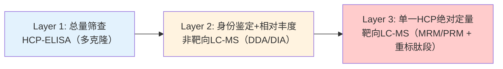
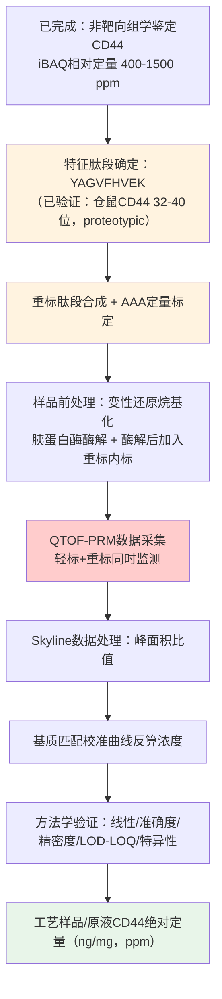

---

reviewNotes:
  - "减法模式下篇幅 17,815 字符（原文 18,302，比例 97%）超出 10,066～17,387 字符的区间"
title: "HCP靶向定量方法综述与CD44-QTOF/PRM靶向定量试验方案设计"
date: 2026-08-31
category: "03质量控制"
primaryTag: "03质量控制/残留/HCP"
description: "本文围绕一个具体任务展开：某CHO-K1表达单抗产品中宿主细胞蛋白（HCP）CD44经非靶向组学鉴定残留于原液，拟以重标特征肽段YAGVFHVEK为内标、基于QTOF平台PRM技术建立绝对定量方法。文章先梳理HCP靶向定量方法学从ELISA到LC-MS正交检测、从非靶向发现到靶向"
tags:
  - "03质量控制/残留/HCP"
sourceNotes:
  - "Antibody-Characterization/HCP/HCP靶向定量方法综述与CD44-QTOF-PRM试验方案设计.md"
---

本文围绕一个具体任务展开：某CHO-K1表达单抗产品中宿主细胞蛋白（HCP）CD44经非靶向组学鉴定残留于原液，拟以重标特征肽段YAGVFHVEK为内标、基于QTOF平台PRM技术建立绝对定量方法。文章先梳理HCP靶向定量方法学从ELISA到LC-MS正交检测、从非靶向发现到靶向PRM/MRM定量的演进，再基于序列验证结果给出完整的试验方案。

> [!abstract] 任务背景
> 某CHO-K1表达单抗产品，经高分辨质谱组学非靶向鉴定（iBAQ相对定量）发现宿主细胞蛋白 **CD44** 残留于工艺样品/原液中，相对定量水平约 **400–1500 ppm**。为支持工艺开发（CD44清除工艺优化）、建立可溯源的绝对定量数据，拟合成重标特征肽段 **YAGVFHVEK**，基于 **QTOF 平台 PRM（Parallel Reaction Monitoring）** 技术建立CD44靶向定量方法。本文第一部分系统检索并核实HCP靶向定量方法学文献；第二部分基于综述结论与序列验证结果，设计具体、可执行的试验方案。

## HCP分析的核心矛盾与方法学分层

宿主细胞蛋白（Host Cell Protein, HCP）是重组治疗性蛋白（如CHO细胞表达的单抗）生产过程中残留的工艺相关杂质，其控制水平直接关系患者用药安全（免疫原性、潜在生物学活性）与产品质量（如蛋白酶/糖苷酶导致的降解）。HCP分析方法学存在清晰的三层递进关系：



- **Layer 1（ELISA）**：行业金标准，检测通量高、灵敏度好，但**无法提供HCP身份信息**，且存在漏检（弱免疫原性HCP）、抗原过剩导致低估、无法区分"多种低丰度累加"与"单一高丰度"等固有局限[^1]。
- **Layer 2（非靶向LC-MS，DDA/DIA）**：解决"有哪些HCP、大概多少"的问题，常用Hi3/Top3或iBAQ做半定量，是发现阶段的标准工具，但准确度通常在真实值的1.5–1.8倍范围内[^2]。
- **Layer 3（靶向MRM/PRM + 重标肽段内标）**：本文方案的核心。针对**已知身份**的高风险HCP（如本文的CD44），利用稳定同位素稀释质谱法（Stable Isotope Dilution MS, SID-MS）实现可溯源绝对定量，是目前公认精度最高的确证手段。

> [!info] 检索方法说明
> 数据库：PubMed / PMC、ACS Publications（Analytical Chemistry）、Taylor & Francis（mAbs）、Wiley（Biotechnology and Bioengineering, Biotechnology Progress）、Springer（Anal Bioanal Chem）。时间范围：2012–2026（重点2015年后），并纳入2003–2006年奠基性方法学文献。所有文献均逐条通过 WebSearch / PubMed / 期刊官网核实标题、作者、期刊卷期页码与DOI，不采用未经核实的估算引用。

## 靶向定量方法学的发展脉络

两种范式的本质差异贯穿方法学演进：Hi3/Top3 靠"内标校准全谱"（一个内标定量所有蛋白，准确度较低但通量高），重标肽段SID-MS靠"每个蛋白自己配自己的标准品"（每个目标蛋白单独合成内标，准确度最高但只能确证少数已知目标）——这正是本文CD44 PRM方案所采用的定量哲学。按时间顺序，已核实文献可归纳为四个阶段。

### 阶段一（2003–2006）：奠基方法学——重标肽段绝对定量的两种范式

| 文献 | 核心贡献 | 与本任务的关联 |
|------|---------|--------------|
| Gerber SA, et al. (2003). *PNAS* 100(12):6940-6945[^3] | 首提 **AQUA策略**，SDS-PAGE切胶+胶内消化+重标肽段内标，实现蛋白绝对定量及PTM化学计量比测定 | 奠定"重标合成肽段作内标"的定量哲学 |
| Kuhn E, et al. (2004). *Proteomics* 4(4):1175-1186[^4] | 建立复杂血清基质中低丰度标志物（CRP）的MRM靶向定量工作流，含免疫去除高丰度蛋白+SEC分级 | 示范如何在高丰度基质背景（血清白蛋白/IgG，类比本任务中的单抗产品本身）中定量低丰度靶标 |
| Silva JC, et al. (2006). *Mol Cell Proteomics* 5(1):144-156[^5] | 提出 **Hi3/Top3 无标记绝对定量法**：同一蛋白电离效率最强的3条肽段"响应/摩尔比"在不同蛋白间近似恒定（CV<10%），仅需单点内标即可对所有鉴定蛋白定量 | 与Layer 3的"重标肽段"哲学互补：Hi3用于**发现阶段全谱半定量**，重标肽段PRM用于**目标HCP确证级绝对定量** |

### 阶段二（2012–2016）：2D-LC-QTOF发现 + QqQ-MRM定量的经典范式

| 文献 | 核心方法与参数 | 关键贡献 |
|------|--------------|---------|
| Doneanu CE, et al. (2012). *mAbs* 4(1):24-44. doi:10.4161/mabs.4.1.18748[^6] | 高/低pH双维反相液相色谱联合QTOF（MS^E非依赖采集）发现HCP，后接LC-MRM（QqQ）定量，跨5个数量级浓度范围 | 确立"先QTOF发现、后MRM定量"的HCP分析范式；鉴定纯化后mAb中约33种HCP |

### 阶段三（2015–2017）：QTOF自身实现靶向定量能力——离子淌度与原生消化

| 文献 | 核心方法与参数 | 关键贡献 |
|------|--------------|---------|
| Doneanu CE, Anderson M, Williams BJ, Lauber MA, Chakraborty A, Chen W. (2015). *Anal Chem* 87(20):10283-10291. doi:10.1021/acs.analchem.5b02103[^7] | 多维RPLC + 行波离子淌度（TWIM）-QTOF，消除高丰度mAb肽段背景 | 检测灵敏度从约50 ppm提升至 **1 ppm**；证明QTOF+IMS组合可媲美QqQ灵敏度 |
| Huang L, Wang N, Mitchell CE, Brownlee T, Maple SR, De Felippis MR. (2017). *Anal Chem* 89(10):5436-5444. doi:10.1021/acs.analchem.7b00304[^8] | **原生消化（Native Digestion）**：保持mAb近乎完整、选择性酶切暴露的HCP，降低动态范围1–2个数量级 | LOD可达<10 ppm（常规流速LC）；成为行业标配前处理方案之一 |
| Kreimer S, Gao Y, Ray S, Jin M, Tan Z, Mussa NA, Tao L, Li Z, Ivanov AR, Karger BL. (2017). *Anal Chem* 89(10):5294-5302. doi:10.1021/acs.analchem.6b04892[^9] | 1D LC-DIA非靶向筛查 + **PRM验证**低ppm浓度目标 | 证明DIA+PRM联合策略可高通量筛查后精确验证，减少对QqQ依赖，是本文PRM技术路线的直接方法学先例 |
| Walker DE, Yang F, Carver J, Joe K, Michels DA, Yu XC. (2017). *mAbs* 9(4):654-663. doi:10.1080/19420862.2017.1303023[^10] | 1D UHPLC-MS/MS模块化平台，集成DDA、SWATH-DIA与靶向MRM/PRM，日通量达20个样本 | 解决工艺开发阶段"HCP身份未知、需要高通量"的核心痛点，为ELISA提供正交补充 |

> [!note] 与既往笔记的勘误
> vault 中既往草稿 `HCP-QTOF定量文献综述.md`（status: draft）存在两处作者归属错误，已在上表中更正：
> 1. "A modular and adaptive mass spectrometry-based platform..." (mAbs, 2017) 真实作者为 **Walker DE, Yang F, Carver J, Joe K, Michels DA, Yu XC**（Genentech/Roche），发表于 *mAbs* 9(4):654–663；此前 `乌司他丁CD44-HCP共纯化问题.md` 参考文献第7条误将其归于"Huang L, et al."且页码/期号有误（误作9(6):1007–1020）。
> 2. "Targeted Host Cell Protein Quantification by LC-MRM..." (Anal Chem, 2020) 真实作者为 **Gao X, Rawal B, Wang Y, Li X, Wylie D, Liu YH, Breunig L, Driscoll D, Wang F, Richardson DD**；此前草稿误标注第一作者为"Kellie JF"。
> 建议后续更新或标注既往两篇笔记的这两处错误。

### 阶段四（2018–2026）：高风险HCP专属靶向定量 + 临床安全风险评估框架标准化

| 文献 | 核心方法与参数 | 关键贡献 |
|------|--------------|---------|
| Vanderlaan M, Zhu-Shimoni J, Lin S, Gunawan F, Waerner T, Van Cott KE. (2018). *Biotechnol Prog* 34(4):828-837. doi:10.1002/btpr.2640[^11] | 回顾性综述CHO HCP（尤其PLBL2脂酶）相关免疫原性/安全性行业经验 | 确立"高风险HCP"概念，推动个体化靶向监控成为行业共识 |
| Gao X, Rawal B, Wang Y, Li X, Wylie D, Liu YH, Breunig L, Driscoll D, Wang F, Richardson DD. (2020). *Anal Chem* 92(1):1007-1015. doi:10.1021/acs.analchem.9b03952[^12] | 多重LC-MRM同时定量PLBL2和LPLA2两种高风险脂酶，线性范围1–500 ng/mg，LLOQ约1 ng/mg | 与产品特异性ELISA高度吻合，是"个体高风险HCP专属靶向定量"的代表性范例，方法学框架与本文CD44 PRM方案高度类似 |
| Pilely K, Johansen MR, Lund RR, Kofoed T, Jørgensen TK, Skriver L, Mørtz E. (2021/2022). *Anal Bioanal Chem* 414(2):747-758. doi:10.1007/s00216-021-03648-2[^13] | 系统比较商品化HCP-ELISA、产品特异性ELISA与LC-MS（DDA/DIA）覆盖度，引入IAC-MS量化ELISA抗体覆盖缺口 | 为"ELISA+LC-MS正交测试"策略提供方法论基础 |
| Guo J, Kufer R, Li D, Wohlrab S, Greenwood-Goodwin M, Yang F. (2023). *mAbs* 15(1):2213365. doi:10.1080/19420862.2023.2213365[^14] | 综述原生消化、2D-LC分离、DDA/DIA采集、FDR控制等实践进展 | 提供从工艺开发到质量控制的全流程LC-MS实施指南 |
| Coye L, Jones MA, Gaza-Bulseco G, et al. (2025). *Biotechnol Bioeng* 122(11):3229-3248. doi:10.1002/bit.70029[^15] | BioPhorum多公司协作更新的HCP**临床安全风险评估框架**：生物活性评估表 + 免疫原性评估表，各因子分"高/中/低"权重 | 明确"100 ng/mg（ppm）"传统基准**并无严谨科学依据**；PLBL2临床案例（242–328 ng/mg降至0.2–0.4 ng/mg）；MCP-1约500 ng/mg曾与严重不良事件相关；此框架将用于本文任务2的CD44风险评估 |

### 方法学横向比较

| 维度 | HCP-ELISA | 非靶向LC-MS（DDA/DIA + Hi3/iBAQ） | **靶向LC-MS（QTOF-PRM + 重标肽段，本方案）** | QqQ-MRM |
|------|-----------|-----------------------------------|----------------------------------------------|---------|
| 身份信息 | 无 | 有（鉴定到蛋白/肽段） | 有（预设目标） | 有（预设目标） |
| 定量准确度 | 依赖抗体识别，易受基质干扰 | 真实值的1.5–1.8倍范围[^2] | **最高**（重标肽段共流出、共电离，比值不受基质/进样波动影响） | 最高（原理相同） |
| 灵敏度（典型LOQ） | ~1–10 ppm | ~1–50 ppm（视前处理策略） | 1–10 ng/mL（视平台，肽段特异） | 0.1–1 ng/mL |
| 特异性来源 | 抗体特异性 | 精确质量+保留时间+MS/MS匹配 | 精确质量+保留时间+完整高分辨MS/MS谱图（可事后选峰） | 保留时间+预设MRM离子对 |
| 灵活性 | 低（需预先包被特定抗体） | 高（全谱采集） | **高**（PRM采集全部碎片离子，定量离子可在数据采集后选择） | 低（需预先确定transition） |
| 通量 | 高 | 中 | 中 | 高 |
| 适用场景 | 总HCP放行检测 | 工艺开发早期全谱摸底、批次比较 | **少数已知高风险HCP的确证级定量**（如本任务CD44） | 同左，适合GMP常规检测 |
| 法规接受度 | 高（传统金标准） | 中（正交辅助） | 高（可提供碎片离子确认，兼具QqQ的可溯源性与QTOF的高分辨特异性） | 最高（GMP首选） |

> [!summary] 综述结论
> 1. HCP分析已从单一ELISA走向"ELISA+LC-MS正交"的行业共识（Pilely 2021[^13]）；
> 2. 对于**已通过非靶向组学鉴定并需要绝对定量确证**的个体高风险HCP（本任务的CD44），**重标肽段+PRM/MRM**是当前公认的金标准方法，其定量哲学源自2003–2006年奠基性文献，并在2017年后的QTOF/DIA平台上得到大规模验证（Kreimer 2017[^9]）；
> 3. QTOF平台执行PRM相较QqQ-MRM的核心优势在于**高分辨全谱碎片采集**（无需预设transition、可事后选择定量离子、复杂基质中特异性更高），代价是灵敏度略低于QqQ（LOQ约高一个数量级），这与本任务"CD44已处于400–1500 ppm的可检测丰度范围"的场景高度匹配——QTOF-PRM的灵敏度已经足够，无需追加QqQ开发成本；
> 4. **个体HCP风险评估框架已从单一ppm阈值（历史惯例100 ppm，Coye 2025[^15]明确指出其"并无严谨科学依据"）演进为基于生物活性+免疫原性的多因子综合评估**，本文任务2将据此框架对CD44展开评估。

## CD44特征肽段YAGVFHVEK的序列验证

设计PRM方案前，必须验证 **YAGVFHVEK** 是否为CD44真实、特异、行为良好的胰蛋白酶酶切肽段。由于该单抗以**CHO-K1细胞**表达，残留的HCP CD44应为**中国仓鼠（Cricetulus griseus）CD44**，而非人源CD44——此为常见的物种混淆风险点。本文直接从UniProt核实两个物种的全长序列。

### 序列比对结果

通过UniProt REST API获取的全长序列：

- **人源CD44**（UniProt [P16070](https://www.uniprot.org/uniprotkb/P16070/entry)，CD44_HUMAN，742 aa）
- **中国仓鼠CD44**（UniProt [P20944](https://www.uniprot.org/uniprotkb/P20944/entry)，CD44_CRIGR，742 aa）

在信号肽之后、透明质酸结合域（HABD/LINK域）起始处，两物种序列比对如下：

| 物种 | 序列片段（切割位点用 `|` 标出） |
|------|-------------------------------|
| 人（P16070） | ...I-D-L-N-I-T-C-R \| **F-A-G-V-F-H-V-E-K** \| N-G-R-Y-S-I-S-R... |
| 仓鼠（P20944） | ...I-D-L-N-I-T-C-R \| **Y-A-G-V-F-H-V-E-K** \| N-G-R-Y-S-I-S-R... |

> [!success] 验证结论
> **YAGVFHVEK 精确对应中国仓鼠CD44（P20944）第32–40位残基，是胰蛋白酶完全酶切（无漏切）产生的真实肽段。** 该肽段与人源同源肽段（FAGVFHVEK，P16070第30–38位）仅在N端第一个残基上存在差异（仓鼠Y32 vs 人F30），前后两侧的酶切位点（...TCR↓ 和 ↓NGR...）在两个物种间完全一致。该单残基差异（Y↔F）恰好赋予肽段种属特异性——若质谱检出该肽段，可唯一地归属于宿主仓鼠CD44，不会与人源CD44产生任何质量重叠或交叉归属风险，是理想的靶向定量特征肽段。

### 肽段适用性核查

筛选原则参见靶向定量MRM-Kuhn&Gerber：长度7–20 aa、无漏切位点、避开Met/Cys、避开N端Gln、离子化响应良好。

| 检查项 | YAGVFHVEK评估结果 |
|--------|-------------------|
| 长度 | 9 aa ✓（适中） |
| 酶切完整性 | 两端均为标准Trypsin切割位点（...R↓Y...和...K↓N...），肽段内部无K/R，无漏切 ✓ |
| Cys | 无 ✓（避免烷基化/氧化导致的定量偏差） |
| Met | 无 ✓（避免氧化导致的信号分流） |
| N端Gln焦谷氨酸环化风险 | N端为Tyr，无风险 ✓ |
| Asn/Gln脱酰胺风险 | 序列中无N、Q残基 ✓（不存在时间依赖性脱酰胺导致的信号漂移） |
| 种属特异性 | 与人源CD44同源位点相差1个残基，唯一归属仓鼠CD44 ✓ |
| 所处结构域 | HABD（透明质酸结合域/LINK域）N端起始区，为CD44保守功能域，理论上重复出现概率低 |

> [!warning] 建议的额外确证步骤
> 本文未运行CHO-K1全蛋白质组的**理论酶切库检索**（in silico digest against CHO-K1 proteome），无法100%排除该9-mer肽段与其他仓鼠蛋白偶然同序列的可能性（概率很低但非零）。**建议在方法开发阶段使用Skyline或PEAKS对CHO-K1参考蛋白质组做理论酶切比对，正式确认肽段唯一性（proteotypic）后再投入重标合成**，此为标准操作而非本方案特有的额外负担。

## 基于QTOF-PRM平台的CD44靶向定量试验方案

### 总体设计思路



核心定量逻辑：重标肽段（YAGVFHVEK*，C端Lys同位素标记）与内源轻标肽段化学性质完全一致、色谱共流出、电离效率相同，仅质谱质量数相差固定值；两者信号比值只取决于摩尔量之比，与基质效应、进样量波动、仪器状态无关。

### 重标肽段规格与标定

| 参数 | 规格 |
|------|------|
| 序列 | YAGVFHVEK |
| 同位素标记位点 | C端Lys：¹³C₆,¹⁵N₂-Lys（质量偏移 **+8.014 Da**） |
| 理论中性单同位素质量（轻标） | 1048.534 Da（计算见下） |
| 理论中性单同位素质量（重标） | 1056.548 Da |
| 纯度要求 | ≥95%（HPLC），推荐≥98% |
| 浓度标定方法 | **氨基酸分析（AAA）**——整个方法准确度的源头，标定误差将直接传递到最终定量结果 |
| 稳定性 | 建议−80°C冻干粉保存，复溶后分装避免反复冻融（≤5次） |

理论质量计算依据（标准单同位素残基质量加和 + H₂O）：

$$
\Sigma\text{residue}(Y,A,G,V,F,H,V,E,K) = 1030.524~\text{Da} \; \Rightarrow \; M = 1030.524 + 18.011~(\text{H}_2\text{O}) = 1048.534~\text{Da}
$$

| 离子 | 轻标 m/z | 重标 m/z（+8.014 Da） | 备注 |
|------|---------|----------------------|------|
| 前体 [M+2H]²⁺ | **525.27** | **529.28** | 2+电荷为主（9-mer，含His可能部分带电） |
| y7 (GVFHVEK) | 815.44 | 823.46 | 定性/定量候选 |
| y6 (VFHVEK) | 758.42 | 766.43 | **推荐定量离子**（信号强、无干扰） |
| y5 (FHVEK) | 659.35 | 667.37 | **推荐定量离子** |
| y4 (HVEK) | 512.28 | 520.30 | 定性离子 |
| y3 (VEK) | 375.22 | 383.24 | 定性离子（低质量区易受干扰，谨慎使用） |

> [!warning] 计算值需仪器软件复核
> 上表m/z为基于标准单同位素残基质量手动计算所得，**投入方法开发前须用Skyline/GPMAW/ProteinProspector等软件重新计算并核对**，同时通过实际进样确定占主导地位的碎片离子（理论强度预测与实际电离/碎裂行为可能存在差异）。

### 样品前处理流程

复用并适配已验证的HCP前处理方案，关键改动为**在胰蛋白酶终止后加入重标肽段内标**（此时样品已是肽段形式，重标肽段无需再消化，直接spike-in）：

```
样品（工艺中间体/原液，含目标蛋白量X）
    ↓ 变性：6 M 盐酸胍（GdnHCl），56°C
    ↓ 还原：DTT 20 mM，56°C，30 min
    ↓ 烷基化：碘乙酰胺（IAM）40 mM，室温避光，30 min
    ↓ Zeba脱盐柱换液至1.6 M尿素/100 mM NH₄HCO₃
    ↓ 胰蛋白酶酶解：E:S=1:50 (w/w)，37°C，16 h
    ↓ 终止：1% 甲酸（FA）
    ↓ ★ 加入重标内标 YAGVFHVEK*（已知浓度）
    ↓ （可选）C18 脱盐/StageTip 富集
    ↓ 上机分析（QTOF-PRM）
```

> [!note] 关于富集策略的考量
> 由于CD44在原液中的相对丰度已达400–1500 ppm（属于HCP中的"较高丰度"级别，对比PLBL2等常需富集到ppb级监控的高风险脂酶），**预计无需额外的抗体亲和富集或SISCAPA（抗肽段抗体捕获）步骤**，常规胰蛋白酶酶解产物直接进样即可满足QTOF-PRM的灵敏度需求（QTOF-PRM典型LOQ 1–10 ng/mL，见第一部分方法比较表）。若后续工艺优化后CD44降至个位数ppm甚至更低，可参考Doneanu 2015的离子淌度方案[^7]或引入原生消化前处理[^8]提升灵敏度。

### 液相色谱条件

参考既有CD44-HCP共纯化问题方案第三部分并结合本方案优化：

| 参数 | 设置 |
|------|------|
| 色谱柱 | C18反相柱（如BEH C18, 1.7 μm, 2.1×100 mm） |
| 流速 | 0.3 mL/min |
| 流动相A | 0.1% 甲酸/水 |
| 流动相B | 0.1% 甲酸/乙腈 |
| 梯度 | 5%→35% B，30–40 min（聚焦目标肽段保留窗口，无需覆盖全谱） |
| 柱温 | 45–50°C |
| 进样量 | 根据灵敏度需求确定（建议先以1–5 μg酶解产物摸索） |

### QTOF-PRM采集参数

| 参数 | 设置 | 说明 |
|------|------|------|
| 离子化模式 | ESI 正离子 | — |
| 目标前体离子列表 | 525.27（轻）/ 529.28（重）[M+2H]²⁺ | 需预先用纯品肽段确认实际保留时间 |
| 隔离窗口（Isolation window） | 1.5–2 Da | 兼顾特异性与灵敏度 |
| 碰撞能量（CE） | 20–30 eV（起始值，需实验优化） | 建议做CE梯度扫描，选择y6/y5响应最强点 |
| MS/MS采集范围 | m/z 100–1200 | 覆盖全部潜在y/b离子 |
| MS/MS分辨率 | ≥30,000 FWHM（视平台，如Waters Xevo G2-XS QTof、Sciex TripleTOF、Agilent 6546） | 高分辨率是QTOF-PRM区别于QqQ-MRM的特异性来源 |
| 保留时间窗口 | 目标肽段RT ± 1–2 min（Scheduled PRM） | 提高单位时间内的采集点数（dwell time） |
| 循环时间（Cycle time） | 确保跨色谱峰≥10–12个采集点 | 保证积分准确性 |

### 校准曲线设计

采用**基质匹配（matrix-matched）校准曲线**策略：

| 校准点 | 轻标浓度（相当于CD44蛋白浓度） | 重标浓度（固定） |
|--------|-------------------------------|-------------------|
| STD1（LLOQ附近） | 与预期LOQ相当（如0.5–1 ng/mL） | 恒定（如10 ng/mL） |
| STD2–STD7 | 覆盖400–1500 ppm对应的预期动态范围，建议跨3个数量级 | 恒定 |
| ULOQ | 高于最高预期样品浓度20–50% | 恒定 |

$$
\text{比值} = \frac{\sum \text{轻标肽段特征碎片离子峰面积（y6+y5）}}{\sum \text{重标肽段特征碎片离子峰面积（y6+y5）}}
$$

以比值对轻标浓度做线性回归（权重1/x或1/x²，视残差分布确定），得到响应曲线后代入样品实测比值反算CD44浓度，再结合样品稀释倍数与目的蛋白浓度换算为最终 ppm（ng CD44 / mg 目的蛋白）。

> [!important] 基质选择
> 校准曲线应尽量在"不含内源CD44的替代基质"中配制（如CD44敲除/低表达的CHO裂解物酶解产物，或不含CD44的重组蛋白酶解背景），以尽可能模拟真实样品的离子抑制/增强环境。若无法获得CD44-free基质，需通过标准加入法（standard addition）评估基质效应。

### 数据处理

推荐使用 Skyline（PRM数据处理行业标准）。流程为导入原始文件 → 定义目标肽段的轻/重前体与产物离子列表 → 自动峰识别 → 手动核查色谱峰形（轻重标共流出、无干扰峰）→ 导出峰面积比值 → 校准曲线拟合与样品浓度反算。

### 与既有数据的桥接验证

建议在方法确立后，选取3–5个已有iBAQ相对定量结果的历史工艺样品，同时用新建立的QTOF-PRM方法定量，比较两种方法的相对趋势一致性（不要求绝对值一致，因iBAQ为半定量），作为方法上线前的交叉确认（bridging），并为后续判断iBAQ相对定量与PRM绝对定量之间的换算关系积累数据。

### 方法学验证方案（依据ICH Q2(R2)与USP&lt;1220&gt;）

| 验证参数 | 接受标准（建议） | 实验设计 |
|---------|-----------------|---------|
| 特异性 | 空白基质（不含CD44）信号<LLOQ；轻重标保留时间一致 | 空白基质 + 加标基质对比 |
| 线性 | R² ≥ 0.99 | ≥6个非零校准点，覆盖预期动态范围 |
| 准确度 | 80–120%（LLOQ点75–125%） | QC样品（低/中/高）加标回收，n≥3批 |
| 精密度（批内/批间） | CV ≤ 15%（LLOQ ≤ 20%） | n≥3重复 × n≥3批 |
| LLOQ | S/N ≥ 10，且满足准确度精密度标准 | 系列稀释确定 |
| 基质效应 | 不同批次样品基质中CD44回收率一致性 | ≥3个不同批次工艺样品基质 |
| 稳定性 | 酶解后样品/重标肽段储液在预期储存条件下信号稳定 | 反复冻融、放置时间考察 |
| 携带污染（Carry-over） | 高浓度样品后空白进样信号<LLOQ的20% | 高浓度QC后紧跟空白进样 |

## 总结与适用边界

对已通过非靶向组学鉴定并需要绝对定量确证的个体高风险HCP（本任务的CD44），重标肽段+PRM/MRM是当前公认的金标准方法；HCP分析整体已走向"ELISA+LC-MS正交"的行业共识。本方案选择QTOF-PRM而非QqQ-MRM的前提是CD44处于400–1500 ppm的可检测丰度范围——QTOF-PRM的灵敏度已足够，无需追加QqQ开发成本。

方案的适用边界与尚待解决的问题：

- YAGVFHVEK 的蛋白组唯一性尚未通过 CHO-K1 全蛋白质组理论酶切库检索确认，建议在方法开发阶段用 Skyline 或 PEAKS 完成后再投入重标合成；
- 校准曲线应尽量在不含内源 CD44 的替代基质中配制，否则需用标准加入法评估基质效应；
- 若后续工艺优化将CD44降至个位数ppm甚至更低，需引入离子淌度方案[^7]或原生消化前处理[^8]提升灵敏度。

## 参考文献

[^1]: Walker DE, Yang F, Carver J, Joe K, Michels DA, Yu XC. A modular and adaptive mass spectrometry-based platform for support of bioprocess development toward optimal host cell protein clearance. *mAbs*. 2017;9(4):654-663. doi:10.1080/19420862.2017.1303023
[^2]: 基于既往笔记 HCP鉴定与定量 引用的单点标准品法准确度评估（来源同[^1]所述平台文献的应用经验）。
[^3]: Gerber SA, Rush J, Stemman O, Kirschner MW, Gygi SP. Absolute quantification of proteins and phosphoproteins from cell lysates by tandem MS. *Proc Natl Acad Sci U S A*. 2003;100(12):6940-6945.
[^4]: Kuhn E, Wu J, Karl J, Liao H, Zolg W, Guild B. Quantification of C-reactive protein in the serum of patients with rheumatoid arthritis using multiple reaction monitoring mass spectrometry and 13C-labeled peptide standards. *Proteomics*. 2004;4(4):1175-1186.
[^5]: Silva JC, Gorenstein MV, Li GZ, Vissers JPC, Geromanos SJ. Absolute quantification of proteins by LCMSE: a virtue of parallel MS acquisition. *Mol Cell Proteomics*. 2006;5(1):144-156. PMID:16219938
[^6]: Doneanu CE, Xenopoulos A, Fadgen K, Murphy J, Skilton SJ, Prentice H, Stapels M, Chen W. Analysis of host-cell proteins in biotherapeutic proteins by comprehensive online two-dimensional liquid chromatography/mass spectrometry. *mAbs*. 2012;4(1):24-44. doi:10.4161/mabs.4.1.18748
[^7]: Doneanu CE, Anderson M, Williams BJ, Lauber MA, Chakraborty A, Chen W. Enhanced detection of low-abundance host-cell protein impurities in high-purity monoclonal antibodies down to 1 ppm using ion mobility mass spectrometry coupled with multidimensional liquid chromatography. *Anal Chem*. 2015;87(20):10283-10291. doi:10.1021/acs.analchem.5b02103
[^8]: Huang L, Wang N, Mitchell CE, Brownlee T, Maple SR, De Felippis MR. A novel sample preparation for shotgun proteomics characterization of HCPs in antibodies. *Anal Chem*. 2017;89(10):5436-5444. doi:10.1021/acs.analchem.7b00304
[^9]: Kreimer S, Gao Y, Ray S, Jin M, Tan Z, Mussa NA, Tao L, Li Z, Ivanov AR, Karger BL. Host cell protein profiling by targeted and untargeted analysis of data independent acquisition mass spectrometry data with parallel reaction monitoring verification. *Anal Chem*. 2017;89(10):5294-5302. doi:10.1021/acs.analchem.6b04892
[^10]: 同[^1]。
[^11]: Vanderlaan M, Zhu-Shimoni J, Lin S, Gunawan F, Waerner T, Van Cott KE. Experience with host cell protein impurities in biopharmaceuticals. *Biotechnol Prog*. 2018;34(4):828-837. doi:10.1002/btpr.2640
[^12]: Gao X, Rawal B, Wang Y, Li X, Wylie D, Liu YH, Breunig L, Driscoll D, Wang F, Richardson DD. Targeted host cell protein quantification by LC-MRM enables biologics processing and product characterization. *Anal Chem*. 2020;92(1):1007-1015. doi:10.1021/acs.analchem.9b03952
[^13]: Pilely K, Johansen MR, Lund RR, Kofoed T, Jørgensen TK, Skriver L, Mørtz E. Monitoring process-related impurities in biologics–host cell protein analysis. *Anal Bioanal Chem*. 2022;414(2):747-758. doi:10.1007/s00216-021-03648-2
[^14]: Guo J, Kufer R, Li D, Wohlrab S, Greenwood-Goodwin M, Yang F. Technical advancement and practical considerations of LC-MS/MS-based methods for host cell protein identification and quantitation to support process development. *mAbs*. 2023;15(1):2213365. doi:10.1080/19420862.2023.2213365
[^15]: Coye L, Jones MA, Gaza-Bulseco G, et al. Host cell protein clinical safety risk assessment—an updated industry review. *Biotechnol Bioeng*. 2025;122(11):3229-3248. doi:10.1002/bit.70029

UniProt数据库：
- CD44_HUMAN, P16070: https://www.uniprot.org/uniprotkb/P16070/entry
- CD44_CRIGR (Cricetulus griseus), P20944: https://www.uniprot.org/uniprotkb/P20944/entry

*本文档所有文献引用均经WebSearch/PubMed/期刊官网逐条核实（核实日期：2026-07-07），拒绝使用未经核实的估算引用。CD44序列比对基于UniProt REST API实时获取的官方序列。*

## 相关阅读

- [HCP ELISA 稀释线性不通过的判定、报告与早期方法开发策略](/posts/hcp-elisa稀释线性不通过的判定报告与早期方法开发策略)
- [宿主细胞蛋白定量中的iBAQ无标记蛋白质组学方法：原理、性能比较与工作流程](/posts/hcp定量-ibaq)
- [ELISA 方法开发中的稀释线性与平行性：MRD 建立、HCP 专属考量与非线性排查](/posts/elisa方法开发-稀释线性和平行性)
- [宿主细胞蛋白（HCP）的质谱鉴定与绝对定量：从定量标准品、Label-free 算法到样品制备方案](/posts/HCP鉴定与定量)
